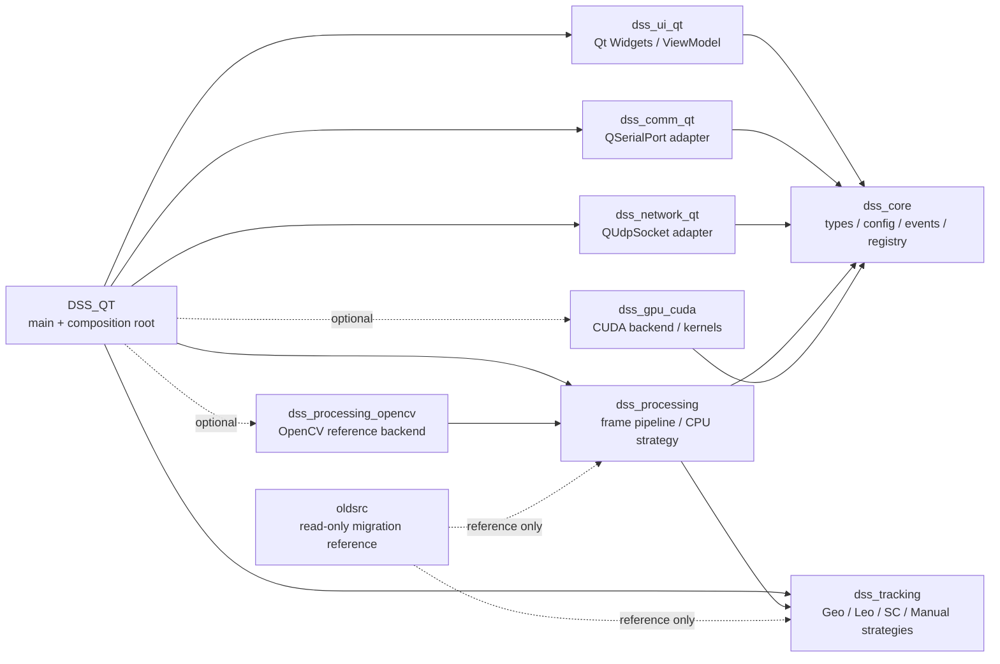

# DSS_QT

DSS_QT 是面向天文高帧频图像采集、图像处理、目标跟踪、串口/UDP 通信和桌面显示的 C++23/Qt6 应用。当前项目处于渐进式现代化重构阶段：旧版 qmake/Qt/OpenCL 单体工程保留在 `oldsrc/` 中作为迁移参考，新工程使用 CMake targets、标准库并发、策略化算法后端、可选 OpenCV/CUDA 和 clang 工具链逐步替换旧实现。

> 当前 README 是项目主入口文档，包含项目说明、架构审查结论、构建说明和迁移路线图。

## 目录

- [项目状态](#项目状态)
- [核心目标](#核心目标)
- [技术栈](#技术栈)
- [仓库结构](#仓库结构)
- [总体架构](#总体架构)
- [模块说明](#模块说明)
- [构建要求](#构建要求)
- [快速开始](#快速开始)
- [CMake Presets](#cmake-presets)
- [构建选项](#构建选项)
- [输出目录与 Qt 部署](#输出目录与-qt-部署)
- [Conan 与第三方依赖](#conan-与第三方依赖)
- [clangd / clang-tidy / clang-format](#clangd--clang-tidy--clang-format)
- [OpenCV 算法后端](#opencv-算法后端)
- [CUDA 后端](#cuda-后端)
- [测试](#测试)
- [编码与命名规范](#编码与命名规范)
- [当前架构审查结论](#当前架构审查结论)
- [已知风险与优化空间](#已知风险与优化空间)
- [迁移路线图](#迁移路线图)
- [开发工作流建议](#开发工作流建议)
- [常用命令](#常用命令)

## 项目状态

当前项目已经完成第一阶段架构脚手架：

- 已从旧版 qmake 项目迁移到 CMake/Ninja/CMake Presets。
- 已按模块拆分为 `dss_core`、`dss_processing`、`dss_tracking`、`dss_gpu_cuda`、`dss_comm_qt`、`dss_network_qt`、`dss_ui_qt`、`DSS_QT`。
- 已设置 C++23、target 级预编译头、统一输出目录、Qt Windows 自动部署。
- 已支持 OpenCV 处理策略和可选 CUDA 后端。
- 已加入 clangd、clang-tidy、clang-format 配置，并将 `compile_commands.json` 同步到仓库根目录供 clangd 使用。
- 已添加基础单元测试入口，包括帧协议、配置、并发队列、OpenCV processing。

仍需继续补齐：

- 串口协议 decode/encode。
- UDP 图像分片、心跳、错误诊断、数据交换协议。
- 服务初始化、注册、关闭生命周期。
- GEO/LEO/SC/Manual 跟踪策略真实迁移。
- CUDA kernel 与 OpenCV/CPU reference 的逐项对齐测试。
- UI ViewModel 到后端服务的完整命令链路。

## 核心目标

重构目标不是一次性重写，而是保持主分支可配置、可构建、可测试的渐进迁移：

- 构建系统现代化：CMake Presets + Ninja + Conan。
- 编码标准现代化：C++23、RAII、`std::expected`、`std::span`、强类型枚举、显式依赖注入。
- 并发模型现代化：`std::jthread`、`std::stop_token`、标准库 mutex/condition variable。
- UI 与后端解耦：UI 只绑定 ViewModel、事件、服务接口，不直接持有算法、串口、网络或 GPU 具体实现。
- 算法后端可替换：CPU/OpenCV 作为 reference backend，CUDA 作为可选加速 backend。
- 旧 OpenCL 迁移可验证：每迁移一个算法，都保留 CPU/OpenCV 对照测试。
- 工具链可维护：clangd、clang-tidy、clang-format、稳定 `compile_commands.json`。

## 技术栈

| 类别 | 当前选择 |
| --- | --- |
| 语言标准 | C++23 |
| 构建系统 | CMake 3.28+ |
| 构建器 | Ninja |
| Windows 编译器 | MSVC 18 / clang-cl |
| 迁移编译器 | GCC / Clang |
| UI | Qt 6 Widgets |
| UI 风格 | ElaWidgetTools 可选，原生 Qt fallback |
| 包管理 | Conan 2 |
| 测试 | GoogleTest / CTest |
| 日志 | spdlog 可选，当前核心日志通过事件总线输出 |
| 配置 | 标准库 INI parser |
| CPU 算法 | 标准库 + OpenCV 可选 |
| GPU 算法 | CUDA 可选 |
| 静态分析 | clangd / clang-tidy |
| 格式化 | clang-format |

## 仓库结构

```text
DSS_QT/
├── CMakeLists.txt
├── CMakePresets.json
├── conanfile.py
├── README.md
├── .clangd
├── .clang-tidy
├── .clang-format
├── cmake/
│   ├── RunClangFormat.cmake
│   └── RunClangTidy.cmake
├── config/
│   └── SystemInit.ini
├── include/
│   └── dss/
│       ├── acquisition/
│       ├── comm/
│       ├── core/
│       ├── gpu/
│       ├── network/
│       ├── processing/
│       ├── storage/
│       ├── tracking/
│       └── ui/
├── src/
│   ├── comm/
│   ├── core/
│   ├── gpu/
│   ├── network/
│   ├── processing/
│   ├── tracking/
│   ├── ui/
│   └── main.cpp
├── kernels/
│   ├── arithmetic.cu
│   ├── calibration.cu
│   ├── composite.cu
│   ├── filter.cu
│   ├── statistics.cu
│   └── transform.cu
├── tests/
│   ├── CMakeLists.txt
│   ├── test_bounded_channel.cpp
│   ├── test_config.cpp
│   ├── test_frame_codec.cpp
│   └── test_opencv_processing.cpp
├── oldsrc/
│   └── legacy qmake/Qt/OpenCL source for migration reference
└── .ref-repos/
    └── local reference clones, ignored by git
```

目录约定：

- `include/dss/<module>`：public headers。
- `src/<module>`：对应实现文件。
- `kernels`：CUDA kernel 实现。
- `tests`：GoogleTest 单元测试。
- `oldsrc`：旧工程只读参考，不参与构建。
- `.ref-repos`：参考仓库缓存目录，已加入 `.gitignore`，不要放入 `build/`。

## 总体架构



架构原则：

- core、processing、tracking、gpu 接口层不依赖 Qt。
- Qt 只位于 UI、串口、网络和应用入口边界。
- UI 通过 ViewModel、事件总线、服务接口与后端通信。
- 算法通过策略接口接入，不让 UI 或 MainWindow 直接感知具体 backend。
- CUDA、OpenCV、Qt、GTest 都应可选或可替换，不能阻塞核心模块开发。

## 模块说明

### dss_core

位置：

- `include/dss/core`
- `src/core`

职责：

- 基础数据结构：`types.h`
- 枚举和常量：`constants.h`
- 事件定义：`events.h`
- 事件总线：`event_bus.h`
- 服务注册表：`service_registry.h`
- 日志入口：`logger.h`
- 配置加载/保存：`config.h`、`config.cpp`

当前评价：

- `src/core/config.cpp` 已经脱离 Qt `QSettings`，使用标准库解析 INI，核心层基本保持 Qt-free。
- `Config` 仍是全局单例，并暴露 `mutable*()` 修改入口。短期方便迁移，长期建议改为显式注入的配置对象或配置服务。
- `core/config.h` 目前复用 `Comm::SerialConfig` 和 `Network::UdpEndpointConfig`，这形成轻微反向依赖。后续可把配置 DTO 移入 core，边界层只消费这些数据。

### dss_processing

位置：

- `include/dss/processing`
- `src/processing`

职责：

- 图像帧数据模型：`frame_packet.h`
- 有界并发队列：`bounded_channel.h`
- 处理策略接口：`i_processing_strategy.h`
- 图像处理流水线：`image_processor.h`、`image_processor.cpp`
- 连通域和测量：`labeler.h`、`labeler.cpp`

当前评价：

- `IProcessingStrategy` 适合承载 CPU/OpenCV/CUDA 不同算法路线。
- `ImageProcessor` 使用 `std::jthread` 和有界队列处理帧流，方向正确。
- `FramePacket` 当前使用多份 `std::vector` 存储 raw、rotated、display、photometry 图像，便于迁移，但 6144 x 6144 大图像下要关注拷贝成本。

### dss_processing_opencv

位置：

- `include/dss/processing/opencv_processing_strategy.h`
- `src/processing/opencv_processing_strategy.cpp`

职责：

- 使用 OpenCV 实现 CPU/reference 图像处理策略。
- 当前覆盖统计、16-bit 灰度映射到 8-bit display、阈值分割、connected components 测量。

当前评价：

- OpenCV backend 适合作为 CUDA kernel 的 reference backend。
- 后续建议把统计、滤波、阈值、labeling 拆成更细粒度 stage，避免单一 strategy 类持续膨胀。

### dss_tracking

位置：

- `include/dss/tracking`
- `src/tracking`

职责：

- 跟踪策略接口：`i_tracking_strategy.h`
- 策略管理：`track_manager.h`、`track_manager.cpp`
- GEO/LEO/SC/Manual 策略：`geo_tracker.*`、`leo_tracker.*`、`sc_tracker.*`、`manual_tracker.*`
- 数学工具：`math_utils.*`

当前评价：

- 策略模式适合表达 GEO、LEO、SC、Manual 多跟踪模式。
- 当前多处仍是 TODO，应按旧 `oldsrc/TrackAlgo.*` 逐步迁移。
- `math_utils.*` 放在 tracking 目录但命名空间是 `Dss::Math`，这是当前最明显的组织命名不一致。后续应迁移到 `include/dss/math` / `src/math`，或改为 `Dss::Tracking::Math`。

### dss_gpu_cuda

位置：

- `include/dss/gpu`
- `src/gpu`
- `kernels`

职责：

- GPU 后端接口：`i_gpu_backend.h`
- CUDA 设备管理：`cuda_device_manager.*`
- CUDA buffer RAII：`gpu_buffer.h`
- CUDA kernel 声明：`cuda_kernels.h`
- CUDA kernel 实现：`kernels/*.cu`

当前评价：

- CUDA 通过 `DSS_ENABLE_CUDA` 可选启用，避免无 CUDA 环境阻塞核心开发。
- `IGpuBackend` 当前仅覆盖设备初始化、设备名、初始化状态，不足以表达算法能力。
- 后续建议新增 `IProcessingAccelerator` 或 operation 级接口，把 CUDA 与 processing pipeline 连接起来。

### dss_comm_qt

位置：

- `include/dss/comm`
- `src/comm`

职责：

- 串口接口：`i_serial_channel.h`
- 帧校验/包装：`frame_codec.h`
- Qt 串口 worker：`serial_worker_base.*`
- 显控、曝光、主控、伺服通道：`display_channel.*`、`exposure_channel.*`、`master_control_channel.*`、`servo_channel.*`

当前评价：

- Qt 串口实现独立在 `dss_comm_qt` 中，模块边界合理。
- `SerialWorkerBase` public header 暴露了 `QSerialPort`，这会增加上层编译耦合。后续可用 pImpl 或 adapter 将 Qt 类型藏到 `.cpp`。
- 协议 encode/decode 尚未完整实现，应以单元测试先固定 20/23/30 字节帧格式。

### dss_network_qt

位置：

- `include/dss/network`
- `src/network`

职责：

- UDP endpoint 和网络接口：`i_network_channel.h`
- UDP 基础通道：`udp_channel.*`
- 图像发送：`image_sender.*`
- 心跳：`heartbeat.*`
- 错误诊断：`error_diagnostics.*`
- 数据交换：`data_exchange.*`
- 大气数据接收：`atmos_receiver.*`

当前评价：

- Qt UDP 实现独立在 `dss_network_qt` 中，边界合理。
- `UdpChannel::socket()` 暴露 `QUdpSocket*`，后续建议移除或限制为内部调试能力。
- 图像分片 header、heartbeat close guard、错误诊断聚合都应有协议测试。

### dss_ui_qt

位置：

- `include/dss/ui`
- `src/ui`

职责：

- 主窗口：`main_window.*`
- 初始化窗口：`init_dialog.*`
- 图像显示控件：`image_display.*`、`image_display_crop.*`
- ViewModel：`view_model.*`

当前评价：

- ViewModel 订阅后端事件并暴露 UI 状态，方向正确。
- 命令侧仍有 TODO，例如采集启动、停止、图像转换、后端服务调用。
- UI target 当前依赖 `dss_processing` 和 `dss_tracking`。短期可接受，长期应收缩为只依赖 core events、view model state 和服务接口。

## 构建要求

### Windows 主路径

建议环境：

- Windows 10/11。
- Visual Studio 18 2026 或兼容 MSVC 工具链。
- clang-cl。
- CMake 3.28+。
- Ninja。
- Qt 6.11.1 MSVC 2022 64-bit，当前本机路径：`F:\Qt\6.11.1\msvc2022_64`。
- 可选：Conan 2。
- 可选：OpenCV。
- 可选：CUDA Toolkit。

### Linux 迁移路径

建议环境：

- GCC 或 Clang，支持 C++23。
- CMake 3.28+。
- Ninja。
- 可选：Qt6、OpenCV、CUDA Toolkit。

Linux 目前重点保证 core、processing、tracking 和 tests 可配置。Qt 桌面应用、Sapera、StarLibs 等硬件/平台能力需要按平台逐步适配。

## 快速开始

### clang-cl + 本机 Qt

```powershell
cmake --preset clang-cl-debug-local --fresh
cmake --build --preset clang-cl-debug-local
```

构建后主程序位于：

```text
build/clang-cl-debug-local/bin/DSS_QT.exe
```

### MSVC + 本机 Qt

普通 PowerShell 通常没有 `cl.exe` 所需环境，建议通过 Visual Studio Developer 环境运行：

```powershell
cmd.exe /d /c 'call "C:\Program Files\Microsoft Visual Studio\18\Enterprise\VC\Auxiliary\Build\vcvars64.bat" && cmake --preset msvc-debug-local --fresh'
cmd.exe /d /c 'call "C:\Program Files\Microsoft Visual Studio\18\Enterprise\VC\Auxiliary\Build\vcvars64.bat" && cmake --build --preset msvc-debug-local'
```

构建后主程序位于：

```text
build/msvc-debug-local/bin/DSS_QT.exe
```

### 只构建核心开发目标

如果当前机器没有 Qt、CUDA 或完整第三方环境，可以先配置核心开发 preset：

```powershell
cmake --preset core-dev --fresh
cmake --build --preset core-dev
```

## CMake Presets

当前 presets 分为几类：

| Preset | 用途 |
| --- | --- |
| `core-dev` | 无 Qt/CUDA 的核心开发配置 |
| `core-tests` | 无 Qt/CUDA 的核心测试配置 |
| `msvc-debug` / `msvc-release` | MSVC + Conan toolchain |
| `msvc-debug-local` / `msvc-release-local` | MSVC + 本机 Qt |
| `clang-cl-debug` / `clang-cl-release` | clang-cl + Conan toolchain |
| `clang-cl-debug-local` / `clang-cl-release-local` | clang-cl + 本机 Qt |
| `mingw-gcc-debug` / `mingw-gcc-release` | Windows MinGW GCC 迁移配置 |
| `gcc-debug` / `gcc-release` | Linux GCC 配置 |
| `clang-debug` / `clang-release` | Linux Clang 配置 |

说明：

- `*-local` presets 当前使用 `F:/Qt/6.11.1/msvc2022_64`。
- `*-local` presets 默认 `DSS_ENABLE_TESTS=OFF`，用于避免本机 GTest ABI 不匹配影响 app 构建。
- Conan presets 需要先生成对应 `build/<preset>/generators/conan_toolchain.cmake`。

## 构建选项

| 选项 | 默认值 | 说明 |
| --- | --- | --- |
| `DSS_BUILD_APP` | `ON` | 构建 Qt 桌面应用 |
| `DSS_ENABLE_TESTS` | `ON` | 构建 GoogleTest 单元测试 |
| `DSS_ENABLE_CUDA` | `OFF` | 构建 CUDA 后端和 kernels |
| `DSS_ENABLE_OPENCV` | `ON` | 构建 OpenCV processing backend |
| `DSS_ENABLE_SAPERA` | `OFF` | 启用 Sapera SDK 支持 |
| `DSS_ENABLE_STARLIBS` | `OFF` | 启用 StarMap/Photometry 等库 |
| `DSS_ENABLE_QT_DEPLOY` | Windows `ON` | 构建后运行 `windeployqt` |
| `DSS_CLANG_TIDY_WARNINGS_AS_ERRORS` | `OFF` | `tidy-check` 是否将 warning 视为 error |

示例：

```powershell
cmake --preset clang-cl-debug-local --fresh -DDSS_ENABLE_CUDA=ON
```

```powershell
cmake --preset core-dev --fresh -DDSS_BUILD_APP=OFF -DDSS_ENABLE_OPENCV=OFF
```

## 输出目录与 Qt 部署

单配置 Ninja preset 输出目录：

```text
build/<preset>/
├── bin/
│   ├── DSS_QT.exe
│   ├── Qt6*.dll
│   ├── platforms/
│   ├── imageformats/
│   ├── styles/
│   ├── tls/
│   └── translations/
├── lib/
│   ├── dss_core.lib
│   ├── dss_processing.lib
│   ├── dss_tracking.lib
│   └── ...
└── compile_commands.json
```

根目录还会生成 clangd 使用的镜像文件：

```text
compile_commands.json
```

该文件已加入 `.gitignore`，不应提交。

Windows 下默认在 `DSS_QT` 构建后运行 `windeployqt6.exe`：

```powershell
F:\Qt\6.11.1\msvc2022_64\bin\windeployqt6.exe --dir <exe-dir> <exe-path>
```

不建议把 exe 和 Qt DLL 分离到不同目录。Windows DLL 搜索、Qt 插件查找和 `windeployqt` 默认行为都更适合将运行时 DLL 与 exe 放在同一个 `bin` 目录。

## Conan 与第三方依赖

`conanfile.py` 当前声明：

| 依赖 | 版本 | 说明 |
| --- | --- | --- |
| `gtest` | `1.15.0` | 单元测试 |
| `spdlog` | `1.14.0` | 日志库，可选接入 |
| `nlohmann_json` | `3.11.3` | JSON 支持 |
| `opencv` | `4.10.0` | 可选 processing backend |
| `qt` | `6.8.0` | 可选 Conan Qt 路径 |

Conan 策略：

- Qt 优先使用本机安装路径。
- 非 Qt 三方库优先通过 Conan 管理。
- OpenCV 可使用本机安装，也可通过 Conan `with_opencv=True`。
- `with_conan_qt=False` 是默认值，避免每次 Conan 安装都拉取大型 Qt 包。

常见 Conan 命令示例：

```powershell
conan install . --build=missing -s build_type=Debug -o with_opencv=True
```

如果使用 Conan preset，需要确保 `CMAKE_TOOLCHAIN_FILE` 指向的 toolchain 文件已经生成。

## clangd / clang-tidy / clang-format

本项目参考 with-fair-wind/ModernCpp 的 clang 工具链实践：

- `.clangd`：配置 clangd 编译数据库、诊断、inlay hints、索引排除路径。
- `.clang-tidy`：启用 modernize、bugprone、performance、cppcoreguidelines、concurrency 等检查，并关闭部分迁移期噪声规则。
- `.clang-format`：统一 C++ 风格，基于 Microsoft，Allman/custom braces，4 空格缩进，120 列。
- `compile_commands.json`：由 CMake 自动从 `build/<preset>` 同步到仓库根目录，供 clangd 识别。

### clangd

`.clangd` 中关键配置：

```yaml
CompileFlags:
  CompilationDatabase: .
  Add:
    - -std=c++23
```

排除路径：

- `oldsrc`
- `third_party`
- `build`
- `.ref-repos`

### clang-format

检查格式：

```powershell
cmake --build --preset clang-cl-debug-local --target format-check
```

自动格式化：

```powershell
cmake --build --preset clang-cl-debug-local --target format
```

建议将格式化作为单独提交，避免和功能改动混在一起。

### clang-tidy

运行静态检查：

```powershell
cmake --build --preset clang-cl-debug-local --target tidy-check
```

自动修复可修复项：

```powershell
cmake --build --preset clang-cl-debug-local --target tidy
```

## OpenCV 算法后端

OpenCV backend 由 `dss_processing_opencv` target 提供，当前以 `OpenCvProcessingStrategy` 接入 `IProcessingStrategy`。

当前处理流程：

1. 校验 `FramePacket` 宽高和 raw image 尺寸。
2. 使用 `cv::minMaxLoc` 计算 min/max。
3. 使用 `cv::meanStdDev` 计算 avg/stddev。
4. 将 16-bit raw image 线性映射到 8-bit display image。
5. 根据 `mean + thresholdSigma * stddev` 计算阈值。
6. 使用 `cv::threshold` 二值化。
7. 使用 `cv::connectedComponentsWithStats` 提取目标 blob。

用途：

- 作为无 CUDA 环境下的算法实现。
- 作为 CUDA kernel 迁移时的 reference backend。
- 作为单元测试中的确定性对照。

后续建议：

- 增加滤波、旋转/裁剪、帧差、灰度形态学、测量链路。
- 把算法拆成 stage，避免一个 strategy 类承载过多逻辑。
- 每个 stage 都保留 CPU/OpenCV reference 输出，供 CUDA 对比。

## CUDA 后端

CUDA 后端由 `DSS_ENABLE_CUDA=ON` 启用。

位置：

- `include/dss/gpu`
- `src/gpu`
- `kernels`

当前目标：

- 将旧 OpenCL kernel 按功能迁移到 CUDA。
- CUDA 永远作为可选后端，不阻塞无 GPU 环境的核心开发。
- 每个 CUDA kernel 都需要和 CPU/OpenCV reference 对比。

迁移优先级：

1. 图像统计：min/max/avg/stddev。
2. 16-bit 到 8-bit 灰度映射。
3. 滤波：Gaussian、median、salt noise。
4. 旋转、裁剪、binning。
5. 二值化和形态学。
6. 连通域标记和测量。
7. 多帧中值、帧差、复合处理链路。

## 测试

测试目录：

```text
tests/
├── CMakeLists.txt
├── test_bounded_channel.cpp
├── test_config.cpp
├── test_frame_codec.cpp
└── test_opencv_processing.cpp
```

测试 target：

- `test_frame_codec`
- `test_config`
- `test_bounded_channel`
- `test_opencv_processing`，仅在 `dss_processing_opencv` 可用时构建。

运行测试：

```powershell
ctest --test-dir build/<preset> --output-on-failure
```

测试优先级：

1. `FrameCodec`：header/tail、长度错误、20/23/30 字节帧。
2. 配置加载：真实 INI、缺字段、非法数字、路径保存。
3. `BoundedChannel`：stop、满队列、空队列、多生产者/消费者。
4. 事件总线：订阅、取消、异常传播、线程安全策略。
5. OpenCV backend：小矩阵、全黑、全白、单目标、多目标、阈值边界。
6. UDP 协议：图像分片 header、heartbeat close guard、错误诊断包。
7. CUDA backend：每个 kernel 与 CPU/OpenCV reference 对比。
8. tracking：Geo/Leo/SC/Manual 的旧算法回归样本。

注意：

- 当前 Windows local Qt presets 关闭测试，用于避免本机 GTest ABI 不匹配影响 app 构建。
- 如果要启用测试，建议使用匹配编译器 ABI 的 Conan GTest 或本机 GTest。

## 编码与命名规范

### 文件命名

| 项目 | 规范 | 示例 |
| --- | --- | --- |
| 头文件 | `.h` | `frame_packet.h` |
| 源文件 | `.cpp` | `image_processor.cpp` |
| CUDA 文件 | `.cu` | `statistics.cu` |
| CMake 辅助脚本 | PascalCase 或动词短语 `.cmake` | `RunClangTidy.cmake` |
| 普通文件名 | `snake_case` | `opencv_processing_strategy.h` |

当前 `include`、`src`、`tests`、`kernels` 下新增文件均符合 `snake_case` 或固定 CMake 命名约定。

### C++ 命名

| 项目 | 规范 | 示例 |
| --- | --- | --- |
| 命名空间 | `Dss::Module` | `Dss::Processing` |
| 类/结构/枚举 | PascalCase | `FramePacket` |
| 接口类 | `I` + PascalCase | `IProcessingStrategy` |
| 函数/方法 | camelCase | `submitFrame()` |
| 变量/参数 | camelCase | `frameSeq` |
| 私有成员 | `m_` + camelCase | `m_workerThread` |
| 常量 | PascalCase | `FrameHeader` |
| scoped enum value | PascalCase | `TrackMode::Manual` |

### Acronym 风格

项目当前采用 acronym-as-word 风格：

- `OpenCvProcessingStrategy`，不写成 `OpenCVProcessingStrategy`。
- `GeoTracker`，不写成 `GEOTracker`。
- `LeoTracker`，不写成 `LEOTracker`。
- `ScTracker`，不写成 `SCTracker`。

业务文档、UI 文案、协议字段中仍可以使用 GEO、LEO、SC、OpenCV 等通用写法。

### 头文件原则

- public header 尽量不暴露 Qt 类型。
- core、processing、tracking、gpu 的 public interface 只使用标准库类型和项目基础类型。
- 能前置声明就前置声明。
- 禁止在 header 中使用 `using namespace`。
- 非模板实现放在 `.cpp`。

### 设计模式原则

- 策略模式：用于 processing、tracking、GPU backend。
- 单例：限制在日志等少量全局设施。`Config` 当前是迁移期单例，后续应改为显式注入。
- 访问者：仅在跨类型消息、结果导出等确有收益时使用。
- 服务注册表：只负责组合根和边界查找，不作为全局隐藏依赖的替代品。

## 当前架构审查结论

总体结论：当前架构方向合理，已经从“Qt 单体程序”拆成模块化 CMake targets。核心层、算法接口、跟踪接口、通信边界、网络边界、UI 边界有明确轮廓，适合继续渐进迁移。

主要优点：

- CMake target 分层清晰，职责基本明确。
- `oldsrc/` 不参与构建，适合作为只读迁移参考。
- 核心配置实现已脱离 `QSettings`。
- OpenCV 与 CUDA 都以可选后端形式存在。
- 并发主路径使用标准库并发设施。
- clangd、clang-tidy、clang-format 工程入口完整。
- Windows 输出目录已细分为 `bin` 和 `lib`。
- Windows Qt 部署已接入 `windeployqt6.exe`。

主要不足：

- 当前仍是“可构建架构骨架”，业务链路未完全跑通。
- 服务初始化、服务注册、关闭生命周期仍需补齐。
- 串口/网络协议仍有大量 TODO。
- 跟踪策略仍未完整从旧算法迁移。
- UI 命令侧尚未完全通过服务接口驱动后端。
- CUDA 与 OpenCV 的算法后端接口还需要进一步统一。

## 已知风险与优化空间

| 风险 | 级别 | 说明 | 建议 |
| --- | --- | --- | --- |
| 服务生命周期未落地 | 高 | `main.cpp` 中服务初始化仍是 TODO | 优先补齐 composition root |
| 串口/网络协议未完整实现 | 高 | decode/encode、heartbeat、image send 等仍缺实现 | 协议测试先行 |
| `Config` 全局可变单例 | 中 | 不利于测试、热加载和多实例 | 迁移为注入式配置服务 |
| Qt 类型泄漏到边界 header | 中 | `QSerialPort`、`QUdpSocket` 暴露增加耦合 | pImpl 或 adapter 私有实现 |
| 大图像拷贝风险 | 中 | 6144 x 6144 图像 vector 多份拷贝成本高 | move-only packet / buffer pool |
| OpenCV/CUDA 接口尚浅 | 中 | 后续算法容易重复实现 | 定义 stage/operation 级接口 |
| 格式尚未全仓库收敛 | 低 | `format-check` 可能暴露旧风格差异 | 单独做格式化提交 |
| `math_utils` 组织不一致 | 低 | 路径在 tracking，命名空间在 Math | 迁入 math 模块或改命名空间 |

## 迁移路线图

### 阶段 1：工程卫生与边界收紧

- 保持 CMake targets 可配置、可构建。
- 收紧 core 层依赖，减少 core 反向包含 comm/network。
- 将 Qt 类型从 comm/network public headers 中隐藏。
- 明确 `Config` 生命周期，逐步替换全局可变单例。
- 保持 `compile_commands.json` 根目录同步和 clangd 可用。

### 阶段 2：协议与服务链路

- 完成串口 20/23/30 字节帧 decode/encode。
- 完成 UDP 图像分片、心跳、错误诊断、数据交换协议。
- 在 `main.cpp` 建立 composition root。
- 使用 `ServiceRegistry` 注册采集、处理、跟踪、通信、网络、存储服务。
- ViewModel 命令只调用服务接口。

### 阶段 3：算法后端统一

- 将 OpenCV backend 固化为 CPU/reference backend。
- 按功能迁移旧 OpenCL 算法到 CUDA。
- 每个 CUDA kernel 都与 OpenCV/CPU reference 对比。
- 引入 `FrameView`、buffer pool 或 move-only packet。
- 建立可组合 `ProcessingPipeline`。

### 阶段 4：跟踪策略迁移

- 从旧 `TrackAlgo` 迁移 GEO 最小链路。
- 迁移 LEO、SC、Manual 策略。
- 给每种策略建立最小轨迹样本测试。
- 将数学工具稳定到独立 math 模块或 tracking 子命名空间。

### 阶段 5：UI 完整业务化

- ViewModel 暴露稳定 UI state 和 command。
- MainWindow 只绑定 ViewModel，不持有后端具体对象。
- 接入真实图像显示、裁剪显示、状态页、日志页、配置页。
- ElaWidgetTools 作为主 Fluent 风格方案，原生 Qt 作为 fallback。

### 阶段 6：跨平台与发布

- Windows：MSVC/clang-cl 作为主交付链。
- Linux：GCC/Clang 保持核心模块和测试可构建。
- CUDA：保持可选，不阻塞无 GPU 环境。
- Qt：支持本机安装路径和可选 Conan Qt。
- 发布时统一从 `build/<preset>/bin` 取 exe、DLL、plugins、translations。

## 开发工作流建议

推荐每个功能以小步提交推进：

1. 写或更新单元测试。
2. 实现最小功能。
3. 运行相关测试。
4. 运行 `format-check` 或对触碰文件格式化。
5. 运行 `tidy-check` 观察新增诊断。
6. 构建目标 preset。
7. 更新 README 或模块文档。

提交粒度建议：

- 格式化单独提交。
- 协议迁移按通道提交。
- CUDA kernel 按算法 stage 提交。
- UI 绑定按页面或 ViewModel command 提交。

不要做：

- 不要把参考仓库放入 `build/`。
- 不要把 `compile_commands.json` 提交到 git。
- 不要把 `oldsrc/` 纳入新 CMake 构建。
- 不要在 UI 中直接创建算法、串口、网络、GPU 具体实现。
- 不要让 CUDA/OpenCV/Qt 成为核心模块的硬依赖。

## 常用命令

配置并构建 clang-cl local：

```powershell
cmake --preset clang-cl-debug-local --fresh
cmake --build --preset clang-cl-debug-local
```

仅构建主程序：

```powershell
cmake --build --preset clang-cl-debug-local --target DSS_QT
```

配置并构建 MSVC local：

```powershell
cmd.exe /d /c 'call "C:\Program Files\Microsoft Visual Studio\18\Enterprise\VC\Auxiliary\Build\vcvars64.bat" && cmake --preset msvc-debug-local --fresh'
cmd.exe /d /c 'call "C:\Program Files\Microsoft Visual Studio\18\Enterprise\VC\Auxiliary\Build\vcvars64.bat" && cmake --build --preset msvc-debug-local --target DSS_QT'
```

同步 clangd 编译数据库：

```powershell
cmake --build --preset clang-cl-debug-local --target dss_sync_compile_commands
```

检查格式：

```powershell
cmake --build --preset clang-cl-debug-local --target format-check
```

自动格式化：

```powershell
cmake --build --preset clang-cl-debug-local --target format
```

运行 clang-tidy：

```powershell
cmake --build --preset clang-cl-debug-local --target tidy-check
```

运行 CTest：

```powershell
ctest --test-dir build/<preset> --output-on-failure
```

查看输出文件：

```powershell
Get-ChildItem build/clang-cl-debug-local/bin
Get-ChildItem build/clang-cl-debug-local/lib
```
