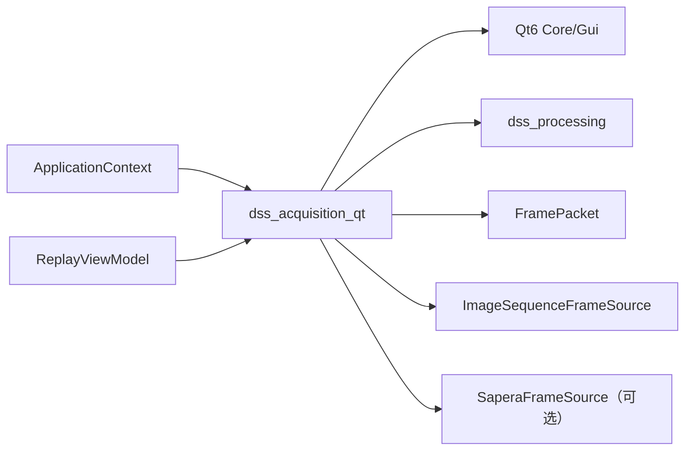
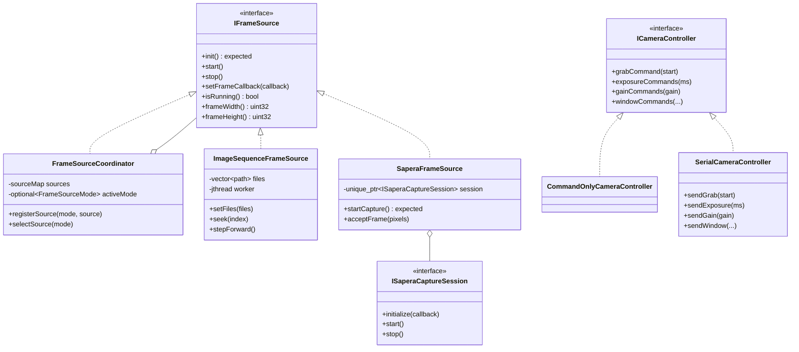
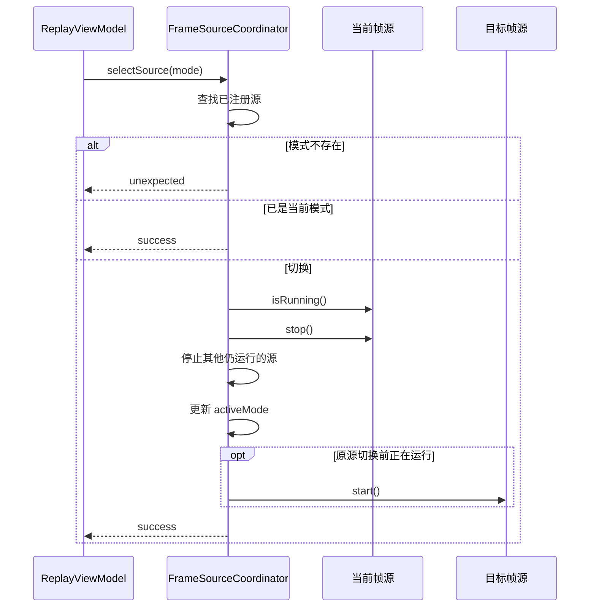
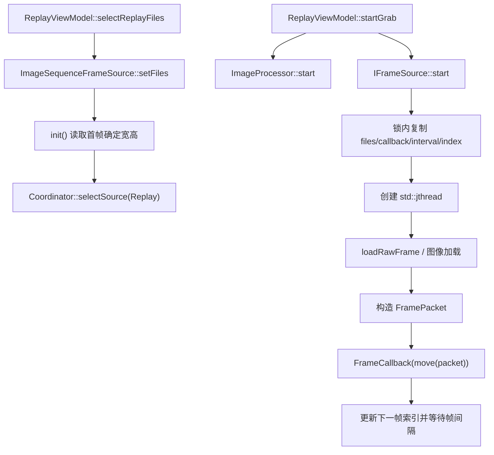
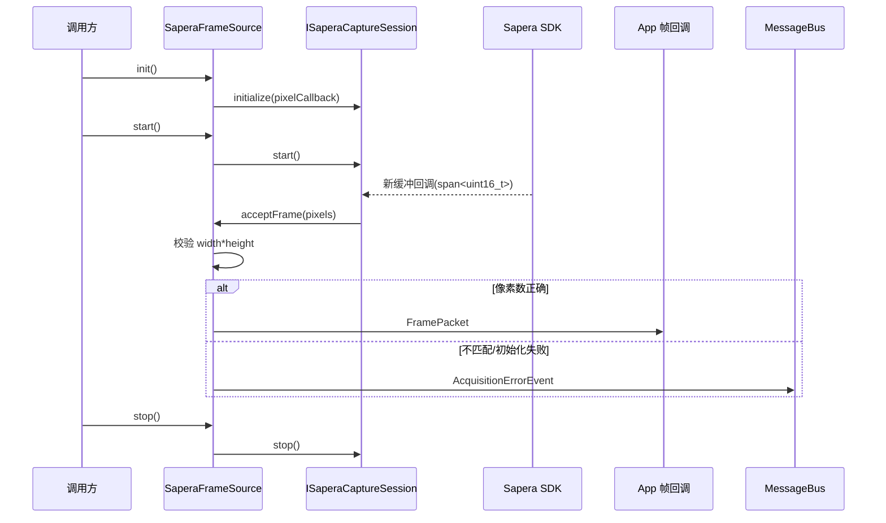
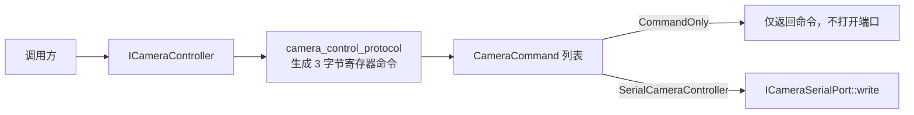

# Acquisition 模块

> 命名空间: `Dss::Acquisition`
>
> 头文件: `include/dss/acquisition/`
>
> 源文件: `src/acquisition/`
>
> 目标: `dss_acquisition_qt`
>
> 依赖: `dss_processing`, `Qt6::Core`, `Qt6::Gui`；启用 Sapera 时私有链接 SDK

## 模块职责

Acquisition 模块定义相机采集、回放帧源与控制接口。当前支持图像序列回放、实时/回放协调与可选 Sapera SDK 采集器；默认无硬件构建可驱动处理、显示和存储链路。

## 组件清单

### 1. IFrameSource (`i_frame_source.h`)

帧采集源接口，定义采集/回放源的生命周期和帧回调方法：

- `init()` — 初始化帧源
- `start()` — 开始采集
- `stop()` — 停止采集
- `setFrameCallback()` — 设置 `FramePacket` 输出回调
- `frameWidth()` / `frameHeight()` — 图像尺寸

### 2. ImageSequenceFrameSource (`image_sequence_frame_source.h`)

从旧版 `ImageReplayer` 思路迁入的图像序列回放源：

| 能力 | 状态 |
|------|------|
| 选择文件序列 | 已实现，UI 可传入 `QStringList` |
| 常规图像解码 | 已实现，使用 Qt `QImage` 读取 BMP/PNG/JPEG/TIFF 等 |
| legacy RAW 解码 | 已实现，复用 `decodeRawImageFile()` |
| 后台回放线程 | 已实现，按帧调用 `IFrameSource::FrameCallback` |
| UI 当前帧进度 | 已实现，`ReplayViewModel` 根据显示事件维护当前帧、总帧数和进度快照 |
| 暂停续播/单帧前进 | 已实现暂停续播、单帧前进/后退、`seek(index)` 随机定位和进度快照 |

### 3. ICameraController (`i_camera_controller.h`)

相机命令接口负责查询逻辑端口状态并生成寄存器命令：

```cpp
class ICameraController {
public:
    virtual bool isOpen() const = 0;
    virtual auto portName() const -> std::string_view = 0;
    virtual auto grabCommand(bool start) const -> CameraCommand = 0;
    virtual auto exposureCommands(float milliseconds) const
        -> std::vector<CameraCommand> = 0;
    virtual auto gainCommands(float gain) const -> std::vector<CameraCommand> = 0;
    virtual auto windowCommands(int line, int start, int fullWidth, int subWidth) const
        -> std::vector<CameraCommand> = 0;
};
```

### 4. CameraControlProtocol (`camera_control_protocol.h`)

3 字节寄存器命令编码从旧版 `CommCamera` 迁移：

| 函数 | 用途 |
|------|------|
| `buildGrabCommand()` | 采集开始/停止命令 |
| `buildExposureCommands(ms)` | 曝光时间寄存器序列 |
| `buildGainCommands(value)` | 增益寄存器序列 |
| `buildWindowCommands(...)` | ROI 窗口寄存器序列 |

### 5. 相机控制器实现

- `CommandOnlyCameraController` 只生成命令，不持有或打开串口。`ApplicationContext` 默认注册此实现，因此无硬件启动安全。
- `SerialCameraController` 通过窄接口 `ICameraSerialPort` 发送相同命令，写失败使用 `std::expected` 返回错误；组件已有单元测试。
- 当前没有把具体相机串口端口适配器注入默认组合根，因此“串口发送组件已实现”不等于“默认应用已连接相机串口”。
## 旧版对照

| 旧版 | 新版 | 状态 |
|------|------|------|
| `CommCamera.h/.cpp` (命令编码) | `camera_control_protocol.h` | **已迁移** |
| `CommCamera.h/.cpp` (串口通信) | `SerialCameraController` + `ICameraSerialPort` | 发送适配器已实现；默认组合根仍使用 command-only |
| `Grabber.h/.cpp` (Sapera SDK) | `SaperaFrameSource` + `ISaperaCaptureSession` | **可选适配器已实现** |
| `ImageReplayer.h/.cpp` (图像序列) | `ImageSequenceFrameSource` + `ReplayViewModel` | **已迁移** |

## 当前缺口

| 缺口 | 严重程度 | 说明 |
|------|---------|------|
| Sapera 硬件验证 | 中 | 适配器与无 SDK 构建已验证；按 [硬件验证](hardware-validation.md) 在采集机执行 smoke test 并回填结果 |
| 相机串口运行时接线 | 中 | 提供具体 `ICameraSerialPort` 适配器，并在显式用户操作后替换默认 command-only 服务；启动时仍不得自动打开串口 |

## 依赖关系

`IFrameSource` 接口依赖 `dss_processing` 的 `FramePacket`；`ImageSequenceFrameSource`
在 `dss_acquisition_qt` 中编译，`.cpp` 内部使用 Qt `QImage` 解码，头文件不直接暴露 Qt 图像头。
实际采集器通过 `DSS_ENABLE_SAPERA` 显式启用 Sapera SDK；默认构建不加载或启动采集硬件。
## 深入架构与调用链

### 模块边界与一跳依赖

Acquisition 把“帧从哪里来”统一为 `IFrameSource`，输出 `Processing::FramePacket`；它不执行阈值分割、目标跟踪或 UI 绘制。相机寄存器命令生成与帧采集是两条独立子链。



Storage 格式头被回放加载器用于解析 RAW/BMP，但 Storage 当前编入 `dss_core`，通过 Processing/Core 依赖可见。Sapera SDK 只在 `DSS_HAS_SAPERA` 时链接。

### 关键类关系



### 帧源选择与切换



Coordinator 在注册源时把已有 callback 下发给新源；重新设置 callback 时会同步更新所有已注册源。它保证对外只暴露一个活动源，但 `selectSource()` 内部持锁调用源的 `stop()/start()`，扩展新帧源时不得在这些方法里反向调用 Coordinator。

### 回放完整调用栈



`stepForward()` 不启动连续线程，而是在调用线程读取一帧并立即执行 callback；UI 在步进前先停止连续回放。到达序列末尾后再次开始会先 `seek(0)`。停止顺序是先停帧源，再停处理器，避免停掉消费者后生产者仍提交帧。

### Sapera 实时采集链



SDK 回调只把像素复制进拥有所有权的 `FramePacket::rawImage` 后转交上层，避免 SDK 缓冲生命周期泄漏到处理线程。

### 相机控制命令链



当前 App 注册的是 `CommandOnlyCameraController`，`isOpen()` 固定为 false；它用于生成和检查命令，不代表相机控制串口已接通。真实发送需要注入实现了 `ICameraSerialPort` 的端口并使用 `SerialCameraController`。

### 数据、线程与背压

| 对象 | 线程 | 共享状态保护 | 输出 |
|---|---|---|---|
| `FrameSourceCoordinator` | 调用者线程 | 单个 mutex 保护源表、活动模式、callback | 转发活动源 callback |
| `ImageSequenceFrameSource` | UI 配置 + 回放 `jthread` | mutex；启动时复制运行快照 | 拥有像素的 `FramePacket` |
| `SaperaFrameSource` | 控制线程 + SDK 回调线程 | mutex 保护尺寸、序号、callback | 拥有像素的 `FramePacket` |
| `SerialCameraController` | 调用者线程 | 依赖注入端口自行保证线程安全 | `expected` 错误 |

Acquisition 自身没有有界帧队列；背压发生在 `ImageProcessor::submitFrame()`。回调返回慢会直接拖慢回放或 SDK 回调，因此回调中只应做快速入队。

### 错误、配置与扩展

- 回放的文件为空、索引越界、解码失败、未设置 callback 均返回 `unexpected`。
- Sapera 初始化/启动/像素尺寸错误发布 `AcquisitionErrorEvent`，同时启动 API 返回错误。
- FrameSourceCoordinator 对空源、重复模式、未注册模式返回错误。
- 配置来源主要是 `Config::paths()`、相机 CCF 路径和 UI 选择的文件列表。
- 新增帧源时实现完整 `IFrameSource` 契约，重点保证 `stop()` 可重复、析构不遗留线程、callback 获得独立数据所有权。

重点测试：`test_image_sequence_frame_source.cpp`、`test_frame_source_coordinator.cpp`、`test_sapera_frame_source_contract.cpp`、`test_camera_control_protocol.cpp`、`test_serial_camera_controller.cpp`、`test_replay_view_model.cpp`。

推荐源码顺序：`i_frame_source.h` → `frame_source_coordinator.*` → `image_sequence_frame_source.*` → `sapera_frame_source.*` → `i_camera_controller.h` → `camera_control_protocol.h` → `serial_camera_controller.*` → App 注册与 `ReplayViewModel`。
