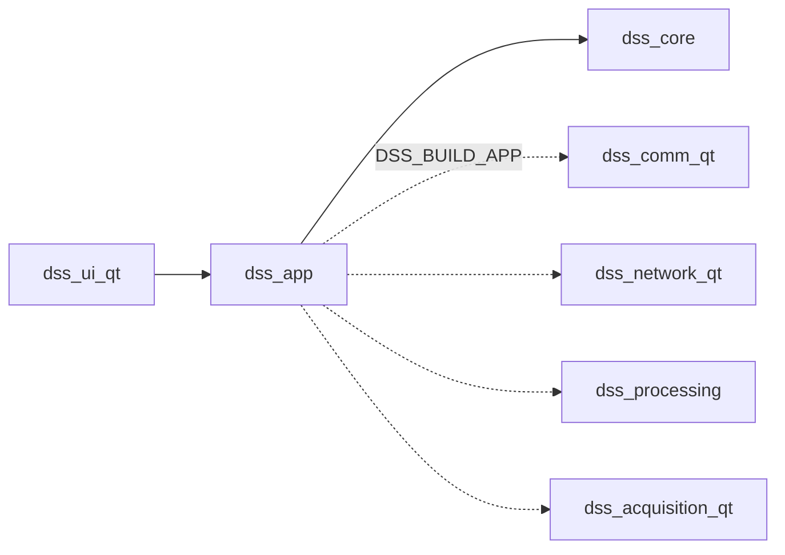
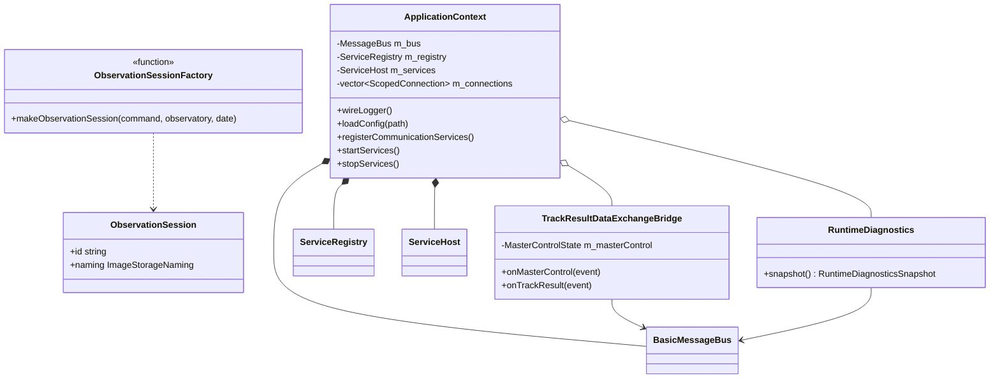
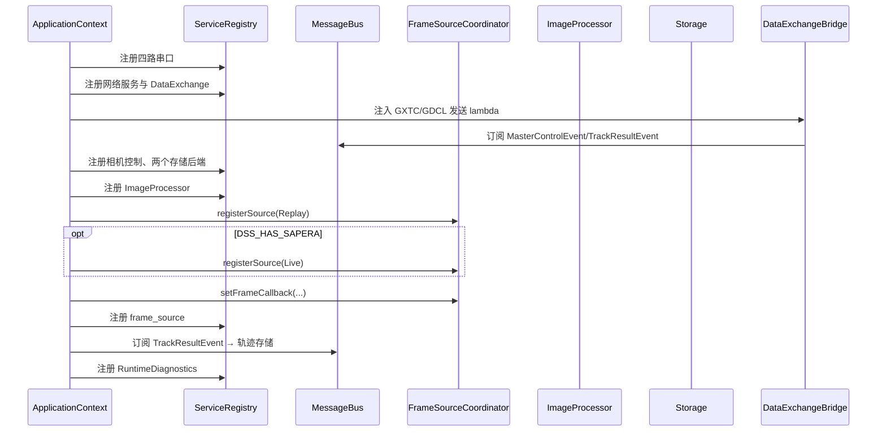
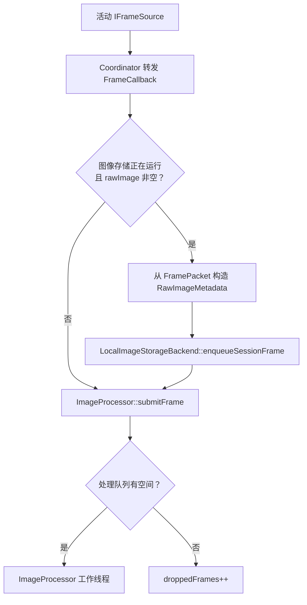
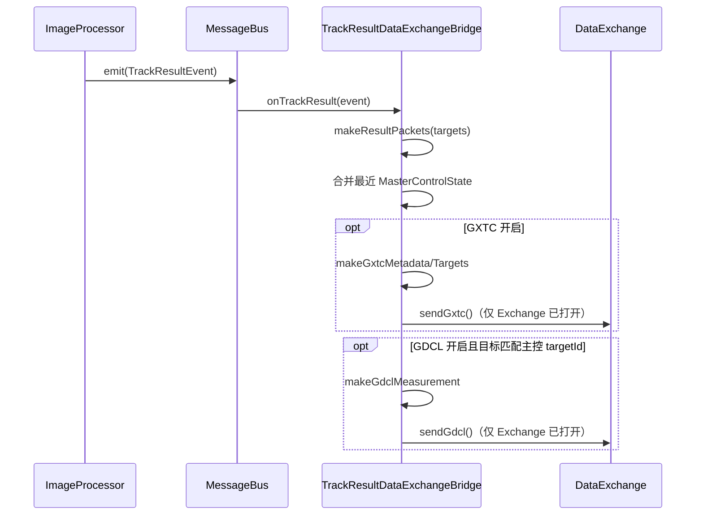
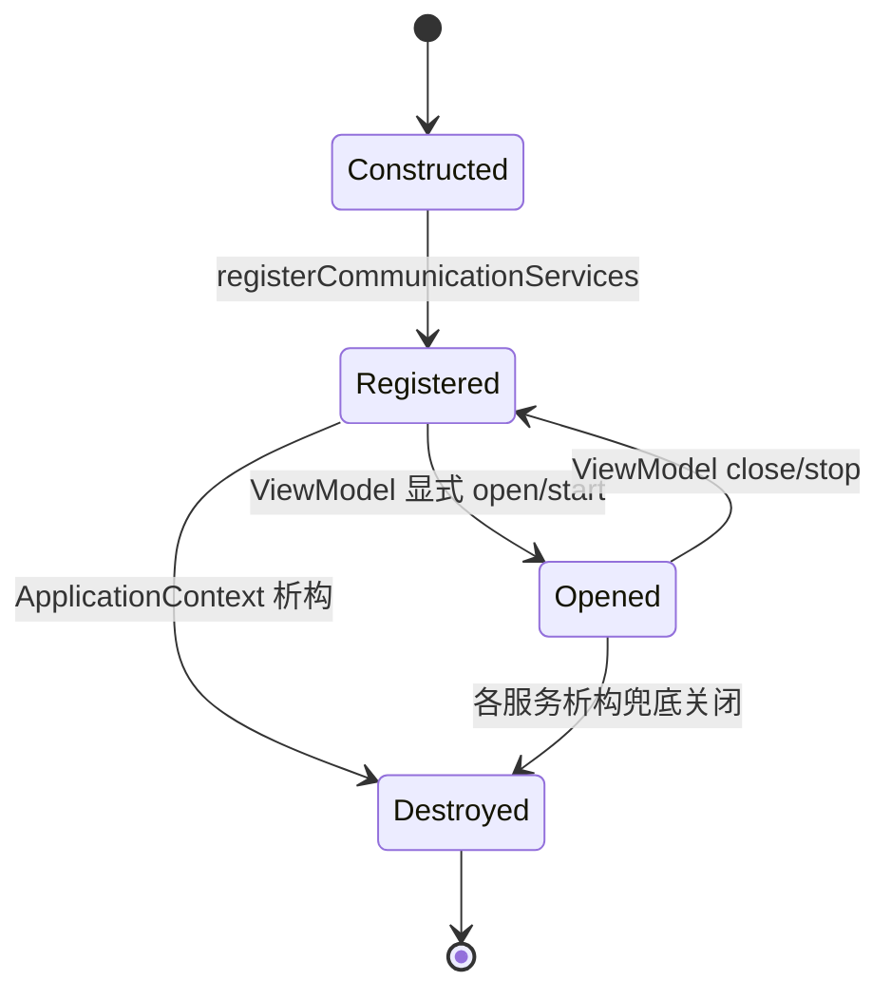

# App 模块 (`dss_app`)

> 命名空间: `Dss::App`
>
> 头文件: `include/dss/app/`
>
> 源文件: `src/app/`
>
> 依赖: `dss_core`, `dss_processing`, `dss_acquisition_qt`, `dss_comm_qt`, `dss_network_qt`

## 模块职责

App 模块是系统的**组合根 (Composition Root)**，负责组装所有子系统、管理全局生命周期、注册通信服务。它是 `main.cpp` 与各业务模块之间的中间层。

## 组件清单

### ApplicationContext

应用上下文，拥有并管理系统的三大基础设施：

| 成员 | 类型 | 职责 |
|------|------|------|
| `m_bus` | `BasicMessageBus<SharedMutexLock>` | 全局事件总线 |
| `m_registry` | `ServiceRegistry` | 服务注册中心 |
| `m_services` | `ServiceHost` | 服务启停编排器 |

**公共 API:**

| 方法 | 说明 |
|------|------|
| `bus()` | 获取消息总线引用 |
| `registry()` | 获取服务注册中心引用 |
| `services()` | 获取服务主机引用 |
| `wireLogger()` | 连接 spdlog 日志门面与事件总线 |
| `loadConfig(path)` | 加载 JSON 配置文件，返回 `std::expected` |
| `registerCommunicationServices()` | 注册所有串口/网络/存储/相机服务 |
| `startServices()` | 按序启动所有已注册服务 |
| `stopServices()` | 按逆序停止所有服务 |

### 通信服务注册 (`communication_services.cpp`)

`registerCommunicationServices()` 内部创建并注册以下服务实例。注册后默认不打开串口、不绑定 UDP、不触碰真实硬件；回放源、处理器和存储 worker 由 UI 命令显式启动。

| 服务 | 模块 | 注册名 |
|------|------|--------|
| `DisplayChannel` / `ISerialChannel` | dss_comm_qt | `display` |
| `ExposureChannel` / `ISerialChannel` / `IExposureCommandPort` | dss_comm_qt | `exposure` |
| `MasterControlChannel` / `ISerialChannel` / `IMasterControlStatusPort` | dss_comm_qt | `master_control` |
| `ServoChannel` / `ISerialChannel` / `IServoCorrectionPort` | dss_comm_qt | `servo` |
| `ImageSender` / `INetworkChannel` | dss_network_qt | `image_sender` |
| `Heartbeat` / `INetworkChannel` | dss_network_qt | `heartbeat` |
| `ErrorDiagnostics` / `INetworkChannel` | dss_network_qt | `error_diagnostics` |
| `DataExchange` | dss_network_qt | `data_exchange` |
| `TrackResultDataExchangeBridge` | dss_app | `track_result_data_exchange_bridge` |
| `AtmosReceiver` / `INetworkChannel` | dss_network_qt | `atmos_receiver` |
| `RuntimeDiagnostics` | dss_app | `runtime_diagnostics` |
| `ImageProcessor` | dss_processing | `image_processor` |
| `FrameSourceCoordinator` / `IFrameSource` | dss_acquisition_qt | `frame_source` |
| `ImageSequenceFrameSource` / `IFrameSource` | dss_acquisition_qt | `replay_source` |
| `SaperaFrameSource` / `IFrameSource`（条件注册） | dss_acquisition_qt | `sapera_source` |
| `LocalImageStorageBackend` / `IStorageBackend` | dss_core (`Dss::Storage`) | `image_storage` |
| `TrackDataStorageBackend` / `IStorageBackend` | dss_core (`Dss::Storage`) | `track_data_storage` |
| `CommandOnlyCameraController` | dss_acquisition_qt | `camera` |

## 启动流程 (`main.cpp`)

```
1. QApplication 初始化
2. ApplicationContext 构造
3. wireLogger()           → spdlog 日志事件转发就绪
4. loadConfig()           → JSON 配置加载
5. InitDialog 显示        → 初始化进度展示
6. registerCommunicationServices()  → 服务注册
7. MainViewModel 构造     → 创建子 ViewModel 并订阅事件
8. MainWindow 构造/显示   → UI 就绪
9. QApplication::exec()  → 事件循环
```

## 当前缺口

| 缺口 | 说明 |
|------|------|
| 相机串口运行时接线 | 默认注册 `CommandOnlyCameraController`；`SerialCameraController` 已实现但尚未注入具体 `ICameraSerialPort` |
| 数据交换联调 | GXTC/GDCL 端点、编码、显式绑定/关闭和错误显示已完成；仍需补发送样例与接收状态 |
| Sapera 硬件验证 | 可选实时源已注册，默认不启动；按 [硬件验证](hardware-validation.md) 在采集机执行 smoke test |
| CUDA 收益验证 | 策略工厂和基准入口已接入；按 [硬件验证](hardware-validation.md) 完成输出对照与性能门槛后再开放 UI |

## 依赖关系

```
dss_app
├── dss_core
├── dss_processing
├── dss_acquisition_qt
├── dss_comm_qt     (编译时条件: DSS_BUILD_APP)
└── dss_network_qt  (编译时条件: DSS_BUILD_APP)
```
## 深入架构与调用链

### 模块边界与依赖

App 是组合根：创建跨模块对象、决定注册名称、连接回调和事件桥。它不实现串口协议、UDP 编码、图像算法或 Widget。



| 依赖方向 | 原因 | 主要接口 |
|---|---|---|
| App → Core | 总线、注册表、Host、配置、Logger | `ApplicationContext` |
| App → Comm | 创建四路串口通道并按接口注册 | `ISerialChannel` 与命令端口 |
| App → Network | 创建 UDP 服务和结果交换桥 | `INetworkChannel`、`DataExchange` |
| App → Acquisition | 创建回放/实时帧源和协调器 | `IFrameSource` |
| App → Processing | 创建处理器并连接帧回调 | `ImageProcessor` |
| App → Storage | 创建图像/轨迹存储后端 | `IStorageBackend` |

### 关键类关系



### 服务注册表真值

`registerCommunicationServices()` 当前注册以下对象。名称是运行时契约，修改时必须同步所有 `tryGet<T>(name)` 调用。

| 名称 | 具体对象 | 注册接口/具体类型 |
|---|---|---|
| `display` | `DisplayChannel` | `ISerialChannel` |
| `exposure` | `ExposureChannel` | `ISerialChannel`、`IExposureCommandPort` |
| `master_control` | `MasterControlChannel` | `ISerialChannel`、`IMasterControlStatusPort` |
| `servo` | `ServoChannel` | `ISerialChannel`、`IServoCorrectionPort` |
| `image_sender` | `ImageSender` | 具体类型、`INetworkChannel` |
| `heartbeat` | `Heartbeat` | 具体类型、`INetworkChannel` |
| `error_diagnostics` | `ErrorDiagnostics` | 具体类型、`INetworkChannel` |
| `atmos_receiver` | `AtmosReceiver` | 具体类型、`INetworkChannel` |
| `data_exchange` | `DataExchange` | 具体类型 |
| `camera` | `CommandOnlyCameraController` | `ICameraController` |
| `image_storage` | `LocalImageStorageBackend` | 具体类型、`IStorageBackend` |
| `track_data_storage` | `TrackDataStorageBackend` | 具体类型、`IStorageBackend` |
| `image_processor` | `ImageProcessor` | 具体类型 |
| `replay_source` | `ImageSequenceFrameSource` | 具体类型、`IFrameSource` |
| `sapera_source` | `SaperaFrameSource`（可选） | `IFrameSource` |
| `frame_source` | `FrameSourceCoordinator` | 具体类型、`IFrameSource` |
| `track_result_data_exchange_bridge` | 结果交换桥 | 具体类型 |
| `runtime_diagnostics` | `RuntimeDiagnostics` | 具体类型 |

同一 `shared_ptr` 可以按多个接口注册；Registry 只是共享所有权和查找入口，不会复制对象。

### 组合根注册流程



### 帧回调的真实调用栈



Raw 存储在处理前入队，因此保存的是采集原始像素；轨迹数据则由 `TrackResultEvent` 订阅者异步入队。两者的启用状态都由 UI 显式控制。

### 跟踪结果到网络交换



桥接器缓存最近一次 `MasterControlEvent`，用它补充测量状态与目标匹配。发送 lambda 在 `DataExchange::isOpen()` 为 false 时直接跳过，不会自动打开端点。

### 主控到观测会话

`MainViewModel::onMasterControl()` 使用 App 的 `ObservationSession` 把主控起止时间、任务/目标编号和台站 ID 转成统一存储命名。跨午夜时结束日期自动加一天；`targetId == 0` 表示搜索模式。会话构造失败时只能提示错误，不应启动半套存储服务。

### 生命周期与当前缺口



- `ApplicationContext::startServices()` 只会启动加入 `m_services` 的 `IService`；当前注册函数没有调用 `m_services.add()`。
- `main()` 也没有调用 `startServices()`，所以实际生命周期是 ViewModel 驱动。
- 析构时 `stopServices()` 对当前 Host 基本为空操作，但 Registry 中对象随后析构，各具体服务仍以 `close()/stop()` 兜底。
- 如果未来改为 Host 统一管理，必须避免同时保留 ViewModel 的重复启动，并明确串口/网络接口如何适配 `IService`。

### 线程、错误与诊断

- App 自身不创建工作线程；它创建的 Processing、Acquisition、Storage、Comm、Network 服务各自管理线程。
- 帧回调可能来自回放线程或 Sapera SDK 回调线程；回调只做有界入队，不应添加阻塞 UI 操作。
- `RuntimeDiagnostics` 用原子计数统计网络、串口、存储错误，并通过注入的 reader 读取处理丢帧和存储计数。
- 配置加载失败返回 `unexpected`；文件日志配置失败只记录警告，不让整体配置加载失败。
- 注册表名称错误通常表现为 ViewModel 获取服务失败，测试应同时覆盖具体类型和接口类型查询。

### 扩展、测试与阅读顺序

新增服务时按顺序完成：创建实例 → 注入总线/配置 → 连接回调 → 以需要的接口和具体类型注册 → 明确谁启动/停止 → 增加注册契约测试。不要在 ViewModel 中临时 new 第二份业务服务。

重点测试：`test_application_context_services.cpp`、`test_observation_session.cpp`、`test_track_result_data_exchange_bridge.cpp`、`test_runtime_diagnostics.cpp`、`test_main_view_model.cpp`。

推荐源码顺序：`application_context.h/.cpp` → `communication_services.cpp` → `track_result_data_exchange_bridge.*` → `observation_session.*` → `runtime_diagnostics.*` → `src/main.cpp`，再跳到各服务的具体模块。
