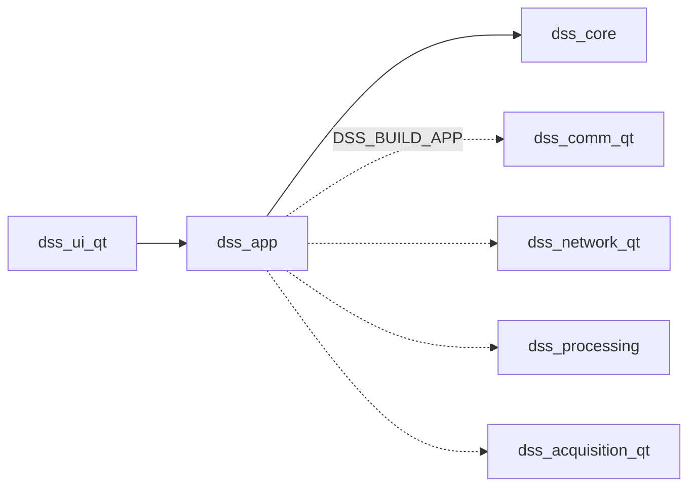
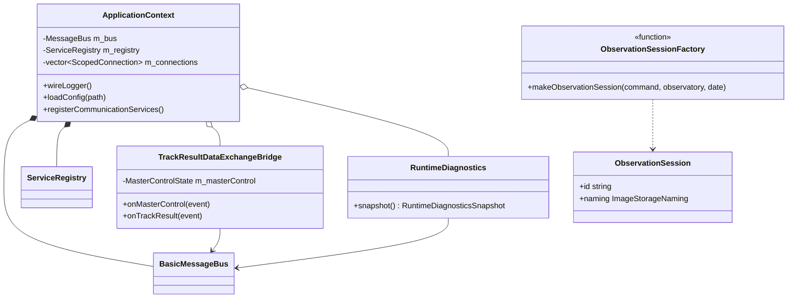
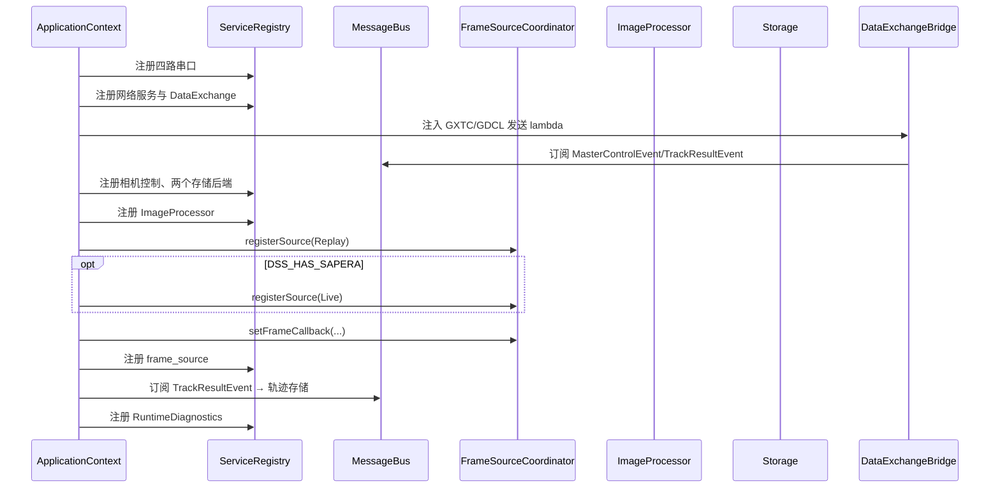
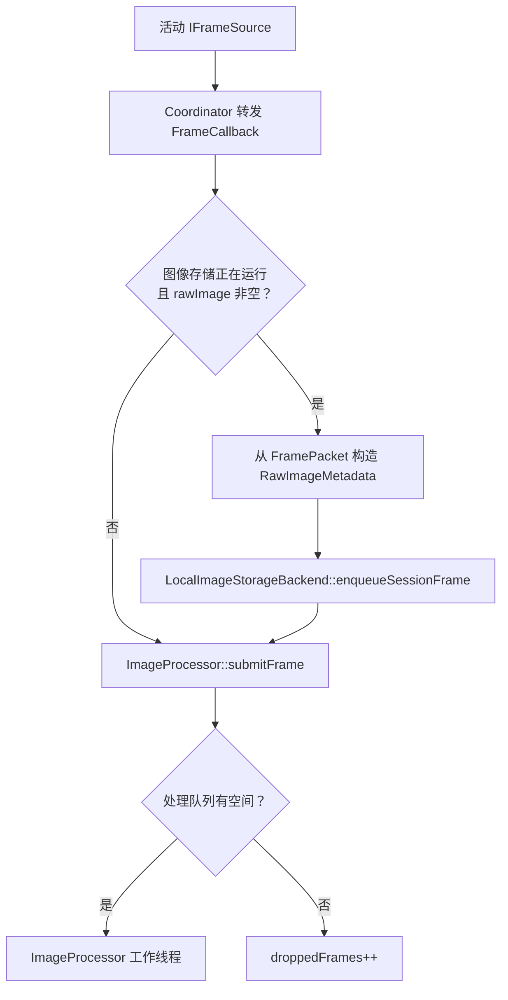
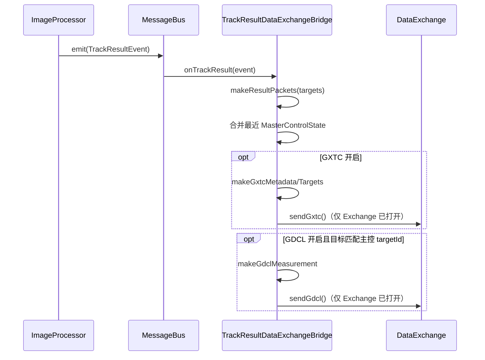
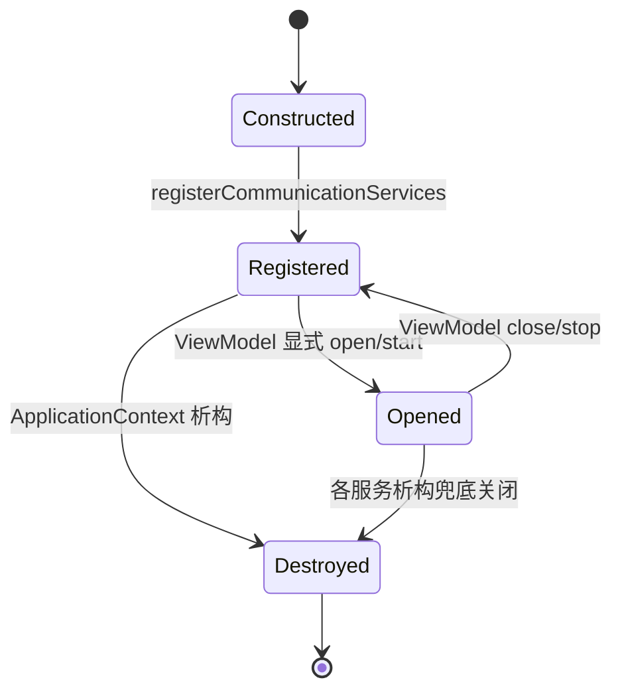

# App 模块 (`dss_app`)

> 命名空间: `Dss::App`
>
> 头文件: `include/dss/app/`
>
> 源文件: `src/app/`
>
> 依赖: `dss_core`, `dss_processing`, `dss_acquisition_qt`, `dss_comm_qt`, `dss_network_qt`

## 模块职责

App 模块是系统的**组合根 (Composition Root)**，负责组装所有子系统、管理全局生命周期、注册通信服务，并通过 ReplaySession 编排回放用例。它是 `main.cpp` 与各业务模块之间的中间层。

## 组件清单

### ApplicationContext

应用上下文，拥有并管理系统的两项基础设施：

| 成员 | 类型 | 职责 |
|------|------|------|
| `m_bus` | `BasicMessageBus<SharedMutexLock>` | 全局事件总线 |
| `m_registry` | `ServiceRegistry` | 服务注册中心 |

**公共 API:**

| 方法 | 说明 |
|------|------|
| `bus()` | 获取消息总线引用 |
| `registry()` | 获取服务注册中心引用 |
| `wireLogger()` | 连接 spdlog 日志门面与事件总线 |
| `loadConfig(path)` | 加载 JSON 配置文件，返回 `std::expected` |
| `registerCommunicationServices()` | 注册所有串口/网络/存储/相机服务 |

### 通信服务注册 (`communication_services.cpp`)

`registerCommunicationServices()` 内部创建并注册以下服务实例。注册后默认不打开串口、不绑定 UDP、不触碰真实硬件；回放源、处理器和存储 worker 由 UI 命令显式启动。

| 服务 | 模块 | 注册名 |
|------|------|--------|
| `DisplayChannel` / `ISerialChannel` | dss_comm_qt | `display` |
| `ExposureChannel` / `ISerialChannel` / `IExposureCommandPort` | dss_comm_qt | `exposure` |
| `MasterControlChannel` / `ISerialChannel` / `IMasterControlStatusPort` | dss_comm_qt | `master_control` |
| `ServoChannel` / `ISerialChannel` / `IServoCorrectionPort` | dss_comm_qt | `servo` |
| `ImageSender` / `INetworkChannel` | dss_network_qt | `image_sender` |
| `Heartbeat` / `INetworkChannel` | dss_network_qt | `heartbeat` |
| `ErrorDiagnostics` / `INetworkChannel` | dss_network_qt | `error_diagnostics` |
| `DataExchange` | dss_network_qt | `data_exchange` |
| `TrackResultDataExchangeBridge` | dss_app | `track_result_data_exchange_bridge` |
| `AtmosReceiver` / `INetworkChannel` | dss_network_qt | `atmos_receiver` |
| `RuntimeDiagnostics` | dss_app | `runtime_diagnostics` |
| `ImageProcessor` | dss_processing | `image_processor` |
| `FrameSourceCoordinator` / `IFrameSource` | dss_acquisition_qt | `frame_source` |
| `ImageSequenceFrameSource` / `IFrameSource` | dss_acquisition_qt | `replay_source` |
| `ReplaySession` | dss_app | `replay_session` |
| `SaperaFrameSource` / `IFrameSource`（条件注册） | dss_acquisition_qt | `sapera_source` |
| `LocalImageStorageBackend` / `IStorageBackend` | dss_core (`Dss::Storage`) | `image_storage` |
| `TrackDataStorageBackend` / `IStorageBackend` | dss_core (`Dss::Storage`) | `track_data_storage` |
| `CommandOnlyCameraController` | dss_acquisition_qt | `camera` |

## 启动流程 (`main.cpp`)

```
1. QApplication 初始化
2. ApplicationContext 构造
3. wireLogger()           → spdlog 日志事件转发就绪
4. loadConfig()           → JSON 配置加载
5. InitDialog 显示        → 初始化进度展示
6. registerCommunicationServices()  → 服务注册
7. MainViewModel 构造     → 创建子 ViewModel 并订阅事件
8. MainWindow 构造/显示   → UI 就绪
9. QApplication::exec()  → 事件循环
```

## 当前缺口

| 缺口 | 说明 |
|------|------|
| 相机串口运行时接线 | 默认注册 `CommandOnlyCameraController`；`SerialCameraController` 已实现但尚未注入具体 `ICameraSerialPort` |
| 数据交换联调 | GXTC/GDCL 端点、编码、显式绑定/关闭和错误显示已完成；仍需补发送样例与接收状态 |
| Sapera 硬件验证 | 可选实时源已注册，默认不启动；按 [硬件验证](hardware-validation.md) 在采集机执行 smoke test |
| CUDA 收益验证 | 策略工厂和基准入口已接入；按 [硬件验证](hardware-validation.md) 完成输出对照与性能门槛后再开放 UI |

## 依赖关系

```
dss_app
├── dss_core
├── dss_processing
├── dss_acquisition_qt
├── dss_comm_qt     (编译时条件: DSS_BUILD_APP)
└── dss_network_qt  (编译时条件: DSS_BUILD_APP)
```
## 深入架构与调用链

### 模块边界与依赖

App 是组合根：创建跨模块对象、决定注册名称、连接回调和事件桥。它不实现串口协议、UDP 编码、图像算法或 Widget。


```mermaid
flowchart LR
    APP["dss_app"] --> CORE["dss_core"]
    APP -. "DSS_BUILD_APP" .-> COMM["dss_comm_qt"]
    APP -.-> NET["dss_network_qt"]
    APP -.-> PROC["dss_processing"]
    APP -.-> ACQ["dss_acquisition_qt"]
    UI["dss_ui_qt"] --> APP
```

| 依赖方向 | 原因 | 主要接口 |
|---|---|---|
| App → Core | 总线、注册表、Host、配置、Logger | `ApplicationContext` |
| App → Comm | 创建四路串口通道并按接口注册 | `ISerialChannel` 与命令端口 |
| App → Network | 创建 UDP 服务和结果交换桥 | `INetworkChannel`、`DataExchange` |
| App → Acquisition | 创建回放/实时帧源和协调器 | `IFrameSource` |
| App → Processing | 创建处理器并连接帧回调 | `ImageProcessor` |
| App → Storage | 创建图像/轨迹存储后端 | `IStorageBackend` |

### 关键类关系


```mermaid
classDiagram
    class ApplicationContext {
        -MessageBus m_bus
        -ServiceRegistry m_registry
        -vector~ScopedConnection~ m_connections
        +wireLogger()
        +loadConfig(path)
        +registerCommunicationServices()
    }
    class TrackResultDataExchangeBridge {
        -MasterControlState m_masterControl
        +onMasterControl(event)
        +onTrackResult(event)
    }
    class RuntimeDiagnostics {
        +snapshot() RuntimeDiagnosticsSnapshot
    }
    class ObservationSession {
        +id string
        +naming ImageStorageNaming
    }
    class ObservationSessionFactory {
        <<function>>
        +makeObservationSession(command, observatory, date)
    }
    class ServiceRegistry
    class BasicMessageBus

    ApplicationContext *-- BasicMessageBus
    ApplicationContext *-- ServiceRegistry
    ApplicationContext o-- TrackResultDataExchangeBridge
    ApplicationContext o-- RuntimeDiagnostics
    TrackResultDataExchangeBridge --> BasicMessageBus
    RuntimeDiagnostics --> BasicMessageBus
    ObservationSessionFactory ..> ObservationSession
```

### 服务注册表真值

`registerCommunicationServices()` 当前注册以下对象。名称是运行时契约，修改时必须同步所有 `tryGet<T>(name)` 调用。

| 名称 | 具体对象 | 注册接口/具体类型 |
|---|---|---|
| `display` | `DisplayChannel` | `ISerialChannel` |
| `exposure` | `ExposureChannel` | `ISerialChannel`、`IExposureCommandPort` |
| `master_control` | `MasterControlChannel` | `ISerialChannel`、`IMasterControlStatusPort` |
| `servo` | `ServoChannel` | `ISerialChannel`、`IServoCorrectionPort` |
| `image_sender` | `ImageSender` | 具体类型、`INetworkChannel` |
| `heartbeat` | `Heartbeat` | 具体类型、`INetworkChannel` |
| `error_diagnostics` | `ErrorDiagnostics` | 具体类型、`INetworkChannel` |
| `atmos_receiver` | `AtmosReceiver` | 具体类型、`INetworkChannel` |
| `data_exchange` | `DataExchange` | 具体类型 |
| `camera` | `CommandOnlyCameraController` | `ICameraController` |
| `image_storage` | `LocalImageStorageBackend` | 具体类型、`IStorageBackend` |
| `track_data_storage` | `TrackDataStorageBackend` | 具体类型、`IStorageBackend` |
| `image_processor` | `ImageProcessor` | 具体类型 |
| `replay_source` | `ImageSequenceFrameSource` | 具体类型、`IFrameSource` |
| `replay_session` | `ReplaySession` | 具体类型 |
| `sapera_source` | `SaperaFrameSource`（可选） | `IFrameSource` |
| `frame_source` | `FrameSourceCoordinator` | 具体类型、`IFrameSource` |
| `track_result_data_exchange_bridge` | 结果交换桥 | 具体类型 |
| `runtime_diagnostics` | `RuntimeDiagnostics` | 具体类型 |

同一 `shared_ptr` 可以按多个接口注册；Registry 只是共享所有权和查找入口，不会复制对象。

### 组合根注册流程


```mermaid
sequenceDiagram
    participant Ctx as ApplicationContext
    participant Reg as ServiceRegistry
    participant Bus as MessageBus
    participant Coord as FrameSourceCoordinator
    participant Processor as ImageProcessor
    participant Store as Storage
    participant Bridge as DataExchangeBridge

    Ctx->>Reg: 注册四路串口
    Ctx->>Reg: 注册网络服务与 DataExchange
    Ctx->>Bridge: 注入 GXTC/GDCL 发送 lambda
    Bridge->>Bus: 订阅 MasterControlEvent/TrackResultEvent
    Ctx->>Reg: 注册相机控制、两个存储后端
    Ctx->>Reg: 注册 ImageProcessor
    Ctx->>Coord: registerSource(Replay)
    opt DSS_HAS_SAPERA
        Ctx->>Coord: registerSource(Live)
    end
    Ctx->>Coord: setFrameCallback(...)
    Ctx->>Reg: 注册 frame_source
    Ctx->>Bus: 订阅 TrackResultEvent → 轨迹存储
    Ctx->>Reg: 注册 RuntimeDiagnostics
```

### 帧回调的真实调用栈


```mermaid
flowchart TD
    SOURCE["活动 IFrameSource"] --> CB["Coordinator 转发 FrameCallback"]
    CB --> CHECK{"图像存储正在运行<br/>且 rawImage 非空？"}
    CHECK -->|"是"| META["从 FramePacket 构造 RawImageMetadata"]
    META --> ENQ["LocalImageStorageBackend::enqueueSessionFrame"]
    CHECK -->|"否"| SUBMIT["ImageProcessor::submitFrame"]
    ENQ --> SUBMIT
    SUBMIT --> QUEUE{"处理队列有空间？"}
    QUEUE -->|"是"| WORKER["ImageProcessor 工作线程"]
    QUEUE -->|"否"| DROP["droppedFrames++"]
```

Raw 存储在处理前入队，因此保存的是采集原始像素；轨迹数据则由 `TrackResultEvent` 订阅者异步入队。两者的启用状态都由 UI 显式控制。

### 跟踪结果到网络交换


```mermaid
sequenceDiagram
    participant Processor as ImageProcessor
    participant Bus as MessageBus
    participant Bridge as TrackResultDataExchangeBridge
    participant Exchange as DataExchange

    Processor->>Bus: emit(TrackResultEvent)
    Bus->>Bridge: onTrackResult(event)
    Bridge->>Bridge: makeResultPackets(targets)
    Bridge->>Bridge: 合并最近 MasterControlState
    opt GXTC 开启
        Bridge->>Bridge: makeGxtcMetadata/Targets
        Bridge->>Exchange: sendGxtc()（仅 Exchange 已打开）
    end
    opt GDCL 开启且目标匹配主控 targetId
        Bridge->>Bridge: makeGdclMeasurement
        Bridge->>Exchange: sendGdcl()（仅 Exchange 已打开）
    end
```

桥接器缓存最近一次 `MasterControlEvent`，用它补充测量状态与目标匹配。发送 lambda 在 `DataExchange::isOpen()` 为 false 时直接跳过，不会自动打开端点。

### 主控到观测会话

`MainViewModel::onMasterControl()` 使用 App 的 `ObservationSession` 把主控起止时间、任务/目标编号和台站 ID 转成统一存储命名。跨午夜时结束日期自动加一天；`targetId == 0` 表示搜索模式。会话构造失败时只能提示错误，不应启动半套存储服务。

### 生命周期与当前缺口


```mermaid
stateDiagram-v2
    [*] --> Constructed
    Constructed --> Registered: registerCommunicationServices
    Registered --> Opened: ViewModel 显式 open/start
    Opened --> Registered: ViewModel close/stop
    Registered --> Destroyed: ApplicationContext 析构
    Opened --> Destroyed: 各服务析构兜底关闭
    Destroyed --> [*]
```

- 实际生命周期由 ViewModel 的业务命令驱动；Registry 中对象析构时，各具体服务仍以 `close()` / `stop()` 兜底。
- `open/close` 与 `start/stop` 由服务内部生命周期锁串行化，周期线程使用可由 `stop_token` 中断的等待。
- **关机顺序**：`main()` 在 `QApplication::exec()` 返回后先调用 `MainViewModel::shutdown()`，关闭 ReplaySession 并 join 服务线程；随后调用 `ApplicationContext::shutdown()`。组合根在所有服务和订阅仍存活时显式关闭外部输入，再次幂等关闭 ReplaySession，再停止并 join 帧源、处理器，排空存储并关闭网络服务；最后释放组合根订阅、注册表和停止回调持有的服务引用。外部 shared_ptr 不会使停止动作失效。析构仅作幂等兜底，不能用注册表元素析构顺序代替生命周期协议。COW 派发中的退订不是等待屏障，必须先结束生产线程再销毁订阅者。

### 线程、错误与诊断

- App 中 ReplaySession 拥有串行命令线程；组合根创建的 Processing、Acquisition、Storage、Comm、Network 服务各自管理线程。
- 帧回调可能来自回放线程或 Sapera SDK 回调线程；回调只做有界入队，不应添加阻塞 UI 操作。
- `RuntimeDiagnostics` 用原子计数统计网络、串口、存储错误，并通过注入的 reader 读取处理丢帧、存储计数及处理/存储/图像发送资源快照。字节口径与压力验证见 [资源验证](resource-validation.md)。
- 配置加载失败返回 `unexpected`；文件日志配置失败只记录警告，不让整体配置加载失败。
- 注册表名称错误通常表现为 ViewModel 获取服务失败，测试应同时覆盖具体类型和接口类型查询。

### 扩展、测试与阅读顺序

新增服务时按顺序完成：创建实例 → 注入总线/配置 → 连接回调 → 以需要的接口和具体类型注册 → 明确谁启动/停止 → 增加注册契约测试。不要在 ViewModel 中临时 new 第二份业务服务。

重点测试：`test_application_context_services.cpp`、`test_observation_session.cpp`、`test_track_result_data_exchange_bridge.cpp`、`test_runtime_diagnostics.cpp`、`test_main_view_model.cpp`。

推荐源码顺序：`application_context.h/.cpp` → `communication_services.cpp` → `track_result_data_exchange_bridge.*` → `observation_session.*` → `runtime_diagnostics.*` → `src/main.cpp`，再跳到各服务的具体模块。

### ReplaySession 的状态和线程契约

`ReplaySession` 由组合根创建并以 `replay_session` 注册；服务创建时启动一个等待命令的线程，尚不启动回放或处理器。接口与实现不使用 QObject、QString 或 Qt 事件循环，但复用的图像解码器依赖 Qt，因此本服务仅在 `DSS_BUILD_APP=ON` 时编译。

| 状态 | 含义及允许的下一步 |
|---|---|
| Idle | 未运行；可选序列、开始、单步、定位 |
| Loading | 正在执行已接受命令；只接受停止/关闭 |
| Running | 连续播放；可停止、换序列、单步或定位；重复 start 拒绝 |
| Stopping | 等待源退出和处理队列回收；拒绝普通命令 |
| Completed | 正常 EOF 且处理队列已排空；start 从头开始 |
| Failed | 初始化、解码或处理失败；start/step 重新加载已选序列并清历史 |
| Closed | shutdown 已完成；永久拒绝新命令 |

`selectFiles/start/step/seek` 的成功返回只表示命令被接受，不能立即接下一条命令。读取一致的 `snapshot()` 判断完成；界面额外等待其快照被映射，避免排队的旧状态覆盖新操作。命令槽容量为一，停止意图单独保存并优先处理。停止请求通过 stop_token 取消单步无损提交等待，不在状态锁内执行回调、源启停或 join。

普通暂停先停止生产者再 drain，保留策略历史；换序列、后退、定位及 EOF 重播清理历史。运行中的定位完成后恢复连续播放。单步也在返回空闲前 drain，因此“单步完成”包含处理完成。服务线程每 25 ms 检查连续回放 EOF/失败；正常结束同样先 drain，再检查 `ImageProcessor::hasFailed()`，末帧失败不能成为 Completed。已发生的失败不会被随后 stop 抹掉。

`shutdown()` 先封闭命令入口、请求取消，再 join；它是允许阻塞的最终关闭屏障，析构作幂等兜底。文件读取/解码和已进入的处理回调不支持强制中断，取消及关闭仍须等待它们返回。服务独占回放生命周期操作；不允许其他线程直接启停/reset 相同依赖对象。

回归入口 `test_replay_session` 不创建 Qt 窗口，也不创建 QCoreApplication，使用 RAW 文件和标准 C++ 同步验证状态转换；链接仍需要 Qt 解码依赖。core-only sanitizer 任务不包含此测试；公共 Qt ASan 配置覆盖 ReplaySession、回放/主/显示 ViewModel 及网络测试，详见 [sanitizer 验证](sanitizer-validation.md)。
