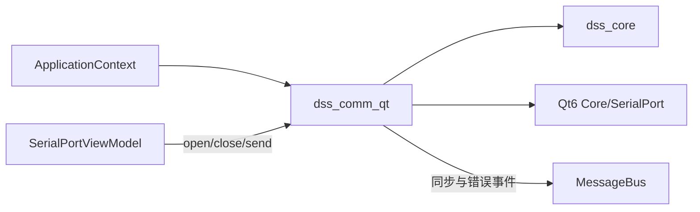
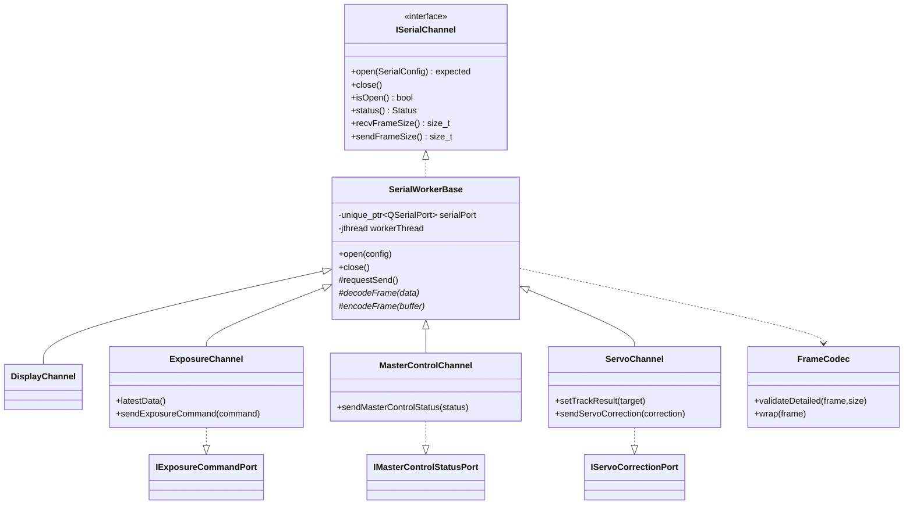
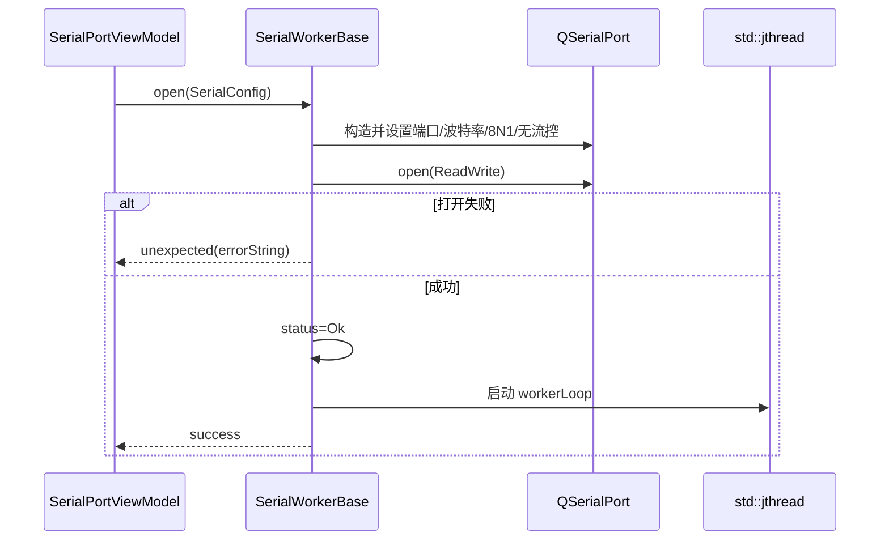
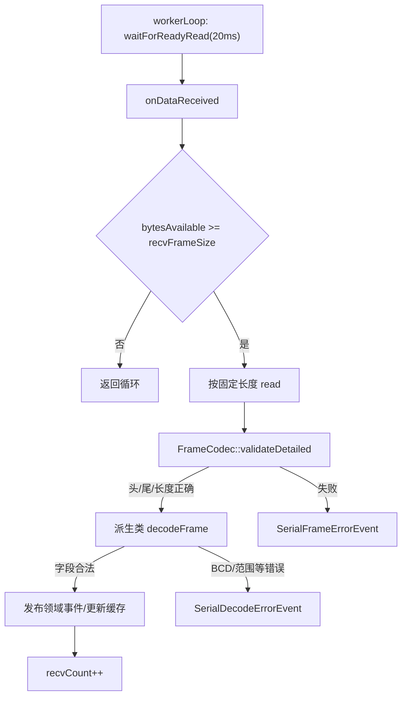
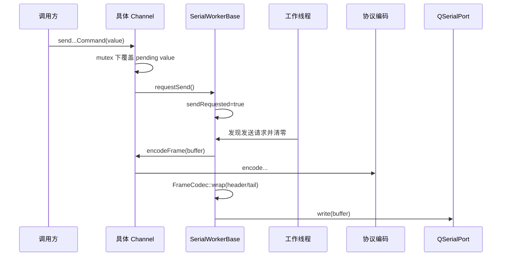

# Comm 模块 (`dss_comm_qt`)

> 命名空间: `Dss::Comm`
>
> 头文件: `include/dss/comm/`
>
> 源文件: `src/comm/`
>
> 依赖: `dss_core`, `Qt6::Core`, `Qt6::SerialPort`

## 模块职责

Comm 模块封装四路串口通信通道，负责与天文设备的低层协议交互。每路串口有独立的帧格式（收/发字节数不同），通过统一的 `SerialWorkerBase` 基类管理 Qt 串口线程。

## 协议帧格式

所有串口帧使用相同的封帧方式：
- 帧头: `0x7E`
- 帧尾: `0xE7`
- 数据: 中间字节

| 通道 | 接收帧长 | 发送帧长 | 用途 |
|------|---------|---------|------|
| Display | 20 字节 | 9 字节 | 显示同步 (25Hz) |
| Exposure | 23 字节 | 8 字节 | 曝光参数同步 |
| MasterControl | 30 字节 | 28 字节 | 主控指令 |
| Servo | 20 字节 | 14 字节 | 伺服修正 |

## 组件清单

### 1. FrameCodec (`frame_codec.h`)

帧编解码基础：

| 方法 | 说明 |
|------|------|
| `validate(frame, expectedSize)` | 验证帧头/尾和长度 |
| `validateDetailed(frame, expectedSize)` | 返回帧长、头尾字节和失败原因，供日志/诊断使用 |
| `failureMessage(reason)` | 将失败原因转换为稳定诊断文本 |
| `wrap(frame)` | 写入帧头帧尾 |

### 2. SerialProtocolCodec (`serial_protocol_codec.h`)

所有四路协议的编解码函数（header-only），核心编解码逻辑集中在此。

**解码函数:**
- `decodeDisplayFrame(frame)` → `ExposureDisplayData`
- `decodeExposureFrame(frame)` → `ExposureDisplayData`
- `decodeMasterControlFrame(frame)` → `MasterControlCommand`
- `decode*FrameDetailed(frame)` → 保留 `SerialDecodeError` 的字段名、偏移和原始值，用于接收诊断

**编码函数:**
- `encodeExposureCommand(command, frame)` → 曝光指令帧
- `encodeServoCorrection(correction, frame)` → 伺服修正帧
- `encodeMasterControlStatus(status, frame)` → 主控状态帧

**数据编码细节:**
- 时间: BCD 编码 (`decodeBcd` / `encodeBcd`)
- 角度: 29 位定点数 (0~360°，精度约 0.00000067°)
- 距离/速度: 有符号幅值编码 (16/24 位)
- 字节序: 小端 (Little-Endian)

### 3. ISerialChannel (`i_serial_channel.h`)

串口通道抽象接口：

```cpp
class ISerialChannel {
    virtual void open(config) = 0;
    virtual void close() = 0;
    virtual bool isOpen() const = 0;
    virtual auto recvFrameSize() const -> size_t = 0;
    virtual auto sendFrameSize() const -> size_t = 0;
};
```

### 4. 串口命令接口 (`serial_command_interfaces.h`)

命令发送入口按职责拆成窄接口，避免 UI 或 ViewModel 依赖具体通道类：

| 接口 | 注册名 | DTO | 用途 |
|------|--------|-----|------|
| `IExposureCommandPort` | `exposure` | `ExposureCommand` | 曝光触发模式、帧频编码、曝光延迟 |
| `IServoCorrectionPort` | `servo` | `ServoCorrection` | 伺服距离/速度修正 |
| `IMasterControlStatusPort` | `master_control` | `MasterControlStatus` | 主控状态回包 |

这些接口只缓存 DTO 并请求发送，真实串口仍必须经 `ISerialChannel::open()` 显式打开。

### 5. SerialWorkerBase (`serial_worker_base.h`)

Qt `QSerialPort` 工作线程基类（pimpl 隐藏 Qt 依赖）：

- 内部线程持有 `QSerialPort` 实例
- `open()` — 配置并打开串口
- 收到完整帧后调用虚函数 `decodeFrame()`
- 发送时调用虚函数 `encodeFrame()`
- 接收帧头尾/长度校验失败时发布 `SerialFrameErrorEvent`，由 UI 日志页展示
- 接收帧通过固定帧校验但字段解码失败时发布 `SerialDecodeErrorEvent`

### 6. 四路通道实现

| 类 | 旧版 | 接收处理 | 发送处理 |
|---|------|---------|---------|
| `DisplayChannel` | `CommDisplay` | 解码 → 发布 `Sync25HzEvent` | — |
| `ExposureChannel` | `CommExposure` | 解码 → 缓存 `latestData()` + 发布 `ExposureSyncEvent` | `IExposureCommandPort` → 曝光指令 |
| `MasterControlChannel` | `CommMasterControl` | 解码 → 发布 `MasterControlEvent` | `IMasterControlStatusPort` → 主控状态回复 |
| `ServoChannel` | `CommServo` | — | `setTrackResult()`/`IServoCorrectionPort` → 编码修正帧 |

## 帧数据布局 (接收)

### Display 帧 (20 字节)
```
[0]     帧头 0x7E
[1]     年 (BCD, +2000)
[2]     月 (BCD)
[3]     日 (BCD)
[4]     时 (BCD)
[5]     分 (BCD)
[6]     秒 (BCD)
[7-8]   毫秒 (U16LE, ÷10)
[9-12]  方位角 (U32LE, 角度码)
[13-16] 俯仰角 (U32LE, 角度码)
[17-18] (保留)
[19]    帧尾 0xE7
```

### MasterControl 帧 (30 字节)
```
[0]     帧头 0x7E
[1-2]   (保留)
[3-5]   曝光时间 (U24LE, ÷100 → ms)
[6]     (保留)
[7]     mode1
[8]     mode2
[9]     跟踪开关 (0xFF=开)
[10]    存储开关 (0xFF=开)
[11-13] 目标ID (U24LE)
[14-16] 任务ID (U24LE)
[17-19] 开始时间 (时/分/秒)
[20-22] 结束时间 (时/分/秒)
[23-28] (保留)
[29]    帧尾 0xE7
```

## 当前缺口

| 缺口 | 说明 |
|------|------|
| 接收侧运行诊断仍需细化 | 帧长/头尾校验失败已发布 `SerialFrameErrorEvent`；显示/曝光 BCD 时间和主控时间窗口字段解码失败已发布 `SerialDecodeErrorEvent`，并进入 UI 日志页 Warning 级别缓存；后续补统计聚合和更多协议字段约束 |
| 错误处理 | 串口断连/重连机制待完善 |

## 依赖关系

```
dss_comm_qt
├── dss_core
├── Qt6::Core
└── Qt6::SerialPort
```
## 深入架构与调用链

### 模块边界与依赖

Comm 把四路遗留定长串口协议封装成统一通道和类型化命令端口。它负责串口打开、工作循环、帧校验、编解码和事件发布；不负责 UI 表单、跟踪算法或网络协议。



### 关键类关系



### 打开与工作线程



当前 `QSerialPort` 在调用 `open()` 的线程创建，随后在 `std::jthread` 中调用阻塞读写，没有使用 `QThread::moveToThread()`。这是必须通过真实硬件验收的线程亲和性边界；若重构，应在工作线程内创建/销毁端口，或统一改为 Qt 线程事件循环模型。

### 接收调用栈



基础层只做定长帧和首尾字节校验；字段范围由 `serial_protocol_codec.h` 详细解码器检查。当前读取按固定块切分，不包含从噪声流中扫描帧头的重同步状态机，线路丢字节后可能连续错位，属于硬件联调重点。

### 发送调用栈



发送请求是布尔标志，不是命令队列；工作线程取走之前的多次调用会合并为“发送最新 pending 值”。这适合状态/修正量更新，不适合要求逐条可靠送达的事务命令。

### 四路协议行为

| 通道 | 接收成功 | 发送载荷 | 运行时接口 |
|---|---|---|---|
| Display | 解码指向时间数据后发布 `Sync25HzEvent` | 当前无有效载荷 | `ISerialChannel` |
| Exposure | 缓存 `ExposureDisplayData`，发布 `ExposureSyncEvent` | `ExposureCommand` | `IExposureCommandPort` |
| MasterControl | 转换并发布 `MasterControlEvent` | `MasterControlStatus` | `IMasterControlStatusPort` |
| Servo | 当前接收解码为空 | `ServoCorrection` | `IServoCorrectionPort` |

`ServoChannel::setTrackResult()` 可把 `TargetInfo` 的 AE 位置/速度换算成角秒修正并请求发送，但当前 App 没有自动订阅 `TrackResultEvent` 调用它；通信页支持显式发送修正命令。

### 协议层次


所有多字节字段、缩放系数和 BCD 范围应集中在 codec；Channel 只做状态缓存和事件映射。新增字段不要在 UI 或 worker 里直接按偏移读写。

### 生命周期、线程与错误

| 状态/数据 | 保护 |
|---|---|
| status、收发计数/FPS | atomic |
| `sendRequested` | send mutex |
| 各通道 pending 命令与 latest data | 各自 mutex |
| QSerialPort | 当前由 worker 执行 I/O；线程亲和需硬件验证 |
| 总线事件 | 在串口 worker 线程同步发布 |

`close()` 请求停止并 join，然后关闭/释放串口，状态回到 Init。帧结构错误和字段解码错误分别发布不同事件，`ErrorDiagnostics` 会把 Display/Exposure 错误标记为通信失败，`RuntimeDiagnostics` 统一累计串口错误数。

### 配置、扩展与测试

端口名和波特率来自 `Config::comm()`，UI 可编辑并保存；应用修改配置时会先关闭已打开通道，避免在运行中替换端口参数。新增协议应先增加 `SerialProtocol` layout 和 codec 测试，再实现薄 Channel，最后注册接口和 UI。

重点测试：`test_frame_codec.cpp`、`test_serial_protocol_codec.cpp`、`test_serial_port_view_model.cpp`、`test_application_context_services.cpp`。真实串口还需覆盖断线、噪声错位、半帧、持续高频发送和关闭竞态。

推荐源码顺序：`i_serial_channel.h` → `frame_codec.h` → `serial_protocol_codec.h` / detail → `serial_command_interfaces.h` → `serial_worker_base.*` → 四个 Channel → App 注册 → `SerialPortViewModel` 和通信面板。
