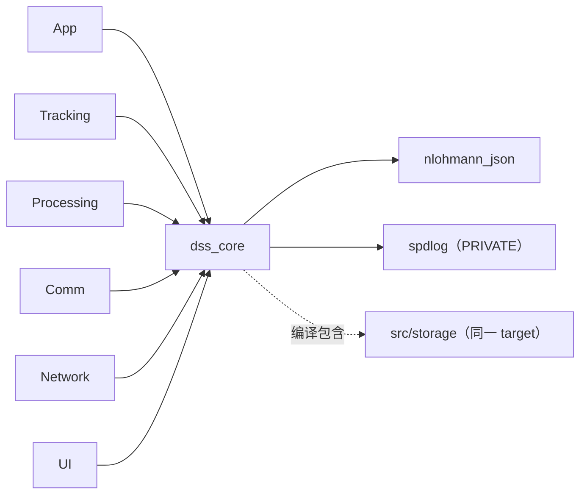
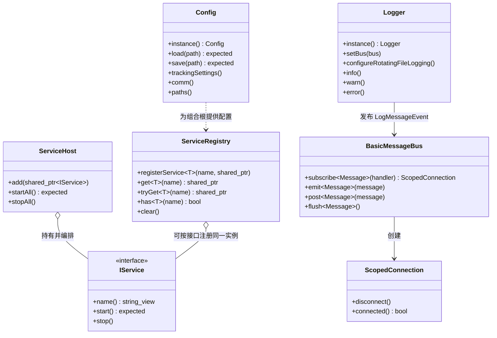
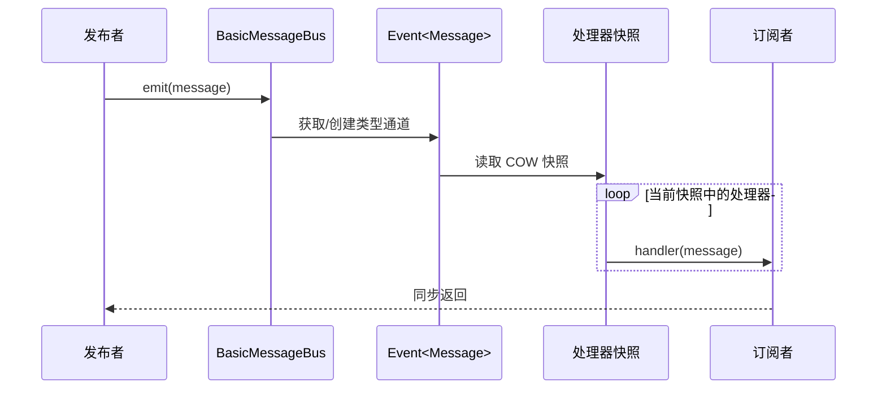
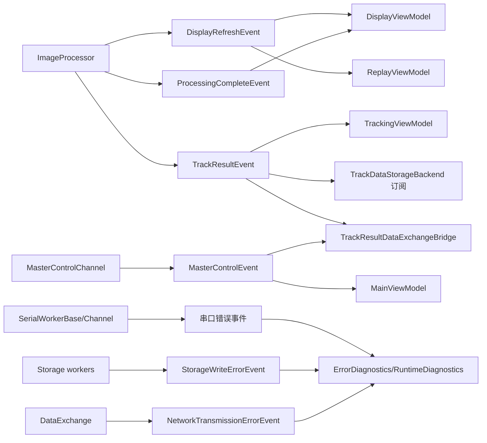
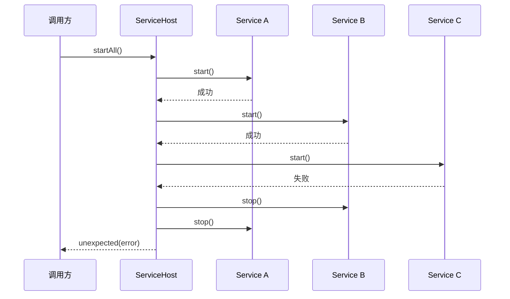
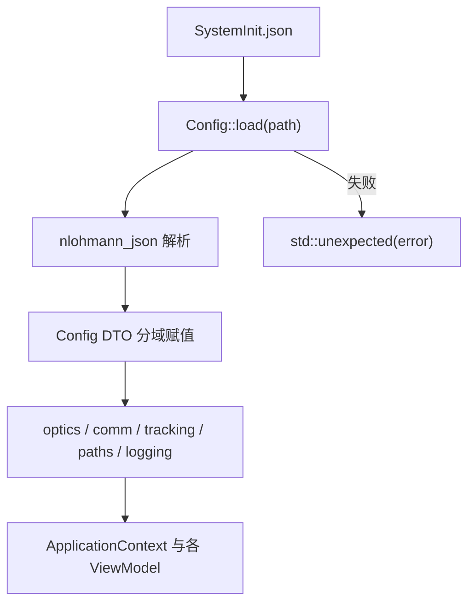

# Core 模块 (`dss_core`)

> 命名空间: `Dss::Core`、`Dss::Evt`
>
> 头文件: `include/dss/core/`
>
> 源文件: `src/core/`
>
> 依赖: `nlohmann_json`；私有使用 `spdlog`

## 模块职责

Core 模块是整个系统的基础层，提供所有其他模块共享的类型定义、事件系统、配置管理和服务基础设施。该模块完全不依赖 Qt，可独立编译和测试。

## 组件清单

### 1. 类型系统 (`types.h`)

定义全局共享的领域数据结构，所有结构体均为纯数据对象 (POD-like)。

| 类型 | 用途 |
|------|------|
| `Timestamp` | 时间戳 (年月日时分秒毫秒微秒) |
| `TimeOfDay` | 时分秒 |
| `OpticParams` | 光学参数 (图像尺寸、视场中心、像元比例) |
| `Vec2f` / `Vec2d` | 二维向量 (float/double) |
| `MeasuredBlob` | 单个目标检测结果 (质心、边界、灰度、面积、方位角/俯仰角等) |
| `FrameMeasurements` | 单帧全部检测结果 (时间戳、序号、所有目标/星体) |
| `TargetFrameInfo` | 单帧中单个目标的状态 |
| `TargetInfo` | 跨帧的目标跟踪状态 (历史帧信息、预测位置/速度) |
| `ImageStats` | 图像统计量 (最大/最小/均值/标准差) |
| `TrackingSettings` | 跟踪参数 (搜索半径、活性阈值、GEO FullLEO/RA-Dec 阈值等) |
| `ExposureDisplayData` | 曝光/显示同步数据 |
| `ResultPacket` | 测量结果数据包，作为 UI、存储和 GXTC/GDCL 映射的共享 DTO，包含目标位置、角速度、光度和环境数据 |
| `PointingErrorResult` | 指向误差模型参数 |

### 1.1 结果包工具 (`result_packet_utils.h`)

将跟踪策略输出的 `TargetInfo` 归一为 `ResultPacket`，避免 UI、存储、网络分别读取 `frameInfos.back()` 并重复拼字段。当前结果包会带出最新帧测量、轴系/天文定位、预测角速度和星等，供轨迹文本和 GXTC/GDCL 协议 adapter 复用。

| 函数 | 说明 |
|------|------|
| `latestTargetFrameInfo(target)` | 获取目标轨迹最新帧，空轨迹返回 `nullptr` |
| `makeResultPacket(target)` | 从最新帧构造通用测量结果数据包，空轨迹返回空 |
| `makeResultPackets(targets)` | 批量构造结果包并跳过空轨迹 |

### 2. 常量 (`constants.h`)

类型安全的枚举和编译期常量，替代旧版 `DefinedMacro.h` 中的宏定义。

**枚举类型:**

| 枚举 | 值 | 用途 |
|------|-----|------|
| `InitStatus` | Ok, ErrorCommNetSettings, ErrorPath, ... | 初始化状态 |
| `Status` | Init, Error, Ok | 三态运行状态 |
| `TriggerMode` | External, Free | 相机触发模式 |
| `CommDisplayMode` | PortInit, Recv, Send, RecvCheck | 串口显示模式 |
| `ProcessingMode` | None, Diff, Direct | 图像处理模式 |
| `TrackMode` | Init, Geo, SpaceCatalog, Leo, Manual | 跟踪模式 |

**天文常量:**
- `Pi`, `DegToRad`, `RadToDeg`, `ArcSecToRad`, `RadToArcSec`, `SecToRad`, `SolarSiderealRatio`

**协议常量:**
- `FrameHeader` (0x7E), `FrameTail` (0xE7)

### 3. 事件系统 (`events.h`)

定义在 `BasicMessageBus` 上传播的类型化事件载荷。

| 事件 | 生产者 | 消费者 |
|------|--------|--------|
| `FrameAcquiredEvent` | 预留事件；当前帧源使用 `IFrameSource` callback | — |
| `GrabStartedEvent` / `GrabStoppedEvent` | `ReplayViewModel` | UI 状态订阅者 |
| `DisplayRefreshEvent` | `ImageProcessor` | `DisplayViewModel` → `ImageDisplay` |
| `ProcessingCompleteEvent` | `ImageProcessor` | `DisplayViewModel` |
| `RotatedFrameReadyEvent` | `ImageProcessor` | 存储/扩展订阅者 |
| `TrackResultEvent` | `ImageProcessor` | `TrackingViewModel`、Storage、DataExchange bridge |
| `ImageSendEvent` | `ImageProcessor` / `ImageSender` | 图像发送状态订阅者 |
| `NetworkTransmissionErrorEvent` | `DataExchange` | `LogViewModel` / Logger |
| `SerialFrameErrorEvent` | `SerialWorkerBase` | `LogViewModel` |
| `SerialDecodeErrorEvent` | Serial Channel | `LogViewModel` |
| `MasterControlEvent` | `MasterControlChannel` | `MainViewModel`、DataExchange bridge |
| `ExposureSyncEvent` | ExposureChannel | 当前无后端订阅 |
| `Sync25HzEvent` | DisplayChannel | 当前无后端订阅 |
| `ManualTargetSelectEvent` | UI | 语义通知；实际目标通过 ViewModel 直接配置 |
| `ZoomChangeEvent` | UI | 当前无 ImageDisplay 订阅；控件直接处理滚轮 |
| `CloseEvent` | UI | ApplicationContext |
| `LogMessageEvent` | Logger | UI Log Panel，带 `LogLevel` 供分级过滤 |
| `AtmosphereDataEvent` | AtmosReceiver | — |

### 4. 事件总线 (`event_bus.h`)

命名空间 `Dss::Evt`，从旧版 `eventBus17.hpp` 移植并增强。

**核心组件:**

- **`Event<Signature, Combiner, LockPolicy>`** — 类型化事件，支持 void 和有返回值两种特化
  - `subscribe()` → 返回 `ScopedConnection`（RAII 自动断连）
  - `emit()` — 同步分发给所有处理器
  - `post()` / `flush()` — 延迟分发（先入队，后批量触发）
- **`BasicMessageBus<LockPolicy>`** — 基于 `type_index` 的消息总线
  - `subscribe<Message>()` — 按类型订阅
  - `emit<Message>()` — 按类型分发
  - `post()` / `flush()` — 延迟分发
- **`ScopedConnection`** — RAII 连接管理器，析构时自动断开订阅
- **`Delegate<R(Args...)>`** — 类型擦除的可调用对象包装

**锁策略:**
- `NoLock` — 单线程，零开销
- `SharedMutexLock` — 多线程安全（读写锁）

**Copy-on-Write:** 处理器列表使用 COW 快照模式，`emit()` 执行时持有快照的共享指针，确保分发期间可安全修改订阅列表。

### 5. 配置系统 (`config.h` / `config_types.h`)

取代旧版 `GlobalParameter` + `QSettings`/INI 方案，使用 JSON 格式。

**`Config` 类 (单例):**
- `load(path)` — 从 JSON 文件加载配置
- `save(path)` — 保存到 JSON 文件
- 分域访问器: `optics()`, `comm()`, `tracking()`, `paths()` 等
- 可变访问器: `mutableOptics()` 等

**配置 DTO:**
- `SerialConfig` — 串口配置 (端口名、波特率)
- `UdpEndpointConfig` — UDP 端点配置 (地址、端口)
- `CommNetConfig::exchangeGxtc/exchangeGdcl` — GXTC/GDCL 独立数据交换端点；旧 `exchange` 配置仍会兼容推导

### 6. 服务基础设施

**`IService`** (`i_service.h`) — 服务生命周期接口:
- `name()` → 服务名称
- `start()` → 启动
- `stop()` → 停止

**`ServiceHost`** (`service_host.h`) — 有序服务启停:
- `add(service)` — 注册服务
- `startAll()` — 按注册顺序启动
- `stopAll()` — 按逆序停止

**`ServiceRegistry`** (`service_registry.h`) — 按类型索引的服务查找:
- `registerService<T>(name, instance)` — 注册
- `get<T>(name)` — 获取（不存在则抛异常）
- `tryGet<T>(name)` — 获取（不存在返回 nullptr）

### 7. 日志 (`logger.h`)

基于 spdlog 和事件总线的日志系统，替代旧版 `MyLog`。

- `Logger::info()`, `warn()`, `error()` — 写日志并写入 `LogLevel`，支持 `std::format` 风格参数
- 内部使用 spdlog logger，并通过自定义 sink 发布 `LogMessageEvent` 到消息总线
- UI 可按 Info/Warning/Error 过滤和着色显示日志
- 由 `ApplicationContext::wireLogger()` 初始化连接

## 依赖关系

```
dss_core
├── nlohmann_json::nlohmann_json
└── spdlog::spdlog
```

Core 模块是所有其他模块的基础依赖，不依赖 Qt 或任何其他项目模块。
## 深入架构与调用链

### 边界与一跳依赖

Core 负责稳定的数据契约和基础设施，不负责 Qt 对象、硬件 I/O、图像算法或业务页面。它是其余模块可以共同依赖的“内层”；Storage 源文件虽然位于独立命名空间和目录，当前仍与 Core 一起编译。



| 依赖 | 用途 | 暴露方式 |
|---|---|---|
| `nlohmann_json` | JSON 配置序列化/反序列化 | `PUBLIC` |
| `spdlog` | 日志后端与 sink | `PRIVATE` |
| C++ 标准库 | `expected`、线程同步、类型索引、智能指针 | 公共接口直接使用 |
| Qt | 无 | Core 必须保持 Qt-free |

### 关键类关系



`ServiceRegistry` 与 `ServiceHost` 解决不同问题：前者按“类型 + 名称”查找共享实例，后者按顺序拥有 `IService` 并负责启停回滚。把对象放进 Registry 不会自动启动它，也不会自动进入 Host。

### 事件分发调用栈



- `emit()` 同步执行，不切线程。
- `post()` 只入队，直到调用对应类型的 `flush()` 才分发。
- `ScopedConnection` 析构断连；订阅者类通常把它保存在 `std::vector` 中，使订阅生命周期与对象一致。
- COW 快照允许处理器执行期间发生订阅/取消订阅，但业务对象本身的线程安全仍由业务代码负责。

### 当前事件连接真值

上方“事件系统”表同时列出了语义用途；实际已经接通的关键路径如下：



`ExposureSyncEvent`、`Sync25HzEvent`、`ManualTargetSelectEvent`、`ZoomChangeEvent` 已有发布点，但不要仅凭事件名称假设存在后端订阅。当前手动目标的真正配置路径是 `TrackingViewModel::selectTarget() → configureTrackingStrategy() → ManualTracker::setManualTarget()`；图像缩放由 `ImageDisplay::wheelEvent()` 直接处理。

### ServiceHost 启停与回滚



`stopAll()` 始终按注册逆序停止。Host 已进入启动/运行状态后不应再随意追加服务；这样可以保证依赖服务晚启动、早停止。

### 配置加载链



配置是进程级单例。读取通常发生在启动阶段，UI 设置页可能修改可变 DTO 并保存；新增字段时必须同时检查默认值、JSON 兼容读取、保存输出和 `test_config.cpp`。

### 线程与所有权

| 组件 | 所有权 | 线程安全策略 |
|---|---|---|
| App 中的 `BasicMessageBus<SharedMutexLock>` | `ApplicationContext` 独占 | 通道表与处理器列表使用共享互斥/COW；处理器内容不自动受保护 |
| `ServiceRegistry` | `ApplicationContext` 独占，内部持有 `shared_ptr` | `shared_mutex` 保护注册和查询 |
| `ServiceHost` | `ApplicationContext` 独占 | 生命周期操作应由单一编排线程执行 |
| `Config` / `Logger` | 静态单例 | 启动期配置；并发变更要额外审查 |
| 领域 DTO | 值对象或智能指针只读快照 | 跨线程优先移动值或传 `shared_ptr<const T>` |

### 错误与诊断

- 配置、服务启动使用 `std::expected<..., std::string>`，调用方必须检查，不能只依赖日志。
- 运行期串口、网络、存储错误通过类型化事件扇出到诊断与日志。
- Registry 的 `get()` 是强约束查询，缺失会抛异常；UI 的可选功能通常使用 `tryGet()` 并转换成状态提示。
- Logger 在 `wireLogger()` 后才会把日志发布到总线；`ApplicationContext` 析构时先停止服务，再断开 Logger 的总线指针。

### 扩展、测试与阅读顺序

新增跨模块数据时，优先在 `types.h` 定义稳定 DTO；只用于通知的载荷放进 `events.h`。新增服务接口时，先判断是否真的需要统一 `IService` 生命周期，避免把 Registry 当作服务定位器滥用。

重点测试：

- `test_event_bus_primitives_header.cpp`、`test_event_header.cpp`
- `test_service_registry.cpp`、`test_service_host.cpp`
- `test_config.cpp`、`test_logger.cpp`
- `test_result_packet_utils.cpp`

推荐源码顺序：`types.h` → `events.h` → `event_bus.h` → `service_registry.h` → `i_service.h` / `service_host.*` → `config_types.h` / `config.*` → `logger.*` → `result_packet_utils.*`。
