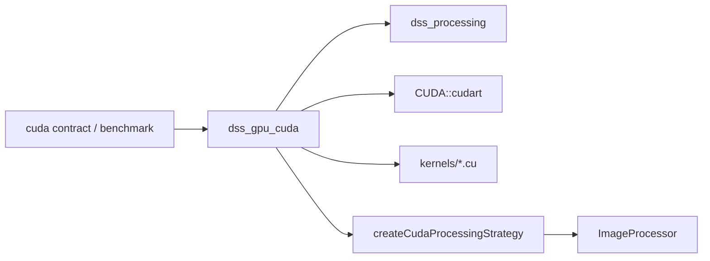
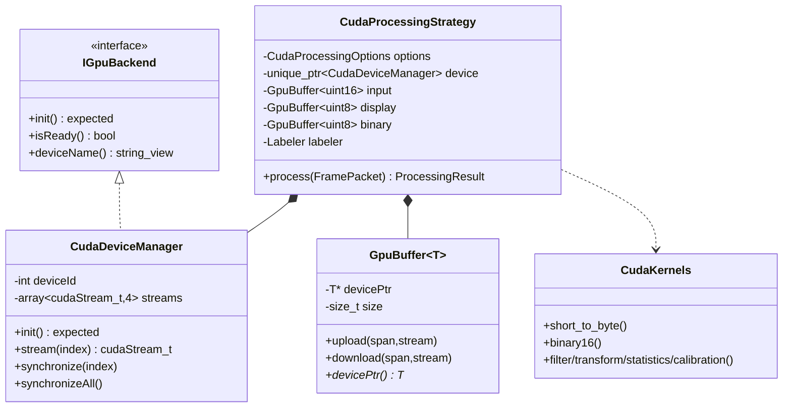
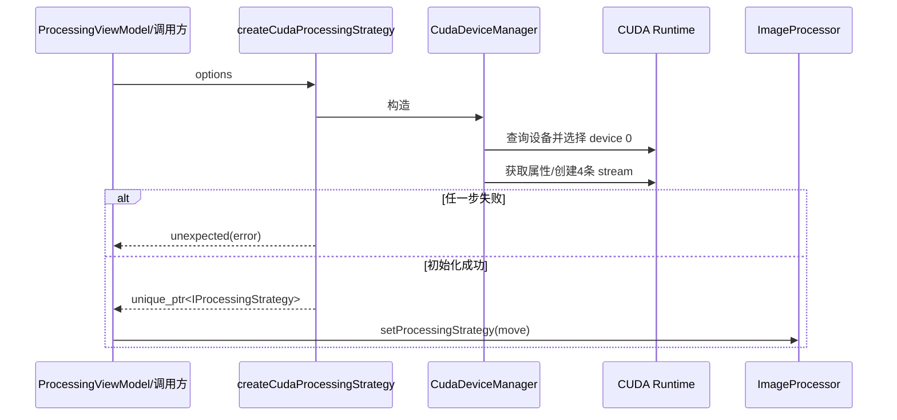
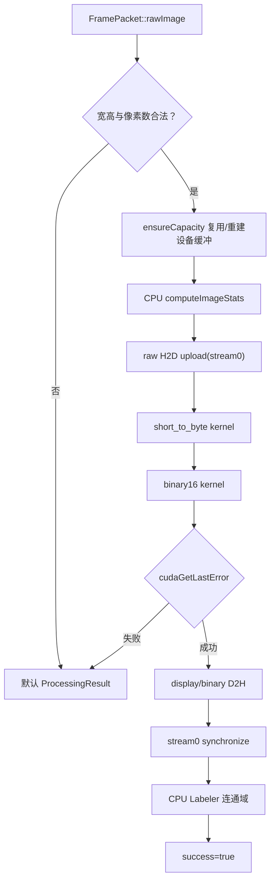

# GPU 模块 (`dss_gpu_cuda`)

> 命名空间: 设备与缓冲区使用 `Dss::Gpu`；处理策略使用 `Dss::Processing`
>
> 头文件: `include/dss/gpu/`
>
> 源文件: `src/gpu/`、`src/processing/cuda_processing_strategy.cpp`、`kernels/`
>
> 依赖: `dss_processing`, `CUDA::cudart`
>
> 构建选项: `DSS_ENABLE_CUDA=ON` (默认 OFF)

## 模块职责

GPU 模块将旧版 OpenCL 计算路径迁移为 CUDA 实现。核函数、设备与缓冲区生命周期已由可选 `CudaProcessingStrategy` 接入处理管线；默认构建仍关闭 CUDA。

## 组件清单

### 1. IGpuBackend (`i_gpu_backend.h`)

GPU 后端初始化接口。

### 2. CudaDeviceManager (`cuda_device_manager.h`)

CUDA 设备管理器，从旧版 `DeviceManager` (OpenCL) 迁移。

| 成员 | 说明 |
|------|------|
| 设备探测 | 自动选择最佳 CUDA 设备 |
| 4 个 CUDA 流 | 支持并行核函数执行 |

### 3. GpuBuffer\<T\> (`gpu_buffer.h`)

RAII 设备内存管理：

- 构造时 `cudaMalloc`
- 析构时 `cudaFree`
- 支持 Host ↔ Device 数据传输

### 4. CUDA 核函数 (`kernels/`)

| 文件 | 旧版 OpenCL 对应 | 核函数内容 |
|------|-----------------|-----------|
| `statistics.cu` | `KernelCL.cl` 统计部分 | 图像统计 (max/min/avg/σ) |
| `filter.cu` | `KernelCL.cl` 滤波部分 | 中值滤波、均值滤波 |
| `transform.cu` | `KernelCL.cl` 变换部分 | 图像旋转、翻转 |
| `arithmetic.cu` | `KernelCL.cl` 算术部分 | 帧差、帧加减 |
| `calibration.cu` | `KernelCL.cl` 定标部分 | 暗场/平场校正 |
| `composite.cu` | `KernelCL.cl` 合成部分 | 多帧合成 |

### 5. CudaProcessingStrategy (`cuda_processing_strategy.h`)

可选 `IProcessingStrategy` 实现，使用 `CudaDeviceManager` 和 `GpuBuffer` 执行统计、阈值与公共 `Labeler` 目标提取；创建失败通过 `std::expected` 返回，不影响无 CUDA 应用启动。

### 6. 核函数声明 (`cuda_kernels.h`)

C++ 主机端可调用的核函数包装声明。

## OpenCL → CUDA 对照

| OpenCL (`KernelCL.cl`) | CUDA (`kernels/*.cu`) | 状态 |
|------------------------|----------------------|------|
| 统计核函数 | `statistics.cu` | 已移植 |
| 滤波核函数 | `filter.cu` | 已移植 |
| 几何变换 | `transform.cu` | 已移植 |
| 算术运算 | `arithmetic.cu` | 已移植 |
| 定标校正 | `calibration.cu` | 已移植 |
| 多帧合成 | `composite.cu` | 已移植 |

## CMake 配置

```cmake
option(DSS_ENABLE_CUDA "Build CUDA GPU backend and kernels" OFF)

# CUDA 标准: C++20
# 目标架构: 50, 60, 70, 75, 80, 86, 89, 90
# 分离编译: ON
```

## 当前缺口

| 缺口 | 说明 |
|------|------|
| 硬件正确性 | 固定帧 CPU/OpenCV/CUDA 对照测试已定义，需在 CUDA 设备执行并回填结果 |
| 性能收益 | 6144 级基准入口已提供，需记录延迟、吞吐、显存和丢帧指标 |
| UI 启用 | `DSS_ENABLE_CUDA=OFF` 保持默认安全；仅在基准达到门槛后增加 UI 模式 |

执行命令、收益门槛和结果表见 [硬件验证](hardware-validation.md)。

## 依赖关系

```
dss_gpu_cuda
├── dss_processing
└── CUDA::cudart
```
## 深入架构与调用链

### 构建边界与依赖

GPU 是可选加速边界，仅在 `DSS_ENABLE_CUDA=ON` 且工具链找到 CUDA 时构建 `dss_gpu_cuda`。非 CUDA 构建仍可包含工厂声明，但调用会返回“当前构建不可用”的 `unexpected`。



### 关键类关系



`GpuBuffer<T>` 是 move-only RAII 设备缓冲：构造/调整容量分配 CUDA 内存，析构释放；上传下载根据是否传 stream 选择异步或同步拷贝。不要把裸 `devicePtr()` 保存到 owner 生命周期之外。

### 策略创建调用栈



设备管理器析构时销毁已创建 stream。初始化失败必须保留错误文本供 UI/日志显示，不能用空策略静默替代用户明确选择的 CUDA 模式。

### 单帧 CUDA 处理链



当前是混合流水线，不是“全部 GPU 化”：统计仍在 CPU，GPU 只执行显示拉伸和二值化，连通域仍由 CPU `Labeler` 完成；每帧下载并同步，尚未与下一帧重叠。性能判断应以 `dss_processing_benchmark` 为准，不能只根据存在 CUDA kernel 推断加速效果。

### Kernel 库与实际接线

| 文件族 | 能力 | 当前 CudaProcessingStrategy 是否调用 |
|---|---|---|
| `arithmetic.cu` | 16→8 位、差分、二值化、DN 抑制 | 调用 `short_to_byte`、`binary16` |
| `statistics.cu` | 直方图、均值/方差、min/max 归约 | 当前策略未接 |
| `filter.cu` | 高斯、中值、形态学 | 当前策略未接；部分 8 位函数仍是 TODO |
| `transform.cu` | 旋转、裁剪、binning、patch | 当前策略未接 |
| `calibration.cu` | 坏线、平场偏置、LCM | 当前策略未接 |
| `composite.cu` | 多帧中值等 | 当前策略未接 |

“kernel 已实现”和“产品主链已使用”必须分开记录。扩展策略时还要核对 host wrapper 的尺寸、边界、共享内存和 stream 错误检查。

### 线程、资源与同步

CUDA 策略只在 `ImageProcessor` 的单工作线程执行，因此当前没有同一策略实例并发调用。DeviceManager 预建 4 条 stream，但策略只使用默认索引 0；`synchronize()` 在每帧末尾形成明确屏障。更高并发设计需要先解决 FramePacket/结果顺序、缓冲多版本和错误归属，不能直接轮换 stream。

### 错误路径

- 工厂初始化失败：返回 `expected` 错误。
- `GpuBuffer` 分配/拷贝失败：抛 `runtime_error`，策略捕获后返回默认失败结果。
- kernel launch：检查 `cudaGetLastError()`；失败返回默认结果。
- 当前逐帧失败没有专用事件、错误码或计数，Processor 仍继续处理下一帧；这是诊断可见性的缺口。
- 构建未启用 CUDA 时，inline 工厂稳定返回不可用错误，便于 UI 做能力降级。

### 扩展与测试

新增 CUDA 路径时应先写 CPU 参考实现/黄金输出，再加 kernel 边界测试；检查零尺寸、非整除网格、最大 DN、stream 同步和设备不可用。新增 kernel 不代表要立即塞进主策略，可先通过 benchmark 验证收益。

重点入口：`test_cuda_processing_contract.cpp` 验证构建能力契约；`benchmarks/processing_benchmark.cpp` 对比后端。CUDA 开启的 CI/专机还应运行 compute-sanitizer 和多尺寸结果对比。

推荐源码顺序：`i_gpu_backend.h` → `cuda_device_manager.*` → `gpu_buffer.h` → `cuda_kernels.h` → `cuda_processing_strategy.*` → 实际调用的 `arithmetic.cu` → 其余 kernel → CMake CUDA 分支 → benchmark/test。
