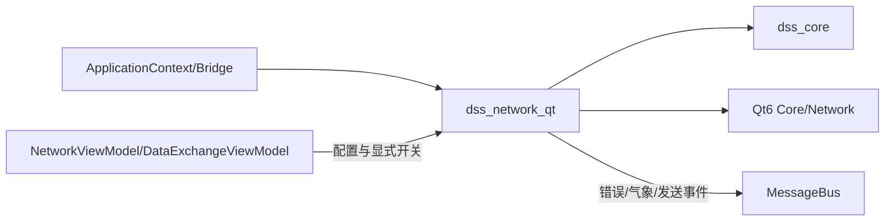
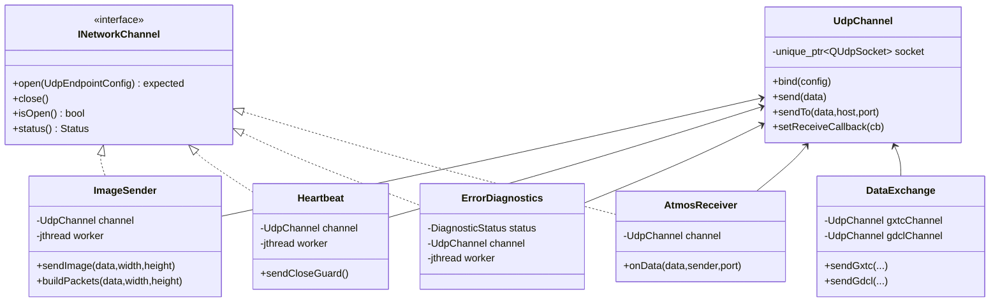
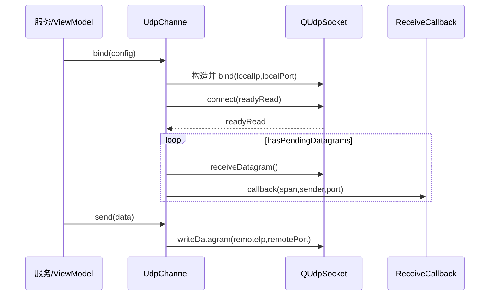
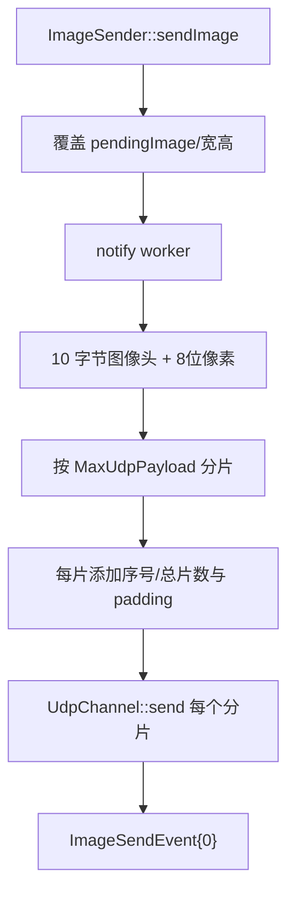
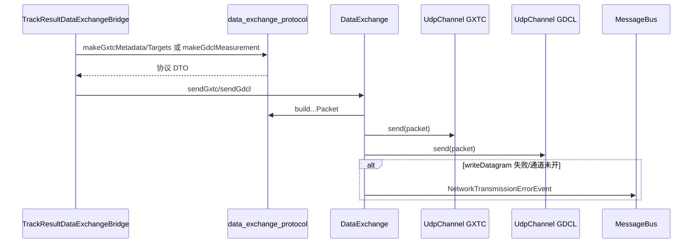
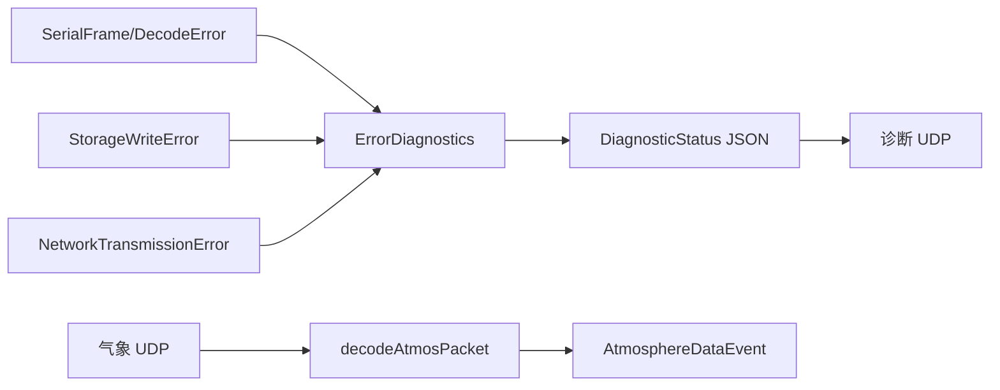

# Network 模块 (`dss_network_qt`)

> 命名空间: `Dss::Network`
>
> 头文件: `include/dss/network/`
>
> 源文件: `src/network/`
>
> 依赖: `dss_core`, `Qt6::Core`, `Qt6::Network`

## 模块职责

Network 模块封装所有 UDP 网络通信，负责图像传输、心跳保活、诊断信息上报、大气数据接收、数据交换等功能。

## 组件清单

### 1. INetworkChannel (`i_network_channel.h`)

UDP 单端点服务抽象接口；图像发送、心跳、诊断和大气接收均实现该接口，并在应用注册时同时按具体类型和 `INetworkChannel` 注册：

```cpp
class INetworkChannel {
    virtual auto open(config) -> std::expected<void, std::string> = 0;
    virtual void close() = 0;
    virtual bool isOpen() const = 0;
    virtual auto status() const -> Status = 0;
};
```

### 2. UdpChannel (`udp_channel.h`)

Qt `QUdpSocket` 封装（pimpl 隐藏 Qt 依赖）：

| 方法 | 说明 |
|------|------|
| `bind(config)` | 绑定本地端点；本地端口为 0 时由系统分配临时端口 |
| `send(data)` | 发送到预设目标 |
| `sendTo(data, host, port)` | 发送到指定目标 |
| `setReceiveCallback(fn)` | 设置接收回调 |

### 3. ImageSender (`image_sender.h`)

分片 UDP 图像传输（从旧版 `NetImageSender` 迁移）。

**设计:**
- 最大单帧载荷: 60KB
- 大图自动分片传输
- 独立工作线程发送

| 方法 | 说明 |
|------|------|
| `buildPackets(imageData)` | 将图像切分为 UDP 分片 |
| `sendImage(imageData)` | 异步发送图像 |

### 4. Heartbeat (`heartbeat.h`)

心跳保活服务（从旧版 `NetApp` 心跳部分迁移）。

| 方法 | 说明 |
|------|------|
| `buildFrame()` | 构建心跳帧 |
| `buildCloseGuardFrame()` | 构建关闭保护帧 |

### 5. ErrorDiagnostics (`error_diagnostics.h`)

JSON 格式诊断信息上报（从旧版 `NetErrorDiagnose` 迁移）。

| 方法 | 说明 |
|------|------|
| `setStatus(key, value)` | 设置诊断状态项 |
| `buildDiagnosticStatusJson()` | 生成 JSON 诊断报文 |

### 6. DataExchange (`data_exchange.h`)

GXTC/GDCL 协议数据交换（从旧版 `NetExchange` 迁移）。

| 方法 | 说明 |
|------|------|
| `sendGxtc(data)` | 发送 GXTC 协议数据包，失败时返回错误并发布 `NetworkTransmissionErrorEvent` |
| `sendGdcl(data)` | 发送 GDCL 协议数据包，失败时返回错误并发布 `NetworkTransmissionErrorEvent` |
| `makeGxtcMetadata(packet, options)` | 从 `ResultPacket` 构造 GXTC 头部 DTO |
| `makeGxtcTarget(packet, options)` | 从 `ResultPacket` 构造 GXTC 目标 DTO |
| `makeGdclMeasurement(packet, options)` | 从 `ResultPacket` 构造 GDCL 测量 DTO |
| `makeJms1970Centiseconds(timestamp)` | 将通用时间戳换算为旧协议 JMS1970 百分之一秒 |

### 7. AtmosReceiver (`atmos_receiver.h`)

大气遥测数据 UDP 接收（从旧版 `NetAtmos` 迁移）。

| 方法 | 说明 |
|------|------|
| `decodeAtmosPacket(data)` | 解码大气数据包 (温度/气压/湿度) |

接收后发布 `AtmosphereDataEvent` 到消息总线。

### 8. 协议头文件 (header-only)

| 文件 | 用途 |
|------|------|
| `atmos_protocol.h` | 大气数据包编解码 |
| `data_exchange_protocol.h` | GXTC/GDCL 数据包编解码，以及 `ResultPacket` 到协议 DTO 的纯映射 |
| `diagnostic_protocol.h` | 诊断 JSON 报文构建 |

## 当前缺口

| 缺口 | 说明 |
|------|------|
| 联调样例与接收状态 | 服务注册、统一端点编辑、显式开关、错误日志落盘/搜索/导出均已完成；仍需补产品化发送样例和接收状态展示 |
| `NetApp` 接收侧逻辑 | 仅迁移当前业务需要的心跳和网络服务，旧版其余接收处理未逐行复制 |
| `ENetServer` | 旧版可靠 UDP 未迁移；当前业务链路不依赖 ENet |

## 依赖关系

```
dss_network_qt
├── dss_core
├── Qt6::Core
└── Qt6::Network
```
## 深入架构与调用链

### 模块边界与依赖

Network 负责 UDP socket、协议 DTO 映射、分片和周期发送。它不决定何时产生跟踪结果，也不直接读取 Widget；App 桥接器把核心事件映射到 `DataExchange`。



### 关键类关系



`DataExchange` 管理两条端点，故没有实现单端点的 `INetworkChannel`；它由专用 ViewModel 同时打开 GXTC/GDCL。

### UdpChannel 基础调用栈



接收 callback 的 `span` 只在本次调用内有效，订阅者若异步保存必须复制。callback 在 mutex 下取快照后执行，避免业务处理时长期持锁。

### 图像发送分片链



ImageSender 只保留最新 pending 图像，不是无界队列；处理速度跟不上时旧待发图会被覆盖。当前主帧流水线只发布 `ImageSendEvent`，没有自动从 `DisplayRefreshEvent` 提取缓冲调用 `sendImage()`。此外 Processor 和 ImageSender 都会发布同名事件，后者序号固定为 0，订阅者不能把该事件当作唯一发送确认。

### 跟踪结果到 GXTC/GDCL



`DataExchange::open()` 先绑定 GXTC，再绑定 GDCL。当前第二条绑定失败时没有自动关闭已成功的第一条，调用方应执行 `close()`；这是后续可补的原子打开/回滚点。

### 心跳、诊断与气象

| 服务 | 数据方向 | 执行方式 | 事件 |
|---|---|---|---|
| `Heartbeat` | 周期发送固定 10 字节帧 | `std::jthread` | 无；可显式发送 close-guard |
| `ErrorDiagnostics` | 周期发送诊断 JSON | `std::jthread`，状态用 mutex | 订阅串口/存储/网络错误 |
| `AtmosReceiver` | 接收并解码气象报文 | `QUdpSocket::readyRead` | 成功发布 `AtmosphereDataEvent` |
| `ImageSender` | 异步发送图像分片 | `std::jthread` + 最新帧缓冲 | 完成循环后发布 `ImageSendEvent` |
| `DataExchange` | 同步发送结果报文 | 调用者线程 | 失败发布网络错误 |



### 生命周期与线程边界

`NetworkViewModel` 和 `DataExchangeViewModel` 通过 Registry 获取服务，应用端点配置后显式 `open()`，重配前先关闭。Heartbeat、ErrorDiagnostics、ImageSender 在打开成功后创建工作线程；AtmosReceiver 和 DataExchange 不额外创建线程。

与 Comm 类似，发送型服务的 `QUdpSocket` 在 `bind()` 调用线程创建，而 `std::jthread` 可能从另一线程调用 `send()`。当前实现需要真实网络压力测试验证 Qt socket 线程亲和；更稳妥的演进方向是在拥有事件循环的专用 QThread 内创建、使用和销毁 socket，或让 worker 只生成数据并排队回 socket 所属线程发送。

### 错误与可观测性

- bind 失败通过 `expected<string>` 返回，UI 显示错误。
- `UdpChannel::send()` 在未绑定或写失败时返回 -1；`DataExchange` 将其升级为 `NetworkTransmissionErrorEvent`。
- ImageSender、Heartbeat、ErrorDiagnostics 当前未逐包检查并发布发送失败事件；端到端可靠性不能只看 `isOpen()`。
- Atmos 解码失败直接丢弃，不发布错误事件；若现场需要区分链路静默与坏包，应增加计数或专用事件。
- UDP 本身无到达/顺序保证，图像接收端必须按分片头重组并处理丢片。

### 配置、扩展与测试

端点配置来自 `Config::comm()`，普通网络服务与 GXTC/GDCL 双端点分别由两个 ViewModel 管理。新增 UDP 服务时优先复用 `UdpChannel`，明确是同步发送、周期 worker 还是 readyRead 接收，并定义失败事件和关闭回滚。

重点测试：`test_network_protocols.cpp`、`test_data_exchange_protocol.cpp`、`test_data_exchange.cpp`、`test_image_sender.cpp`、`test_heartbeat.cpp`、`test_error_diagnostics.cpp`、`test_network_view_model.cpp`、`test_data_exchange_view_model.cpp`。

推荐源码顺序：`i_network_channel.h` → `udp_channel.*` → 各 protocol 头文件 → `data_exchange.*` → App 结果桥 → `image_sender.*` → `heartbeat.*` → `error_diagnostics.*` → `atmos_receiver.*` → 两个网络 ViewModel。
