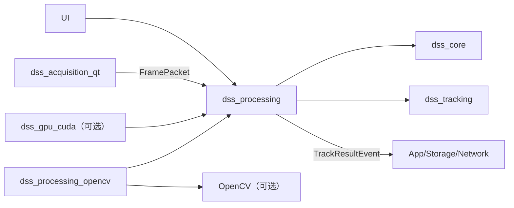
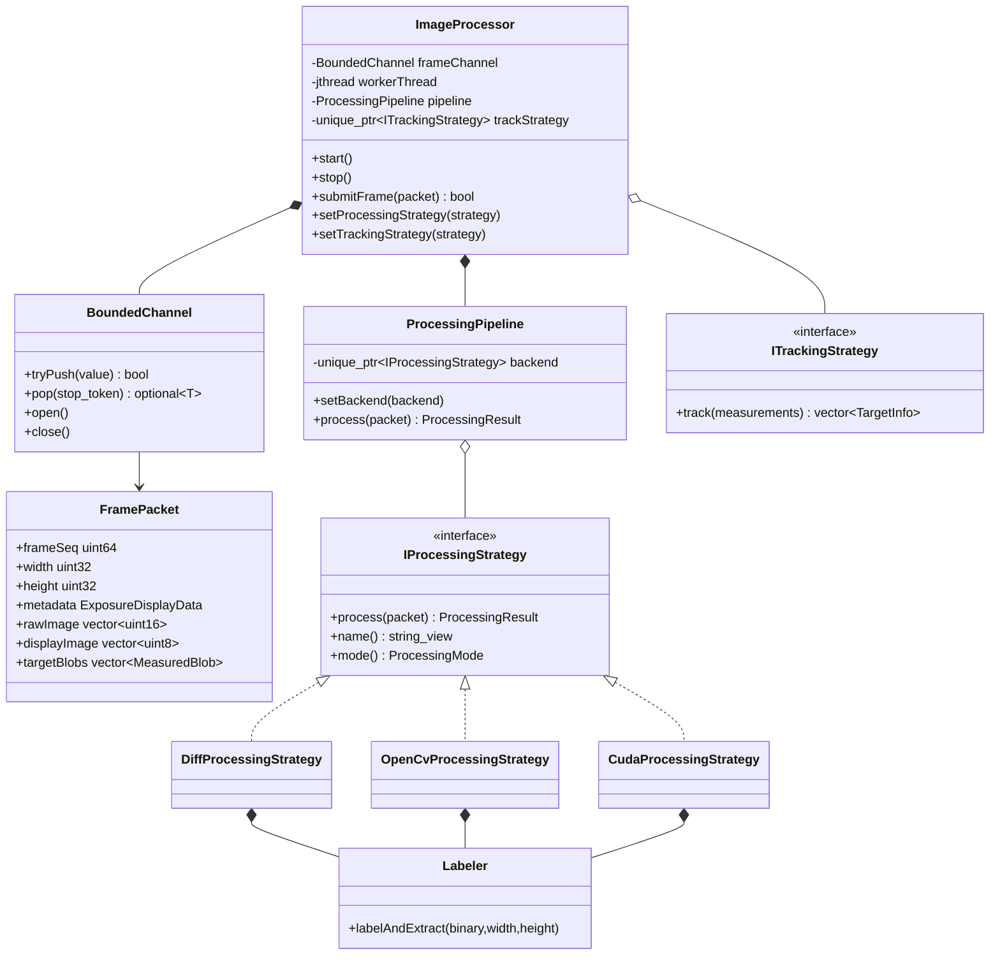
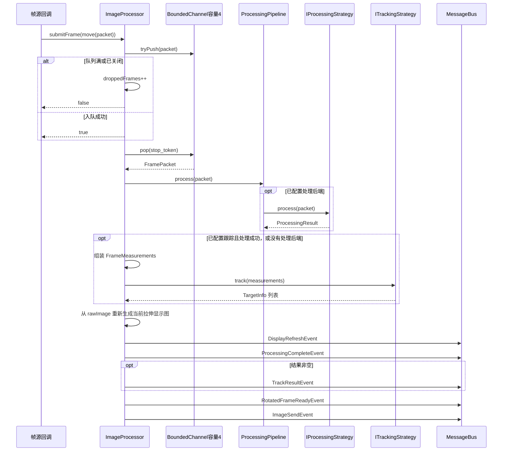
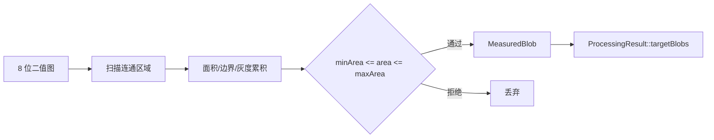
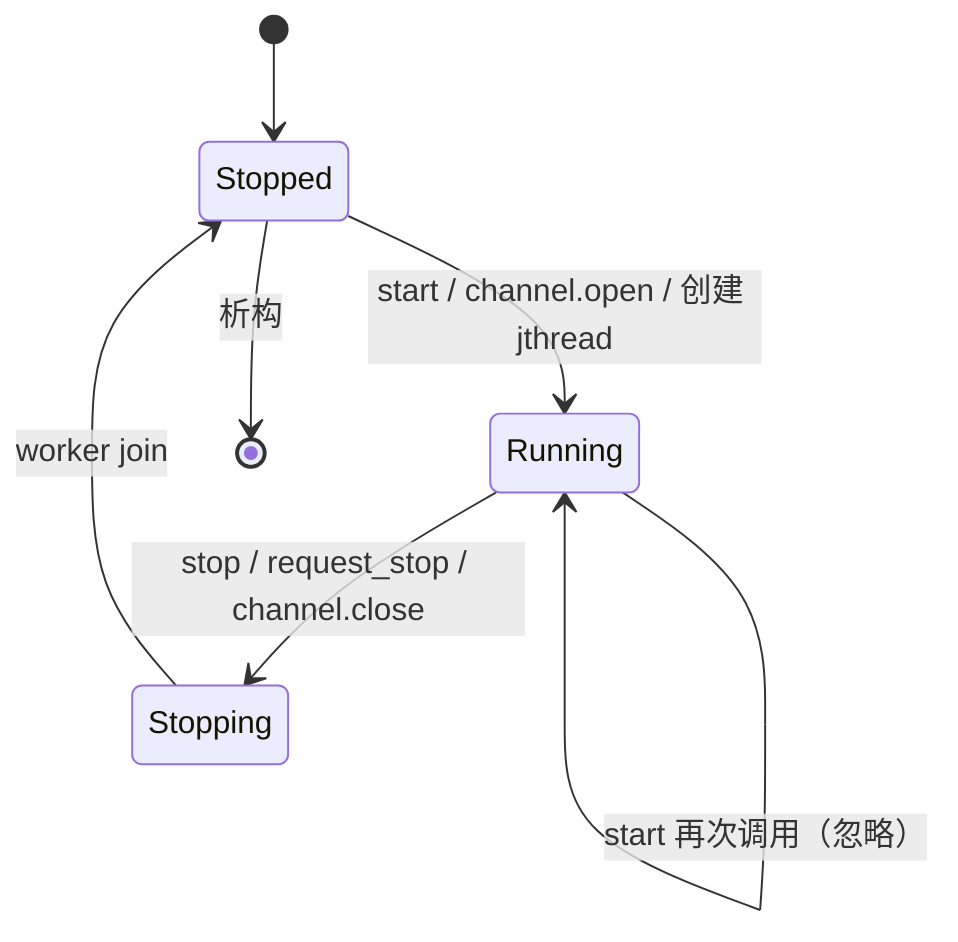

# Processing 模块 (`dss_processing` / `dss_processing_opencv`)

> 命名空间: `Dss::Processing`
>
> 头文件: `include/dss/processing/`
>
> 源文件: `src/processing/`
>
> 依赖: `dss_core`, `dss_tracking`; 可选 `OpenCV`

## 模块职责

Processing 模块实现图像处理管线，负责帧数据的缓冲、分发、统计分析、阈值分割、连通域检测和目标提取。通过策略模式支持多种处理后端（CPU/OpenCV/CUDA）。

## 组件清单

### 1. FramePacket (`frame_packet.h`)

多缓冲区帧数据模型，承载一帧图像从采集到处理完成的全部数据。

| 字段 | 类型 | 用途 |
|------|------|------|
| `rawBuffer` | `vector<uint16_t>` | 原始 16 位图像 |
| `rotatedBuffer` | `vector<uint16_t>` | 旋转后图像 |
| `displayBuffer` | `vector<uint8_t>` | 8 位显示图像 |
| `photometryBuffer` | `vector<uint8_t>` | 光度测量图像 |
| `blobs` | `vector<MeasuredBlob>` | 检测到的目标列表 |
| `width` / `height` | `uint32_t` | 图像尺寸 |
| `frameSeq` | `uint64_t` | 帧序号 |
| `metadata` | `ExposureDisplayData` | 曝光同步元数据 |

### 2. FrameView / MutableFrameView (`frame_view.h`)

帧数据的非拥有视图（基于 `std::span`），提供零拷贝访问。

- `makeFrameView(packet)` → 只读视图
- `makeMutableFrameView(packet)` → 可变视图

### 3. BoundedChannel (`bounded_channel.h`)

线程安全的有界队列，用于生产者-消费者模式的帧传递。

```cpp
BoundedChannel<FramePacket, 4>  // 容量为 4 的帧缓冲
```

- `push(item)` — 入队，满则丢弃最老帧
- `pop(stop_token)` — 阻塞出队，支持协作式取消
- `close()` — 关闭通道

### 4. IProcessingStrategy (`i_processing_strategy.h`)

可插拔的图像处理后端接口。

```cpp
class IProcessingStrategy {
    virtual auto process(const FramePacket& input) -> ProcessingResult = 0;
    virtual auto name() const -> std::string_view = 0;
    virtual auto mode() const -> ProcessingMode = 0;
};
```

### 5. ProcessingPipeline (`processing_pipeline.h`)

处理管线调度器，持有当前后端实例并委托执行。

| 方法 | 说明 |
|------|------|
| `setBackend(strategy)` | 切换处理后端 |
| `process(packet)` | 执行当前后端的处理，返回 `ProcessingResult` |
| `currentMode()` / `backendName()` | 查询当前后端模式和名称 |
| `hasBackend()` | 判断是否启用了处理后端 |

### 6. ImageProcessor (`image_processor.h`)

核心帧处理工作线程：

1. 从 `BoundedChannel` 取帧
2. 调用 `ProcessingPipeline::process()` 执行图像处理
3. 调用 `ITrackingStrategy::track()` 执行跟踪（如已设置）
4. 在消息总线上发布 `DisplayRefreshEvent`、`ProcessingCompleteEvent` 等事件

| 方法 | 说明 |
|------|------|
| `start()` | 启动工作线程 (`std::jthread`) |
| `stop()` | 停止工作线程 |
| `submitFrame(packet)` | 提交帧到处理队列 |
| `droppedFrames()` | 获取丢帧计数 |
| `setProcessingStrategy()` | 切换处理后端 |
| `setTrackingStrategy()` | 切换跟踪策略 |
| `currentProcessingMode()` / `currentTrackMode()` | 查询当前处理/跟踪模式 |

无处理 backend 时，`ImageProcessor` 仍会把原始回放帧作为 Direct 帧发布显示；如果当前跟踪策略是 Manual 且已有 UI 选点，也会构造 `FrameMeasurements` 并发布 `TrackResultEvent`。这使无 Sapera、无 OpenCV/CUDA 策略的回放模式也能验证“选序列 → 显示 → 手动跟踪”的主链路。

### 7. Labeler (`labeler.h`)

CPU 连通域检测与目标提取。

```cpp
auto labelAndExtract(span<const uint8_t> binaryImage,
                     uint32_t width, uint32_t height)
    -> vector<MeasuredBlob>;
```

从二值图像中检测连通区域并计算质心、边界框、面积、灰度总和等。

### 8. OpenCvProcessingStrategy (`opencv_processing_strategy.h`)

基于 OpenCV 的参考处理后端（可选 target `dss_processing_opencv`）：

- 统计分析（最大/最小/均值/标准差）
- 16 位 → 8 位映射（线性拉伸）
- 自适应阈值分割
- 连通域检测 (`cv::connectedComponentsWithStats`)

### 9. DiffProcessingStrategy (`diff_processing_strategy.h`)

CPU 帧差策略保留上一帧 16 位图像，尺寸变化时重置历史；绝对差超过阈值的像素进入二值图，再复用公共 `Labeler` 提取目标。阈值和面积范围来自配置快照。

### 10. CudaProcessingStrategy (`cuda_processing_strategy.h`)

可选 CUDA 后端由 `createCudaProcessingStrategy()` 创建。无 CUDA 构建返回 `std::expected` 错误而不抛异常；CUDA 构建复用 `CudaDeviceManager`、`GpuBuffer` 和公共 `Labeler`。硬件正确性与性能结果按 [硬件验证](hardware-validation.md) 记录。
## 处理流水线

```
原始帧 (16-bit)
    │
    ▼
统计分析 (max/min/avg/σ)
    │
    ▼
16→8 位映射 (线性拉伸)
    │
    ▼
阈值分割 → 二值图
    │
    ▼
连通域检测 → MeasuredBlob[]
    │
    ▼
跟踪算法 → TargetInfo[]
    │
    ▼
事件发布 (DisplayRefresh / ProcessingComplete / TrackResult)
```

## 当前缺口

| 缺口 | 说明 |
|------|------|
| 光度测量 | `photometryBuffer` 尚未形成完整业务链路 |
| 星图匹配 | `DSS_ENABLE_STARLIBS` 仍是预留构建边界 |
| 完整定标与指向误差 | CUDA 核函数已有暗场/平场能力，但尚未形成统一的处理策略与 UI 参数闭环 |
| CUDA 硬件验收 | `CudaProcessingStrategy` 已接入可选构建；输出对照、6144 性能和 UI 启用门槛见 [硬件验证](hardware-validation.md) |

## 依赖关系

```
dss_processing
├── dss_core
└── dss_tracking

dss_processing_opencv (可选)
├── dss_processing
└── OpenCV (core, imgproc)

dss_gpu_cuda (可选)
├── dss_processing
└── CUDA::cudart
```
## 深入架构与调用链

### 模块边界与依赖

Processing 是帧流水线的调度中心：接收 `FramePacket`、在单一工作线程执行处理策略和跟踪策略、生成显示图与事件。它不负责采集线程、磁盘写入、网络发送或 Widget。



### 关键类关系



### 从提交到事件扇出的完整调用栈



显示缓冲的优先级很重要：尺寸合法且有 `rawImage` 时，总是根据当前 `DisplayStretchSettings` 重新构造 8 位图；否则退回策略的 `displayImage`，再退回输入包已有显示图。原始像素以 `shared_ptr<const vector<uint16_t>>` 放进 `DisplayRefreshEvent`，让 UI 可在不复制业务状态的情况下重新拉伸。

### 处理策略行为

| 策略 | 主要步骤 | 状态性 | 输出 |
|---|---|---|---|
| 无后端 | Pipeline 返回默认失败结果 | 无 | 可直接使用 `FramePacket` 自带 blobs 做跟踪 |
| `DiffProcessingStrategy` | 统计 → 与上一帧绝对差 → 阈值二值化 → Labeler | 保存上一帧和尺寸 | target blobs、二值显示图 |
| `OpenCvProcessingStrategy` | 统计/拉伸 → 阈值 → OpenCV 连通域 → DTO 转换 | 参数状态 | blobs、统计、显示图 |
| `CudaProcessingStrategy` | 上传 → CUDA 拉伸/二值化 → 下载 → CPU Labeler | 复用设备缓冲 | blobs、统计/显示图 |

Diff 首帧或尺寸变化时只缓存基准帧并返回成功，不会产生跨帧差分目标。策略切换由 `ProcessingViewModel` 创建新实例并通过 `setProcessingStrategy()` 替换，旧策略状态随实例销毁。

### Labeler 与数据契约



`FramePacket` 拥有输入缓冲，适合在线程间移动；`FrameView`/ `MutableFrameView` 是不拥有内存的轻量视图，只能在底层缓冲有效期内使用。新增算法时不要把临时 `span` 保存进异步对象。

### 生命周期与并发



- 队列容量固定为 4，生产者非阻塞；满时丢新帧并累计 `droppedFrames`。
- `m_strategyMutex` 同时保护处理策略和跟踪策略。工作线程执行整个策略期间持锁，因此 UI 切换策略会等待当前帧结束。
- 显示拉伸设置使用独立 mutex，可在不替换策略的情况下更新。
- `stop()` 先请求停止并关闭通道，再 join；工作线程退出后把 `m_running` 置 false。
- 处理和跟踪当前在同一工作线程串行执行，避免策略内部状态被并发访问。

### 错误与可观测性

策略用 `ProcessingResult::success=false` 表示单帧处理失败，主循环仍会尝试构建显示并继续下一帧；没有异常或错误事件自动上报。队列丢帧通过 `droppedFrames()` 被 `RuntimeDiagnostics` 读取。扩展策略时应保证错误帧不破坏下一帧状态，并明确是否需要新增诊断事件。

### 配置与扩展点

- 处理模式由 `ProcessingViewModel` 映射为具体策略；可用性受 `DSS_HAS_OPENCV` / `DSS_HAS_CUDA` 控制。
- 显示拉伸包含 Auto/Manual、低高阈值和信号上限；UI 修改后同步到 Processor，并可用缓存 raw 立即重绘当前帧。
- 新策略实现 `IProcessingStrategy` 后，需要补工厂/UI 模式映射、CMake target 依赖、无效输入契约和至少一个算法测试。
- 如果算法会长期阻塞，不应简单增大队列掩盖延迟；先用 `droppedFrames` 和基准测试定位。

重点测试：`test_bounded_channel.cpp`、`test_frame_view.cpp`、`test_processing_pipeline.cpp`、`test_image_processor.cpp`、`test_diff_processing.cpp`、`test_opencv_processing.cpp`、`test_display_stretch.cpp`、`test_cuda_processing_contract.cpp`。

推荐源码顺序：`frame_packet.h` → `bounded_channel.h` → `i_processing_strategy.h` → `processing_pipeline.*` → `image_processor.*` → `display_stretch.*` → `labeler.*` → Diff/OpenCV/CUDA 策略 → `ProcessingViewModel`。
