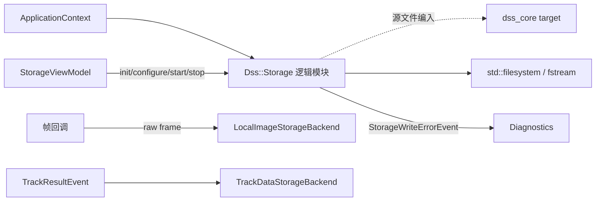
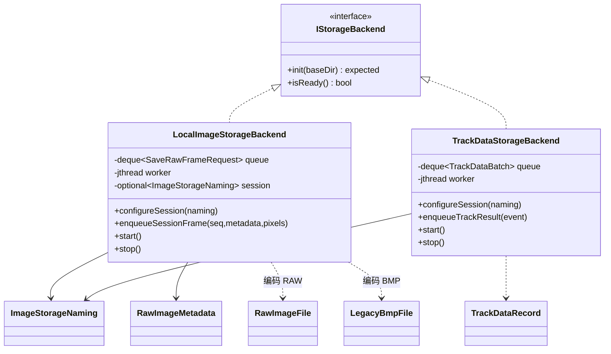
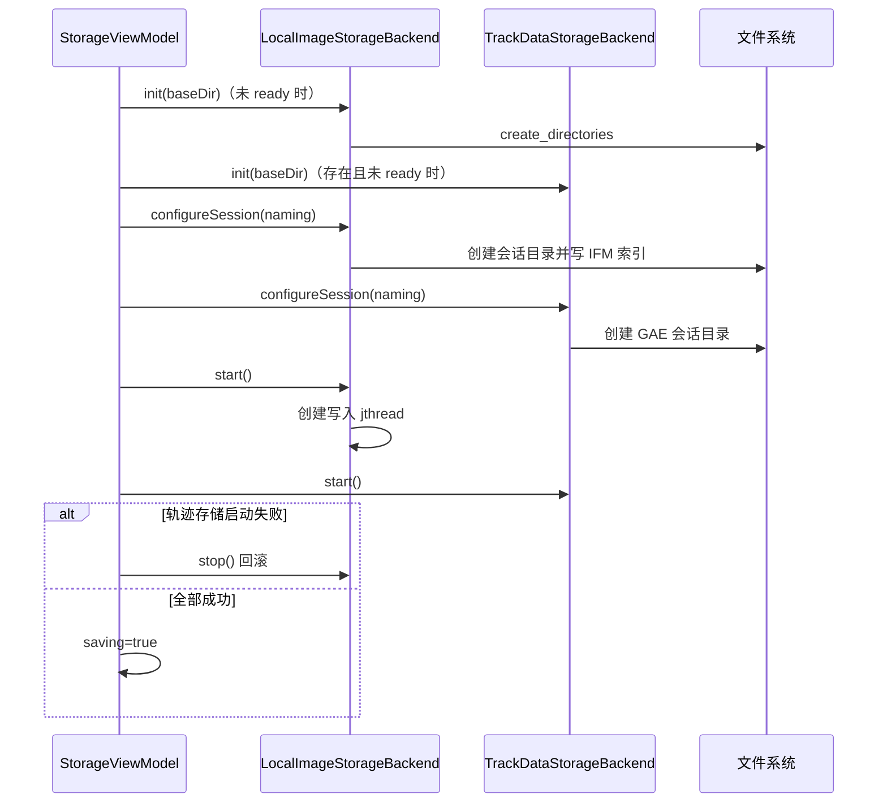
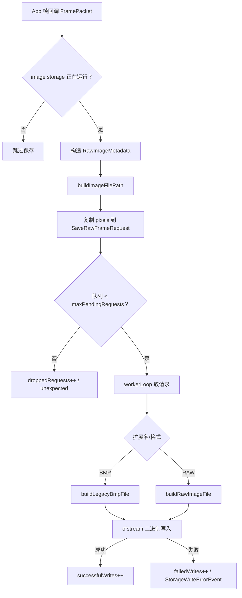
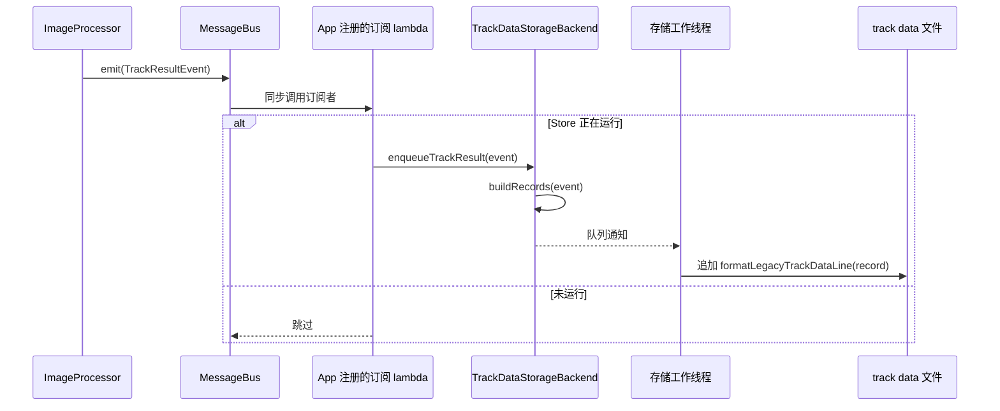
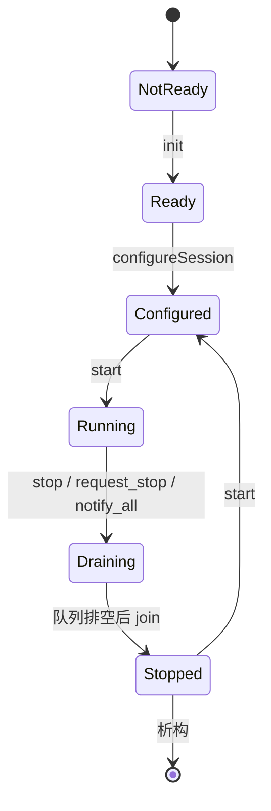

# Storage 模块

> 命名空间: 包含于 `Dss::Storage`
>
> 头文件: `include/dss/storage/`
>
> 源文件: 无独立编译目标（header-only + 轻量后端）

## 模块职责

Storage 模块定义图像和轨迹数据的存储格式、本地异步后端与会话命名。RAW/BMP、IMI/GAE 会话文件、背压统计、错误事件和主控任务到会话命名的自动映射均已接入。

## 组件清单

### 1. IStorageBackend (`i_storage_backend.h`)

存储后端抽象接口：

```cpp
class IStorageBackend : public IService {
    virtual auto init(basePath) -> bool = 0;
};
```

### 2. LocalImageStorageBackend (`local_image_storage_backend.h`)

本地图像存储后端，持有 `baseDir` 路径，并提供显式启动的 I/O worker：

| 方法 | 说明 |
|------|------|
| `init(baseDir)` | 创建/设置存储根目录 |
| `start()` / `stop()` | 启动/停止后台写入线程，停止时 drain 队列 |
| `enqueueRawFrame(path, metadata, pixels)` | 入队 legacy RAW 帧写入 |
| `isRunning()` | 查询 worker 状态 |

### 3. TrackDataStorageBackend (`track_data_storage_backend.h`)

轨迹数据存储后端，持有 `baseDir` 路径，并提供显式启动的 I/O worker：

| 方法 | 说明 |
|------|------|
| `init(baseDir)` | 创建/设置轨迹数据目录 |
| `start()` / `stop()` | 启动/停止后台写入线程，停止时 drain 队列 |
| `enqueueTrackResult(event)` | 将 `TrackResultEvent` 先归一为 `ResultPacket`，再转为 legacy 轨迹文本记录并入队 |
| `outputPath()` | 返回当前 `track_data.txt` 输出路径 |
| `isRunning()` | 查询 worker 状态 |

### 4. 图像存储格式 (`image_storage_format.h`)

定义 RAW 文件和命名规则，从旧版 `ImageCode` + `ImageStorage` 迁移。

| 内容 | 说明 |
|------|------|
| RAW 文件头 | 31 字节，包含帧序号、尺寸、时间戳等元数据 |
| 文件命名规则 | 基于时间戳和目标 ID 生成文件名 |
| IFM 内容格式 | 图像文件索引清单 |
| 回放间隔 | `replayIntervalMilliseconds()` 计算回放帧间隔 |

### 5. BMP 图像格式 (`bmp_image_format.h`)

旧版 BMP 文件格式兼容，从 `ImageCode` BMP 路径迁移。

| 内容 | 说明 |
|------|------|
| BMP 头 | 标准 Windows BMP 头 |
| 属性头 | 60 字节自定义属性区 |

### 6. 轨迹数据格式 (`track_data_storage_format.h`)

旧版轨迹数据文本格式，从 `TrackDataStorage` 迁移。

| 内容 | 说明 |
|------|------|
| 行格式 | 每行一帧的跟踪结果文本表示 |
| `makeTrackDataRecord(packet)` | 从通用 `ResultPacket` 构造 legacy 文本记录，复用同一结果 DTO |
| GAE 文件 | 方位/俯仰数据文件 |

## 旧版对照

| 旧版 | 新版 | 状态 |
|------|------|------|
| `ImageCode.h/.cpp` (RAW编解码) | `image_storage_format.h` | 格式定义已迁移 |
| `ImageCode.h/.cpp` (BMP编解码) | `bmp_image_format.h` | 格式定义已迁移 |
| `ImageStorage.h/.cpp` (文件I/O) | `LocalImageStorageBackend` | RAW/BMP 异步写入、IMI 会话索引、背压和错误事件已迁移 |
| `TrackDataStorage.h/.cpp` | `TrackDataStorageBackend` + format | `track_data.txt`/GAE 会话写入、结果归一化、背压和错误事件已迁移 |
| `ImageReplayer.h/.cpp` | `ImageSequenceFrameSource` | 回放读取已迁至 Acquisition 模块 |

## 当前缺口

| 缺口 | 说明 |
|------|------|
| 产品级保留策略 | 当前已具备会话级写入与背压；配额、清理周期和归档策略属于后续产品配置，不是 legacy 迁移阻塞项 |

## 依赖关系

Storage 模块的格式定义为 header-only，仅依赖 `dss_core` 类型。后端通过 `ServiceRegistry` 注册到 App 模块。
## 深入架构与调用链

### 模块边界与编译归属

Storage 负责会话命名、二进制/文本格式编码和异步磁盘写入，不负责决定“何时开始保存”或生成跟踪结果。当前没有 `dss_storage` target：`src/storage` 与头文件一起编进 `dss_core`。



### 关键类关系



### 保存会话启动栈



运行期间不能重新 `configureSession()`。主控触发的会话和 UI 手动会话最终都转换为 `ImageStorageNaming`，从而共用目录与文件命名规则。

### 原始图像写入链



默认最大待写请求数为 1024。入队会复制像素，调用者返回后不依赖 `FramePacket` 生命周期。队列满属于背压拒绝，只返回错误并计数；真正的磁盘失败还会发布错误事件。

### 轨迹文本写入链



一条 `TrackResultEvent` 可能转换为多条 `TrackDataRecord`。写入采用 append；格式化函数负责旧协议字段宽度和单位兼容，业务层不应手工拼文本。

### 停止、排空与所有权



worker 的退出判断允许收到停止请求后继续处理队列中已有请求；因此 `stop()` 是同步排空点，可能受磁盘速度影响。析构再次调用 `stop()` 是幂等兜底。

| 状态 | 保护方式 |
|---|---|
| ready/running 与统计计数 | atomic |
| 请求队列 | mutex + condition_variable_any |
| session 命名/输出路径 | 启动前配置，运行时不允许修改 |
| 事件总线指针 | 非拥有指针，必须短于 `ApplicationContext` |

### 格式层次

| 文件/类型 | 用途 | 字节序/特点 |
|---|---|---|
| `image_storage_format.h` / `RawImageFile` | 自定义 RAW 帧与头部 | 兼容旧格式字段，头部显式编码 |
| `bmp_image_format.*` / `LegacyBmpFile` | 带遗留元数据的 BMP | BMP 小端头 + 元数据映射 |
| `track_data_storage_format.h` | GAE/轨迹文本行 | 固定字段文本格式 |
| `ImageStorageNaming` | 会话目录、IFM 与帧文件名 | 搜索/目标模式共用规则 |

格式 helper 设计为纯函数，修改时优先增加 round-trip/黄金字节测试，避免只通过“文件能打开”判断兼容性。

### 错误与诊断

- `init`、`configureSession`、`start`、`enqueue` 均返回 `expected`，UI 将错误转换为状态文本。
- 队列满增加 dropped 计数，但当前 App 帧回调忽略返回值；应通过 `RuntimeDiagnostics` 观察。
- 磁盘创建、打开、编码、写入失败发布 `StorageWriteErrorEvent`，由 `ErrorDiagnostics` 和 `RuntimeDiagnostics` 订阅。
- 轨迹存储启动失败时 UI 会停止已经启动的图像存储，保证不会出现“界面显示保存成功但只启一半”。

### 扩展、测试与阅读顺序

新增格式时把“命名/编码”与“队列/写盘”分开；新增后端时实现 `IStorageBackend` 还不够，还要明确启动接口、背压策略和事件上报。若未来拆出独立 `dss_storage` target，需要先处理 Core 与 Storage 的 DTO 依赖方向。

重点测试：`test_image_storage_format.cpp`、`test_bmp_image_format.cpp`、`test_track_data_storage_format.cpp`、`test_local_image_storage_backend.cpp`、`test_track_data_storage_backend.cpp`、`test_storage_view_model.cpp`。

推荐源码顺序：`i_storage_backend.h` → `image_storage_format.h` → `bmp_image_format.*` → `track_data_storage_format.h` → 两个 backend → App 帧/事件连接 → `StorageViewModel` → `ObservationSession`。
