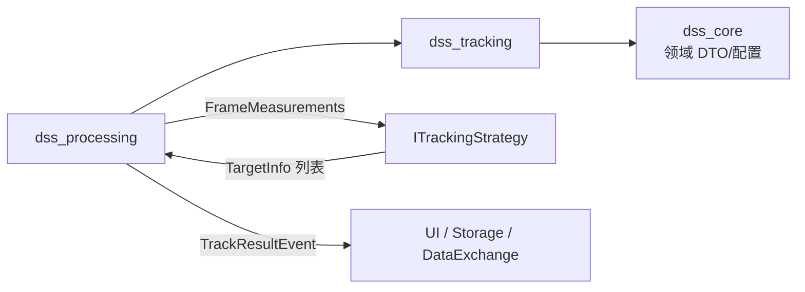
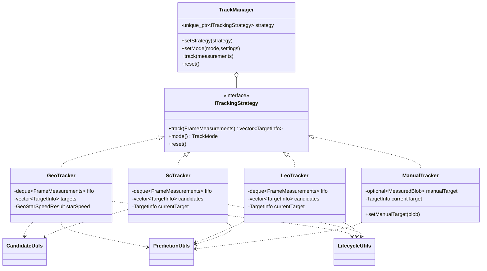
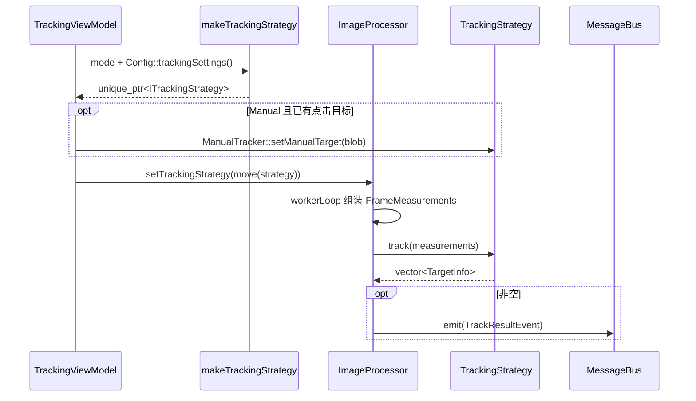
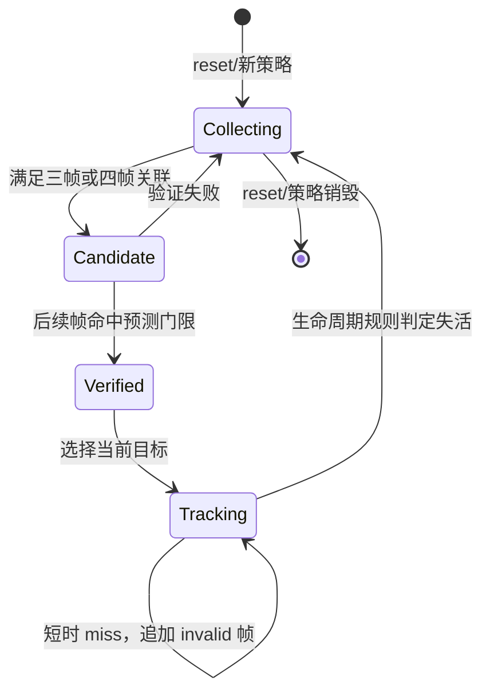
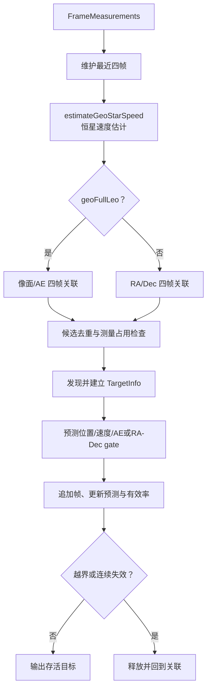
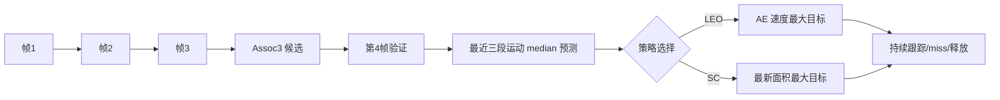
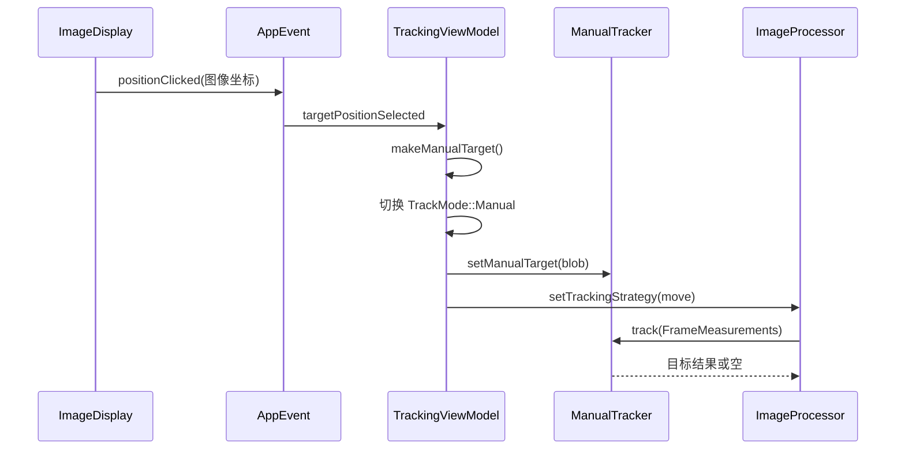

# Tracking 模块 (`dss_tracking`)

> 命名空间: `Dss::Tracking`、`Dss::Math`
>
> 头文件: `include/dss/tracking/`
>
> 源文件: `src/tracking/`
>
> 依赖: `dss_core`

## 模块职责

Tracking 模块实现天文目标跟踪算法，支持 GEO（地球静止轨道）、LEO（低地球轨道）、SC（星表）和 Manual（手动）四种跟踪模式。通过策略模式允许运行时切换。

## 组件清单

### 1. ITrackingStrategy (`i_tracking_strategy.h`)

跟踪策略接口：

```cpp
class ITrackingStrategy {
    virtual auto track(const FrameMeasurements& measurements)
        -> vector<TargetInfo> = 0;
    virtual auto mode() const -> TrackMode = 0;
    virtual void reset() = 0;
};
```

### 2. TrackManager (`track_manager.h`)

跟踪管理器，持有当前策略实例，线程安全（互斥锁）。

| 方法 | 说明 |
|------|------|
| `setStrategy(strategy)` | 替换跟踪策略 |
| `setMode(mode, settings)` | 按模式创建并切换 GEO/Manual/LEO/SC 策略，`Init` 清空当前策略 |
| `track(measurements)` | 委托当前策略执行跟踪 |
| `currentMode()` | 获取当前跟踪模式 |
| `reset()` | 重置策略状态 |

### 公共候选/预测/匹配与生命周期工具

LEO/SC/GEO 迁移中抽出的 Qt-free 纯函数层，用于复用测量坐标/运动、候选去重、目标帧信息构造、预测 fallback、外部校验 fallback、blob 匹配、匹配帧追加和基础生命周期判断。策略模式仍由 `ITrackingStrategy`、`GeoTracker`、`LeoTracker`、`ScTracker` 等类承担；公共 helper 只提供可组合的算法积木，具体候选生成、门限和 legacy policy 选择仍保留在各策略中。

| 函数/类型 | 说明 |
|-----------|------|
| `candidate_utils.h` | 测量坐标/运动读取、单帧测量占用判断、按初始帧同 index 测量复用进行候选去重，保留 oldsrc 基于原始候选全集比较、保留首个候选的压缩语义 |
| `prediction_utils.h` | 目标帧信息、预测、运动量、最近 blob 匹配、外部校验 fallback 和匹配/invalid 帧追加 helper |
| `makeTargetFrameInfo()` / `makeInvalidTargetFrameInfo()` | 构造有效测量帧和预测 invalid 帧 |
| `frameMotion()` / `aeMotion()` / `target*MotionAt()` | 计算像素空间和 AE 空间运动量 |
| `findNearestBlob(frame, target, settings, options)` | 按 `BlobMatchSpace::Frame` 或 `BlobMatchSpace::Ae` 查找最近候选，可选中心视场过滤 |
| `updatePredictionFromRecentFour()` | 使用最近三段运动的 median 更新下一帧预测和有效率 |
| `lifecycle_utils.h` | 最近 invalid 计数、连续 invalid 判断、latest valid、validity window、有效率更新和 `TrackLivingRule`/`TrackMissPolicy` 生命周期策略入口 |

### 3. GeoTracker (`geo_tracker.h`)

GEO 目标跟踪器，对应旧版 `TrackAlgo` 中 GEO 模式的算法。

**旧版核心算法:**
- `calcStarSpeed()` — 星体运动速度计算
- `assoc4()` — 四帧关联
- `findTargets()` — 新目标发现
- `trackTargets()` — 已知目标跟踪维持

**当前状态:** GEO 关键路径已完成并由模式单测与 legacy 黄金场景覆盖。`estimateGeoStarSpeed()` 提供 Qt-free 纯函数用于估计中心视场星速和 AE 速度；`calcStarSpeed()` 已接入策略状态；`assoc4()` 已迁移确定性的四帧候选关联、星速过滤、运动一致性过滤和基础重复抑制；`findTargets()`/`trackTargets()` 已能发布基础目标并按预测位置维持，且会抑制同一帧测量被多个目标复用，并在预测越出图像边界或最近 `numFramesLiving` 帧全无效时结束目标。最近 invalid 计数、连续 invalid 判断和有效率更新已复用 `lifecycle_utils`。`geoFullLeo=false` 时，初始 `Assoc4` 和 `TrackTarget` 已按 legacy 非 FullLEO 分支使用 RA/Dec 半径、最小 RA/Dec 位移、RA/Dec 速度阈值和天区边界判断，配置项 `geoRa*Arcsec`/`geoDec*Arcsec` 已接入 JSON 读写；公共候选 helper 支持按 RA/Dec 读取测量位置/运动、按 RA/Dec 去重、同帧测量占用判断，也支持按最近帧窗口判断 living-target 重叠。GEO 跟踪阶段的动态搜索半径、像面速度误差、AE gate、RA/Dec gate 和测量占用规则已集中为内部 gate options，便于后续外部校验与 TWDW/GDCL 分支复用同一套门限配置。目标全部失活后会回到四帧关联入口，支持后续图像中重新发现目标；已有目标存活时也能追加新四帧候选，并按当前测量空间过滤最近四帧重叠轨迹。外部校验 blob 的生成和消费已抽为纯函数，TWDW/GDCL 字段来源及协议回归已有黄金场景覆盖。剩余工作是用更多真实数据校准全局阈值和边界行为，而不是继续逐行翻译旧单体实现。

### 4. LeoTracker (`leo_tracker.h`)

LEO 目标跟踪器，对应 `TrackAlgo` 中 LEO 模式。

**当前状态:** `track()` 已覆盖 legacy `LEO_Assoc3`、`LEO_VerifyTarget` 和 `LEO_TrackTarget` 关键路径： 维护三帧 FIFO，按 AE 速度下限和两段 AE 运动一致性生成初始候选；第四帧可按预测 AE 位置匹配 blob，追加验证帧，用最近三段运动 median 更新预测，并选择 AE 速度最大的已验证目标；第四帧未命中时会追加 invalid 帧、丢弃未验证候选，并允许后续帧重新进入三帧关联完成重发现；验证后的第五帧有效测量会继续按预测 AE 匹配、追加并推进下一帧预测，后续单帧 miss 会按预测位置追加 invalid 帧并保持目标存活，连续 5 帧 miss 后按 legacy 规则释放目标。帧信息构造、AE 最近匹配、匹配/invalid 帧追加和 median 预测更新已复用 `prediction_utils`，连续 invalid living policy 已复用 `lifecycle_utils`。TWDW/GDCL 数据源与协议回归已补齐。

### 5. ScTracker (`sc_tracker.h`)

星表跟踪器 (Space Catalog)，对应 `TrackAlgo` 中 SC 模式。

**当前状态:** `track()` 已覆盖 legacy `SC_Assoc3`、`SC_VerifyTarget` 和 `SC_TrackTarget` 关键路径： 维护三帧 FIFO，按像素位移半径、FOV 中心窗口和两段像素运动一致性生成初始候选，并按 oldsrc 原始候选全集比较压缩复用初始测量点的相似轨迹，链式重复场景已覆盖；第四帧可按预测像素位置匹配 blob，追加验证帧，用最近三段运动 median 更新预测，并选择最新 blob 面积最大的已验证目标；验证分支使用 validity-window living policy，验证后的下一帧会继续按预测像素位置和 FOV 中心窗口匹配，TrackTarget 分支使用 legacy 活动逻辑中的 latest-valid 释放策略，miss 后允许后续帧重新进入三帧关联完成重发现。候选去重已复用 `candidate_utils`；帧信息构造、Frame 最近匹配、FOV 中心门控、匹配/invalid 帧追加和 median 预测更新已复用 `prediction_utils`；latest valid、validity window 与 living policy 入口已复用 `lifecycle_utils`。TWDW/GDCL 数据源与协议回归已补齐。

### 6. ManualTracker (`manual_tracker.h`)

手动跟踪器，用户点击选定目标后在后续帧中跟踪。

| 方法 | 说明 |
|------|------|
| `setManualTarget(blob)` | 设置手动选定的人工目标 blob |
| `track(measurements)` | 将人工 blob 转换为当前帧 `TargetInfo` 并维护预测状态 |

**当前状态:** Manual 最小闭环已完成。未选择目标时不输出结果；选择目标后会补齐人工 blob 的边界框、DN/area、AE 坐标、距离修正和相邻帧速度，并输出 `TargetInfo`。TWDW/GDCL 输出字段已纳入跨模式黄金回归；旧版 `MANUAL_Assoc3`、`MANUAL_VerifyTarget`、`MANUAL_TrackTarget` 的完整历史校验语义仍待按实际需求补齐。

### 7. 数学工具 (`math_utils.h`) — 命名空间 `Dss::Math`

从旧版 `mpolyfit`、`mfft`、`getperiod` 移植的数学函数，**已完全移植且有测试覆盖**。
其中 `legacyFftSpectrum()` 对齐旧版 `mFFT::FFT_process` 的可观察输出，包括非 2 的幂输入补零、DC/普通频点幅值归一、相位角和基础频率。

| 函数 | 旧版来源 | 用途 |
|------|---------|------|
| `polyfit()` / `polynomialFit()` / `linearFit()` | `mpolyfit` | 最小二乘多项式拟合和统计量 |
| `polyval()` | `mpolyfit` | 多项式求值 |
| `legacyFftSize()` / `legacyFftSpectrum()` | `mfft` | 旧版频谱尺寸、幅值、相位、基频兼容 |
| `fft()` / `ifft()` | `mfft` | DFT/逆变换基础函数 |
| `samplePeriodError()` / `minimumSamplePeriod()` | `getperiod` | 采样周期误差和最小周期估计 |
| `removePolynomialTrend()` / `legacyNearestSampleInterpolate()` | `getperiod` | 去趋势和旧版最近采样插值 |
| `estimatePeriod(data, sampleRate)` | `getperiod` | 信号周期估计 |
| `median(data)` | — | 中位数计算 |

## 跟踪算法对照表

| 旧版 `TrackAlgo` 函数 | 新类 | 迁移状态 |
|----------------------|------|---------|
| `TrackProc_GEO()` | `GeoTracker::track()` | **关键路径完成**，关联、验证、持续跟踪、重发现、外部校验和结果字段有回归覆盖 |
| `TrackProc_LEO()` | `LeoTracker::track()` | **关键路径完成**，Assoc3、验证、持续跟踪、miss、释放和重发现已覆盖 |
| `TrackProc_SC()` | `ScTracker::track()` | **关键路径完成**，Assoc3、重复候选压缩、验证、持续跟踪、living policy 和重发现已覆盖 |
| `TrackProc_MANUAL()` | `ManualTracker::track()` | **最小闭环完成**，legacy 三帧关联/校验细节待迁移 |
| `calcStarSpeed()` | `GeoTracker` / `estimateGeoStarSpeed()` | **已完成**，中心视场星速和 AE 换算已覆盖 |
| `assoc4()` | `GeoTracker` 内方法 | **关键路径完成**，FullLEO 像素和非 FullLEO RA/Dec 四帧关联及门限已有覆盖 |
| `findTargets()` | `GeoTracker` 内方法 | **基础完成**，按关联结果设置发现/验证状态 |
| `trackTargets()` | `GeoTracker` 内方法 | **关键路径完成**，预测维持、测量占用、生命周期、外部校验和重发现已有覆盖 |
| `mpolyfit` / `mfft` / `getperiod` | `Dss::Math::*` | **已完成**，包含 legacy FFT 频谱兼容 helper |

## 当前缺口

| 缺口 | 严重程度 | 说明 |
|------|---------|------|
| Manual legacy 历史语义 | 中 | 最小选点闭环和输出字段已完成；三帧关联与 Verify/TrackTarget 历史校验仅在产品场景需要时继续补齐 |
| 真实数据阈值校准 | 中 | GEO/LEO/SC 关键路径已有黄金回归，仍需用现场数据校准全局门限和极端边界 |
| 指向误差模型 | 中 | `PointingErrorResult` 已定义，但完整计算逻辑属于 Processing/Tracking 的共同剩余项 |

## 依赖关系

```
dss_tracking
└── dss_core
```
## 深入架构与调用链

### 模块边界与依赖

Tracking 是纯 C++、Qt-free 的有状态策略层。输入是单帧 `FrameMeasurements`，输出是跨帧 `TargetInfo` 列表；它不负责检测二值图、发布事件、存储或协议发送。



当前在线主链由 `ImageProcessor` 直接持有 `unique_ptr<ITrackingStrategy>`，并不经过 `TrackManager`；`TrackManager` 是可复用的策略门面和独立测试入口。阅读线上行为时从 `TrackingViewModel::configureTrackingStrategy()` 跳到策略工厂，再到 `ImageProcessor::workerLoop()`。

### 关键类关系



### 在线调用栈



策略切换会销毁旧实例，因此 FIFO、候选和预测状态全部重置。相同模式再次配置同样会创建新策略；若需要保留状态，不能只比较模式枚举，必须明确热更新参数的语义。

### 公共跟踪阶段



`TargetInfo::frameInfos` 是状态核心：每帧追加有效或 invalid 的 `TargetFrameInfo`，预测和 living/validity 均从最近窗口计算。网络、存储不要自行解释内部历史，应优先通过 `makeResultPacket(s)` 读取标准化最新结果。

### GEO 四帧链



GEO 与其他策略的最大区别是四帧关联和恒星速度补偿。FullLEO 分支使用像面与 AE 门限；非 FullLEO 分支使用 RA/Dec 半径、位移和速度门限。实现拆分在 `geo_association.cpp`、`geo_validation.cpp`、`geo_continuous_tracking.cpp`，不要只读 `geo_tracker.cpp` 就判断完整逻辑。

### LEO 与 SC 三帧链



- LEO 按 AE 速度下限和两段运动一致性关联，持续跟踪使用 AE 预测位置。
- SC 按像素位移、FOV 中心窗口和运动一致性关联，并压缩复用初始测量点的相似候选。
- 两者在第 4 帧验证后才进入稳定跟踪；miss 会追加 invalid 帧，达到各自 lifecycle policy 的阈值后释放并允许重发现。
- 预测 helper 使用最近运动的中位数降低单帧异常值影响。

### Manual 点击到结果



当前 Manual 是“人工种子 + 最小持续预测”闭环，不等同于历史实现完整的三帧关联/校验。点击事件虽同时发布 `ManualTargetSelectEvent`，实际策略配置依靠上图的直接调用。

### 坐标、门限与生命周期工具

| 工具 | 负责内容 | 不负责内容 |
|---|---|---|
| `candidate_utils` | 测量空间读取、候选去重、同帧占用/重叠判断 | 决定某模式的全部门限 |
| `prediction_utils` | 构造帧信息、匹配最近 blob、追加命中/invalid、median 预测 | 策略状态机 |
| `lifecycle_utils` | invalid 计数、latest-valid、有效率窗口、living rule | 选择目标 |
| `math_utils` | 多项式拟合、FFT、周期等数学原语 | 业务 DTO 和事件 |

像素、AE、RA/Dec 的单位和阈值不能混用。新增门限时应在名称中带出坐标空间/单位，并同步 `TrackingSettings`、JSON 读写和黄金场景。

### 线程、错误与重置

所有策略都在 `ImageProcessor` 单工作线程内调用，本身不加锁；UI 替换策略由 Processor 的 strategy mutex 与当前帧串行化。策略通过空结果、living/validity 状态表达“未发现/失活”，没有异常或事件错误通道。输入序号回退、图像尺寸改变或观测会话切换是否需要 `reset()`，应由上层明确触发，不能依赖策略自动猜测。

### 扩展、测试与阅读顺序

新增模式需要：扩展 `TrackMode` 与配置 → 实现策略 → 更新 `makeTrackingStrategy` / UI 映射 → 定义坐标空间和生命周期 → 增加 hit/miss/释放/重发现黄金场景 → 检查结果包、Storage、GXTC/GDCL 字段。

重点测试：`test_track_manager.cpp`、四个 `test_*_tracker.cpp`、`test_tracking_candidate_utils.cpp`、`test_tracking_prediction_utils.cpp`、`test_tracking_lifecycle_utils.cpp`、`test_tracking_legacy_scenarios.cpp`、`tests/fixtures/tracking/*.json`。

推荐源码顺序：`i_tracking_strategy.h` → `track_manager.*` 与工厂 → `candidate_utils.*` → `prediction_utils.*` → `lifecycle_utils.*` → LEO/SC → GEO 四个拆分源文件 → Manual → `math_utils.*`，最后回看 `ImageProcessor::workerLoop()` 和 `TrackingViewModel`。
