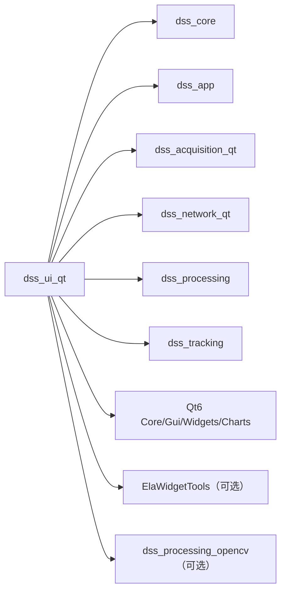
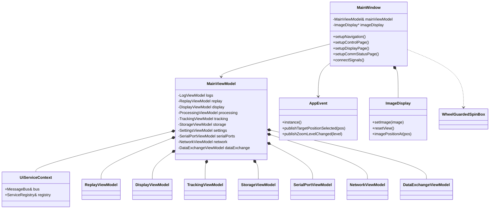
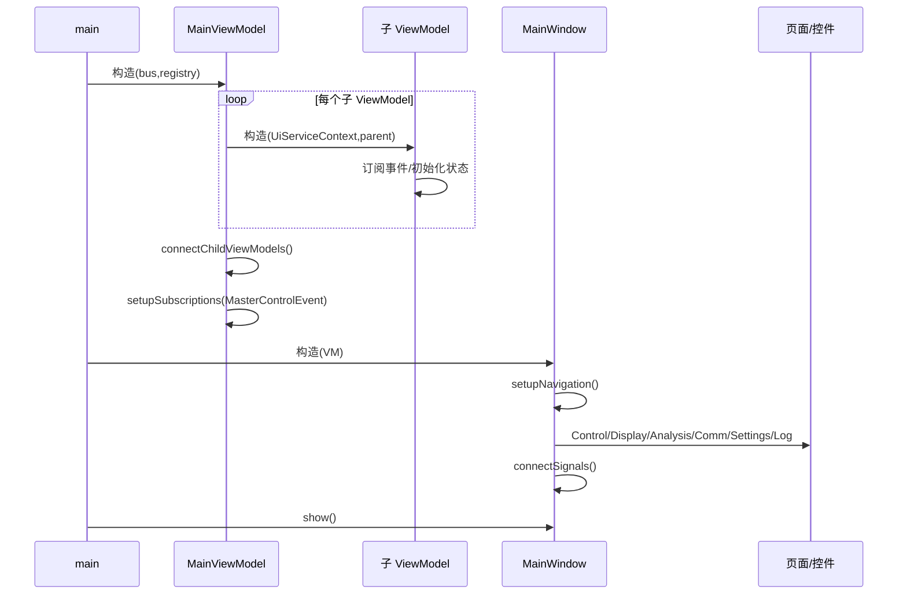
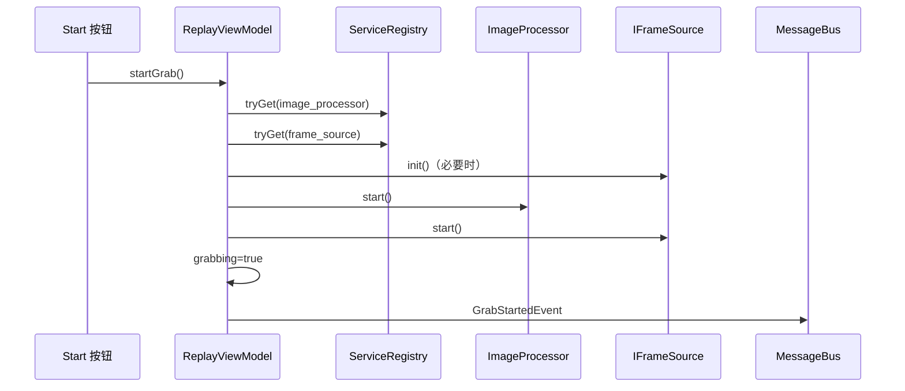
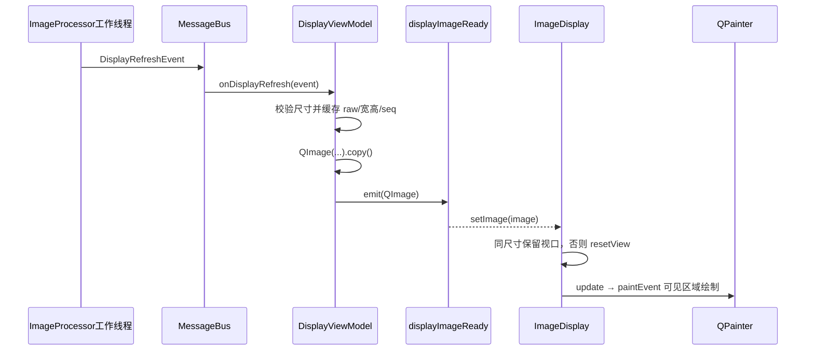
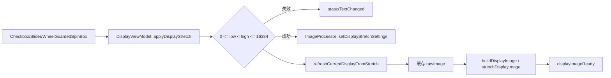
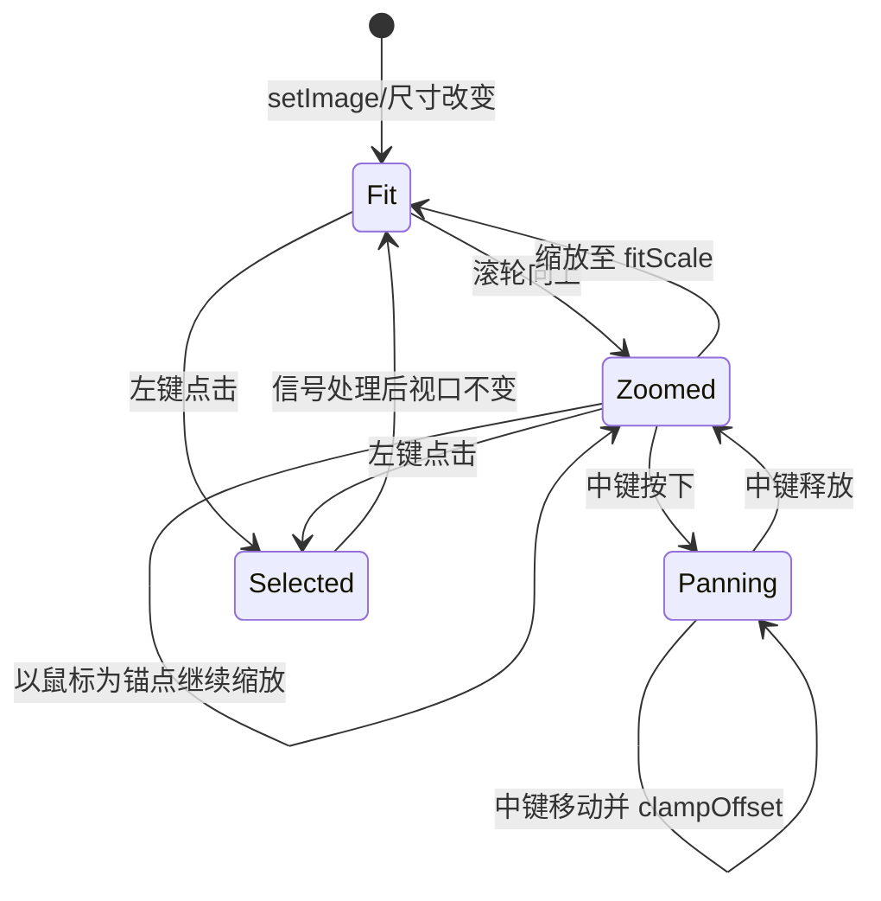
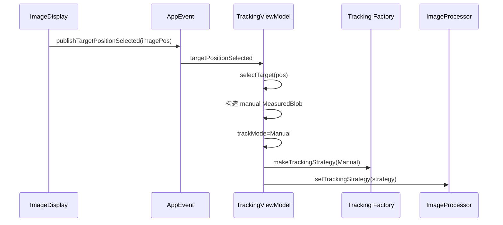
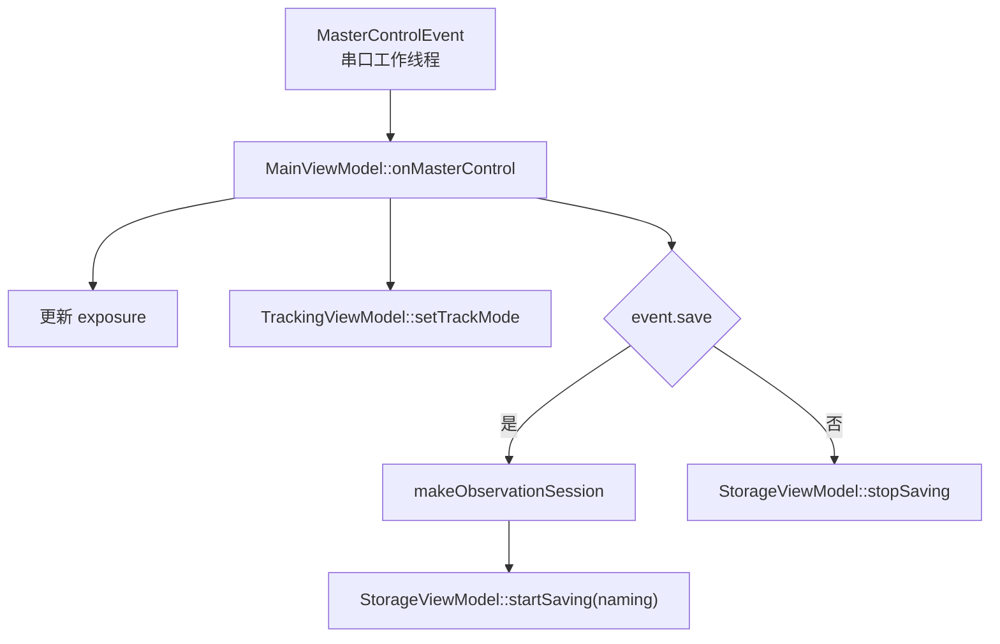
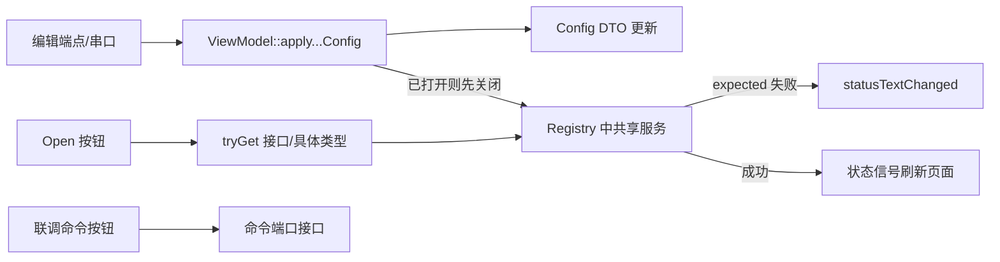

# UI 模块 (`dss_ui_qt`)

> 命名空间: `Dss::Ui`
>
> 头文件: `include/dss/ui/`
>
> 源文件: `src/ui/`
>
> 依赖: `dss_core`, `dss_app`, `dss_acquisition_qt`, `dss_network_qt`, `dss_processing`, `dss_tracking`, `Qt6::Core/Gui/Widgets/Charts`

## 模块职责

UI 模块实现系统的图形用户界面，采用 MVVM 模式：`MainViewModel` 作为 UI 层主 ViewModel 与组合根创建各业务域子 ViewModel，`MainWindow` 及各页面组件直接绑定到对应子模块的属性和信号。

## 架构模式

```
事件总线 (MessageBus)
    │
    ▼
MainViewModel (QObject 主 ViewModel / 组合根)
    │
    ├── Replay/Display/Processing/Tracking/Storage
    ├── SerialPort/Network/DataExchange/Log
    ├── 状态汇总信号 ──→ MainWindow 状态栏
    │
    ▼
AppEvent (跨页面 Qt 信号中枢)
```

**双事件通道设计:**
- **MessageBus** — 后端事件（跨线程安全，任意线程触发）
- **AppEvent** — UI 层事件（Qt 信号，适用于跨页面通信）

## 组件清单

### 1. UI 主 ViewModel 与子 ViewModel (`main_view_model.h` + `*_view_model.h`)

`MainViewModel` 是 UI 层主 ViewModel 与组合根，只负责创建子模块、汇总状态文本、连接少量跨模块关系，并响应 `MasterControlEvent` 协调曝光、跟踪、保存和回放状态。业务状态与命令由具体子 ViewModel 承担，旧单体 `ViewModel` facade 已从代码和构建中移除。

| 子模块 | 主要职责 |
|------|---------|
| `ReplayViewModel` | 选择图像序列、初始化 `ImageSequenceFrameSource`、开始/暂停、单帧前进、维护当前帧和总帧数 |
| `DisplayViewModel` | 缓存当前 raw frame、计算统计信息、自动/手动拉伸、实时刷新显示图 |
| `ProcessingViewModel` | 同步 None/OpenCV/Diff 处理策略与参数快照；CUDA 仅在硬件收益达标后开放 |
| `TrackingViewModel` | 同步 Manual/GEO/LEO/SC 跟踪策略、处理手动选点、输出跟踪状态与目标信息 |
| `StorageViewModel` | 控制图像 raw worker 与轨迹文本 worker 的启动、停止和 drain |
| `SerialPortViewModel` | 管理显示、曝光、主控、伺服串口配置、显式 open/close 和联调命令 |
| `NetworkViewModel` | 管理图像发送、诊断、大气、心跳 UDP 端点配置和显式 open/close |
| `DataExchangeViewModel` | 管理 GXTC/GDCL 数据交换端点、显式 open/close 和端点重配关闭保护 |
| `LogViewModel` | 缓存 spdlog 事件、网络/串口错误事件，支持 Info/Warning/Error 分级过滤和彩色显示 |

**聚合根信号:**
- `statusTextChanged(QString)` — 子模块状态文本汇总后通知状态栏
- `exposureChanged(double)` — 主控或 UI 修改曝光时间后通知控件同步

**典型事件订阅归属:**
- `DisplayRefreshEvent` → `DisplayViewModel`
- `ProcessingCompleteEvent` → `DisplayViewModel`
- `TrackResultEvent` → `TrackingViewModel` / `StorageViewModel`
- `MasterControlEvent` → `MainViewModel`
- `NetworkTransmissionErrorEvent` → `LogViewModel`
- `SerialFrameErrorEvent` → `LogViewModel`
- `SerialDecodeErrorEvent` → `LogViewModel`
- `LogMessageEvent` → `LogViewModel`

### 2. AppEvent (`app_event.h`)

跨页面 UI 事件单例（Qt 信号中枢）：

```cpp
class AppEvent : public QObject {
    Q_OBJECT
signals:
    void publishTargetPositionSelected(float x, float y);
    // ...
};
```

用于 MainWindow 内不同页面之间的通信，避免直接引用。

### 3. MainWindow (`main_window.h`)

多页面主窗口：

| 页面 | 旧版 | 说明 |
|------|------|------|
| 控制页 | `UI_CtrlPad` | 采集/跟踪/存储控制 (部分) |
| 显示页 | `UI_DispPad` | 全图显示 |
| 分析页 | — | 图像分析工具 |
| 通信页 | — | 串口/网络状态，串口显式 open/close，串口曝光/伺服/主控状态联调命令，网络端点统一编辑，图像发送/诊断/大气/心跳/GXTC/GDCL UDP 联调入口 |
| 设置页 | — | 路径、滚动日志和光学参数校验与持久化 |
| 日志页 | — | 分级过滤、彩色显示、搜索和导出核心日志及通信/存储错误，最多缓存最近 500 条 |

支持两种窗口后端:
- **ElaWidgetTools** — 现代风格 (`DSS_HAS_ELA=1`)
- **QMainWindow** — Qt 原生回退

### 4. InitDialog (`init_dialog.h`)

启动进度对话框：

| 方法 | 说明 |
|------|------|
| `setStatus(name, ok)` | 设置子系统初始化状态 |
| `setProgress(percent)` | 设置总体进度 |

### 5. ImageDisplay (`image_display.h`)

图像显示控件（从旧版 `QLabelImage` 迁移）：

| 方法 | 说明 |
|------|------|
| `setImage(QImage)` | 更新显示图像 |
| `resetView()` | 回到整图适配视图 |
| 鼠标滚轮 | 围绕鼠标所在图像像素区域放大/缩小 |
| 按住鼠标中键拖动 | 放大后平移图像，且边缘不露出空白 |
| 坐标映射 | Widget 坐标 ↔ 图像坐标 |
| 点击/移动信号 | 用户交互事件 |

## 旧版对照

| 旧版 | 新版 | 状态 |
|------|------|------|
| `UI_CtrlPad` | `MainWindow` + `MainViewModel` + 子 ViewModel | 回放定位、保存、运行诊断、参数化处理及四种跟踪入口已接 |
| `UI_DispPad` | `ImageDisplay` | 图像显示、坐标映射、滚轮缩放和中键平移已迁移 |
| `UI_InitDlg` | `InitDialog` | 已迁移 |
| `UI_DistCurve` | — | **未迁移** |
| `QLabelImage` | `ImageDisplay` | 已迁移 |
| 直接子系统引用 | MVVM + 事件总线 | 架构升级 |

## 当前缺口

| 缺口 | 说明 |
|------|------|
| CUDA 模式 | 可选后端和基准入口已存在；达到 [硬件验证](hardware-validation.md) 的收益门槛后再加入处理模式选择 |
| 串口/网络联调状态 | 参数编辑、显式开关、错误日志和首批命令已接入；发送样例、接收状态和断连重连展示仍需完善 |
| 距离曲线图 | `UI_DistCurve` 未迁移，分析页仅保留入口空间 |

## 依赖关系

```
dss_ui_qt
├── dss_core
├── dss_network_qt
├── dss_processing
├── dss_tracking
├── Qt6::Core
├── Qt6::Gui
├── Qt6::Widgets
├── Qt6::Charts
└── elawidgettools (可选, DSS_HAS_ELA)
```
## 深入架构与调用链

### 模块边界与一跳依赖

UI 负责用户操作、页面装配、Qt 信号槽和后端命令适配；业务服务由 App 创建并放入 Registry，UI 不拥有第二套后端实例。



UI 不直接链接 Comm target，但 App 对象已按 `ISerialChannel` 和命令接口注册，串口 ViewModel 通过 Core Registry 获取接口；实际可执行程序同时链接 `dss_comm_qt`。

### 组合关系



Qt 父子树管理 ViewModel/Widget 生命周期：`MainViewModel` 在构造列表中创建所有子 ViewModel，并把 `this` 作为 QObject parent；`MainWindow` 只保存主 ViewModel 引用，要求它比窗口长寿。

### UI 启动与页面装配



| 页面 | 主要 ViewModel | 关键动作 |
|---|---|---|
| Control | Replay、Processing、Tracking、Storage、Display | 选序列、开始/停止/步进、切处理/跟踪模式、保存、查看统计 |
| Display | Display、Tracking | 拉伸设置、图像显示、左键选目标、滚轮缩放、中键平移 |
| Analysis | 当前基础占位/分析控件 | 扩展统计图表 |
| Communication | SerialPort、Network、DataExchange | 配置、打开/关闭、发送联调命令 |
| Settings | Settings | 编辑并保存系统配置 |
| Log | Log | 事件日志过滤、搜索、导出 |

### 回放按钮到主帧流水线



`stopGrab()` 先停止 FrameSource，再停止 ImageProcessor，更新状态并发布 `GrabStoppedEvent`。步进和 seek 会先停止连续回放，避免两个生产路径同时推进索引。

### 显示事件到控件



MessageBus 同步执行，因此 `DisplayViewModel::onDisplayRefresh()` 通常运行在 Processor 工作线程；它先复制独立 QImage，再通过 Qt 信号送到主线程 Widget。当前 raw 缓存使用 mutex，供 UI 修改拉伸后立即重绘当前帧。

### 拉伸设置链



`WheelGuardedSpinBox` 只有在控件已获得明确焦点时才处理滚轮，否则忽略事件并让父级滚动区域继续滚动；Communication 页的端口数值编辑也使用该类，避免鼠标经过数值框时截走整页滚轮。

### ImageDisplay 交互状态



- 缩放范围是 `fitScale()` 到 `max(32, fitScale())`，以滚轮位置对应的图像点为锚。
- 中键拖动改变图像左上角 offset；小图自动居中，大图边缘不允许完全拖出视口。
- 左键把控件坐标通过 `imagePositionAt()` 转成图像坐标，再发布 `positionClicked`。
- 绘制只取视口与图像相交的 source rect；缩小时启用平滑变换。
- 同尺寸新帧保留缩放/偏移，尺寸变化或空图重置。当前已不存在 `ImageDisplayCrop`、`setCropCenter`、`setCropSize`。

### 手动选点跨 UI 调用栈



`AppEvent` 只解决 Widget 之间的 Qt 信号解耦，后端状态仍通过 Core MessageBus。两者不要互相替代：AppEvent 的载荷是 Qt 类型，不能下沉到 Core。

### 主控事件到 UI/会话



这是跨线程敏感路径：MessageBus 会在串口线程直接调用 `MainViewModel`，而 Qt QObject 状态通常应只在其所属主线程修改。后续演进宜在订阅 lambda 中用 queued invocation 切回主线程；硬件联调应覆盖主控高频变化和窗口关闭竞态。

### 通信页调用栈



Network 与 DataExchange 分开管理：普通单端点服务由 `NetworkViewModel` 控制，GXTC/GDCL 双端点由 `DataExchangeViewModel` 控制。修改交换端点时，`MainViewModel` 把 Network 的编辑信号连接到 DataExchange 的关闭槽，避免带旧地址继续发送。

### 子 ViewModel 职责与后端入口

| ViewModel | MessageBus 订阅 | Registry 查询/命令 |
|---|---|---|
| `LogViewModel` | `LogMessageEvent` 及错误事件 | 无主要服务 |
| `ReplayViewModel` | `DisplayRefreshEvent` | replay source、frame source、processor、runtime diagnostics |
| `DisplayViewModel` | 显示刷新、处理完成 | image processor |
| `ProcessingViewModel` | 无 | image processor，创建策略 |
| `TrackingViewModel` | 跟踪结果 | image processor，创建策略 |
| `StorageViewModel` | 无 | 两个具体 storage backend |
| `SerialPortViewModel` | 无主要后端事件 | serial channel 与三个命令端口 |
| `NetworkViewModel` | 无 | 四个 `INetworkChannel`/具体服务 |
| `DataExchangeViewModel` | 无 | `DataExchange` |
| `SettingsViewModel` | 无 | `Config` 单例 |

### 线程、所有权与信号规则

- QObject 子 ViewModel 由 `MainViewModel` 父子树拥有；后端服务由 Registry 的 `shared_ptr` 拥有。
- 每个订阅型 ViewModel 保存 `ScopedConnection`，析构时自动断开 MessageBus。
- 从处理/串口/存储线程进入的 MessageBus handler 不会自动切回 UI 线程；handler 应只处理线程安全状态，然后通过 Qt queued signal/invoke 更新 Widget。
- QImage 事件进入 Widget 前必须拥有自己的像素；当前 `makeGrayImageCopy()` 已显式 `copy()`。
- UI 不应持有指向事件临时载荷的裸指针或 span。

### 错误反馈与可测试性

ViewModel 把后端 `expected` 错误统一转换成 `statusTextChanged`，MainWindow 再显示 MessageBar 或 status bar。测试优先直接实例化 ViewModel + MessageBus + Registry 注入 fake/真实轻量服务，不通过鼠标驱动所有业务。

重点测试：

- `test_main_view_model.cpp`、`test_main_window_layout.cpp`
- `test_replay_view_model.cpp`、`test_display_view_model.cpp`、`test_processing_view_model.cpp`、`test_tracking_view_model.cpp`、`test_storage_view_model.cpp`
- `test_serial_port_view_model.cpp`、`test_network_view_model.cpp`、`test_data_exchange_view_model.cpp`
- `test_image_display.cpp`、`test_wheel_guarded_spin_box.cpp`
- `test_log_view_model.cpp`、`test_settings_view_model.cpp`

### 扩展与推荐阅读顺序

新增页面时先判断业务属于哪个子 ViewModel，保持 MainViewModel 只做组合和跨子模块协调；页面文件只装配控件和信号，不直接编码协议或 new 后端服务。跨线程事件先写线程边界测试，再接 Widget。

推荐源码顺序：`view_model_context.h` → `main_view_model.*` → 各子 ViewModel → `main_window.cpp` 与各 page 文件 → `app_event.*` → `image_display.*` → `wheel_guarded_spin_box.*` → communication panels → 对应模块后端与测试。
