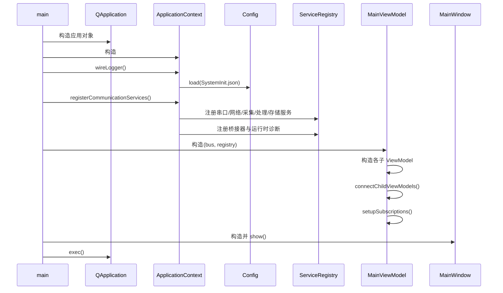
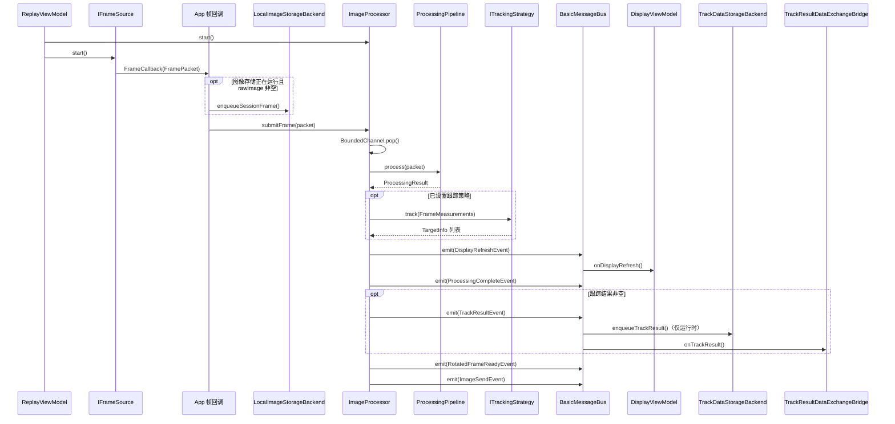
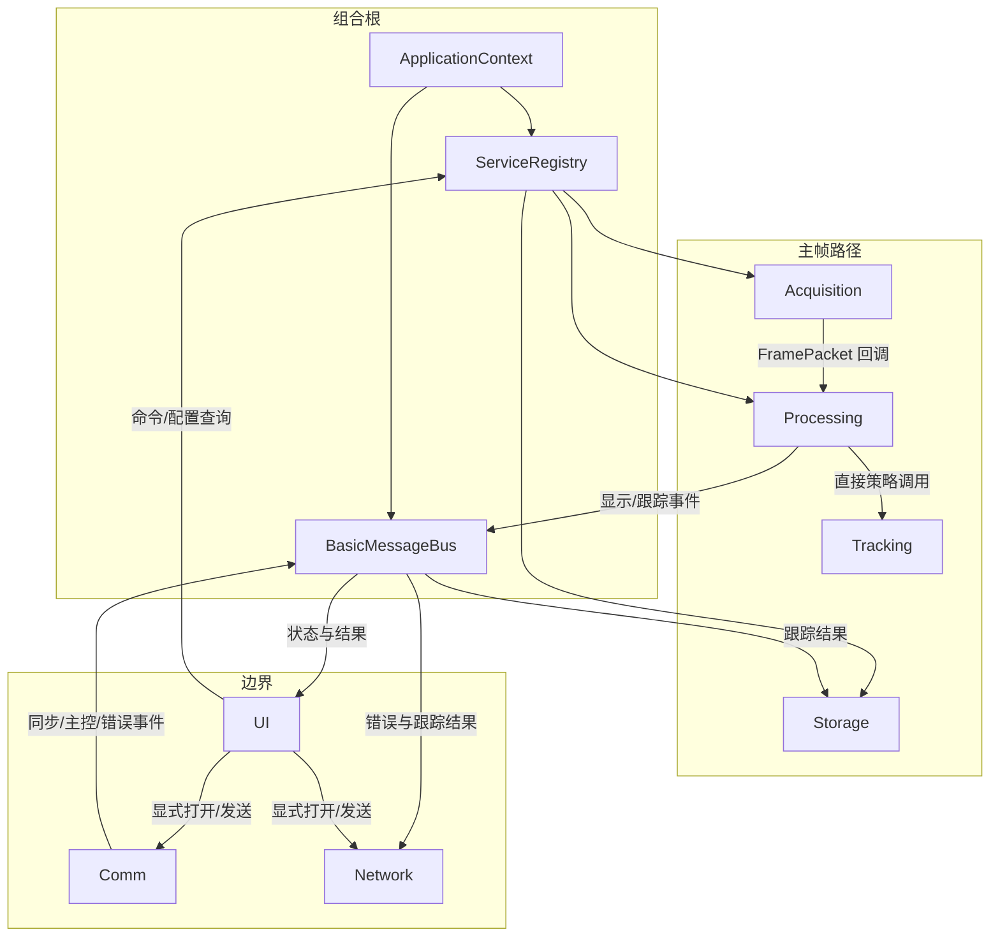

# DSS_QT 系统架构总览

> 天文高帧率图像处理系统 (Astronomical High Frame-Rate Image Processing System)

## 项目概述

DSS_QT 是一套用于天文观测的实时图像采集、处理、跟踪与通信系统。系统通过高帧率相机采集星空图像，经过图像处理管线（统计分析、阈值分割、连通域检测）提取目标信息，再由跟踪算法（GEO/LEO/SC/Manual 四种模式）计算目标轨迹，最终将修正数据通过串口/网络发送给伺服系统和上位机。

现代 CMake 模块化架构已成为唯一运行与开发主线；`oldsrc/` 只读归档仅用于行为对照。剩余工作集中在可选硬件验收、Manual 历史语义和少量产品能力。

## 技术栈

| 类别 | 技术选型 |
|------|---------|
| 语言标准 | C++23 |
| 构建系统 | CMake 3.28+、CMakePresets |
| 包管理 | Conan 2 |
| UI 框架 | Qt 6 (Widgets / Charts) |
| 图像处理 | OpenCV 4.10 (可选)、CUDA (可选) |
| 测试框架 | Google Test |
| 日志 | spdlog + 事件总线 |
| 配置 | nlohmann_json (JSON) |
| 代码质量 | clang-format、clang-tidy、IWYU |
| CI | GitHub Actions (MSVC Release) |

## 架构设计原则

1. **分层模块化** — 核心、应用、处理、跟踪及 Qt 边界使用独立 CMake target，依赖方向显式
2. **Qt 仅在边界** — UI、串口、UDP 适配层使用 Qt，核心逻辑 Qt-free
3. **策略模式** — 图像处理 (`IProcessingStrategy`) 和跟踪 (`ITrackingStrategy`) 通过接口解耦
4. **事件驱动解耦** — `BasicMessageBus`（后端）+ `AppEvent`（跨 UI 页面 Qt 信号）
5. **依赖注入** — `ServiceRegistry` + `ServiceHost` 管理服务生命周期
6. **旧代码仅参考** — `oldsrc/` 不参与构建，不被 clangd 索引

## 模块依赖图

```
DSS_QT (可执行文件)
├── dss_ui_qt       → core, app, acquisition, network, processing, tracking, Qt6
├── dss_app         → dss_core；应用构建时私有连接 comm/network/processing/acquisition
├── dss_comm_qt     → dss_core, Qt6::SerialPort
├── dss_network_qt  → dss_core, Qt6::Network
├── dss_processing  → dss_core, dss_tracking
├── dss_processing_opencv (可选) → dss_processing, OpenCV
├── dss_tracking    → dss_core
├── dss_gpu_cuda (可选) → dss_processing, CUDA
└── dss_core        → nlohmann_json
```

## 数据流概览
> 下方 ASCII 图是早期概念关系，不表示当前直接调用。当前精确帧链、串口/网络并行关系和未接通边界见后文“按源码还原的阅读地图”。


```
相机采集              串口同步               图像处理              跟踪算法
┌──────────┐     ┌──────────────┐     ┌──────────────┐     ┌──────────────┐
│ IFrameSource │ ──→ │ ExposureChannel │ ──→ │ImageProcessor│ ──→ │ TrackManager │
│ Replay/Sapera│     │ DisplayChannel  │     │ Pipeline     │     │ GEO/LEO/SC   │
└──────────┘     └──────────────┘     └──────────────┘     └──────────────┘
                                            │                       │
                                            ▼                       ▼
                                     ┌──────────────┐     ┌──────────────┐
                                     │  显示刷新      │     │ 伺服修正      │
                                     │ DisplayRefresh│     │ ServoChannel │
                                     │ → MainWindow  │     │ → 串口发送    │
                                     └──────────────┘     └──────────────┘
                                                                  │
                                                                  ▼
                                                          ┌──────────────┐
                                                          │ 网络上报      │
                                                          │ ImageSender  │
                                                          │ DataExchange │
                                                          │ Heartbeat    │
                                                          └──────────────┘
```

## 目录结构

```
DSS_QT/
├── cmake/                  CMake 辅助脚本 (clang-format/clang-tidy)
├── config/                 运行时配置 (SystemInit.json)
├── docs/                   项目文档 (本目录)
├── include/dss/            公共头文件
│   ├── acquisition/        采集层 (相机控制接口)
│   ├── app/                应用层 (组合根)
│   ├── comm/               串口通信层
│   ├── core/               核心层 (类型、事件、配置、服务)
│   ├── gpu/                GPU 计算层
│   ├── network/            网络通信层
│   ├── processing/         图像处理层
│   ├── storage/            存储层
│   ├── tracking/           跟踪算法层
│   └── ui/                 UI 层
├── kernels/                CUDA 核函数 (.cu)
├── oldsrc/                 旧版代码 (仅参考，不构建)
├── profiles/conan/         Conan 编译器配置
├── src/                    源文件 (与 include 结构对应)
├── tests/                  单元测试 (GTest)
├── CMakeLists.txt          根构建文件
├── CMakePresets.json        构建预设
└── conanfile.py            Conan 依赖声明
```

## CMake 构建选项

| 选项 | 默认值 | 说明 |
|------|--------|------|
| `DSS_BUILD_APP` | ON | 构建 Qt 桌面应用程序 |
| `DSS_ENABLE_TESTS` | ON | 构建单元测试 |
| `DSS_ENABLE_CUDA` | OFF | 构建 CUDA GPU 后端 |
| `DSS_ENABLE_OPENCV` | ON | 构建 OpenCV 图像处理后端 |
| `DSS_ENABLE_SAPERA` | OFF | 使用 Sapera SDK (相机采集卡) |
| `DSS_ENABLE_STARLIBS` | OFF | 使用 StarMap/Photometry 库 |
| `DSS_ENABLE_QT_DEPLOY` | ON (Win) | 构建后运行 windeployqt |

## 命名规范

| 元素 | 风格 | 示例 |
|------|------|------|
| 文件名 | snake_case | `image_processor.h` |
| 命名空间 | Dss::Module | `Dss::Core`、`Dss::Processing` |
| 类/结构体 | PascalCase | `ImageProcessor`、`FramePacket` |
| 方法/函数 | camelCase | `submitFrame()`、`decodeDisplayFrame()` |
| 成员变量 | m_ 前缀 | `m_bus`、`m_frameChannel` |
| 常量 | PascalCase / UPPER_CASE | `FrameHeader`、`DegToRad` |
| 枚举 | enum class + PascalCase 值 | `TrackMode::Geo` |

## 模块文档索引

| 文档 | 说明 |
|------|------|
| [Core 模块](module-core.md) | 类型系统、事件总线、配置、服务注册 |
| [App 模块](module-app.md) | 应用上下文、组合根、服务编排 |
| [Processing 模块](module-processing.md) | 图像处理管线、帧模型、策略 |
| [Tracking 模块](module-tracking.md) | 跟踪算法、数学工具 |
| [Comm 模块](module-comm.md) | 串口通信、协议编解码 |
| [Network 模块](module-network.md) | UDP 网络通信、图像传输 |
| [Storage 模块](module-storage.md) | 图像/轨迹数据存储格式 |
| [Acquisition 模块](module-acquisition.md) | 相机采集接口、控制协议 |
| [GPU 模块](module-gpu.md) | CUDA 设备管理、GPU 核函数 |
| [UI 模块](module-ui.md) | 视图模型、主窗口、图像显示 |
| [迁移进度](migration-status.md) | oldsrc → 新架构迁移状态 |
## 按源码还原的阅读地图

> 本节以当前 `develop` 分支源码与 `CMakeLists.txt` 为准。前面的简图只用于建立概念；遇到调用方向、生命周期或“是否已经接通”的判断时，以本节及各模块的“深入调用链”章节为准。历史实现只在 `oldsrc/` 中作为对照，不属于当前运行路径。

### 推荐阅读顺序

1. 先读 `src/main.cpp`，确认进程级组合顺序。
2. 读 `ApplicationContext`、`ServiceRegistry`、`BasicMessageBus`，弄清对象从哪里来、如何被找到、事件如何同步分发。
3. 沿主帧路径阅读：`IFrameSource` → `FrameSourceCoordinator` → 帧回调 → `ImageProcessor` → 处理/跟踪策略。
4. 沿结果扇出阅读：`DisplayRefreshEvent`、`ProcessingCompleteEvent`、`TrackResultEvent` 分别流向 UI、存储和数据交换。
5. 最后读串口、UDP、GPU 和 UI 控件；它们是边界适配层，不应反向定义核心数据模型。
6. 修改代码前回到对应模块文档的“线程与所有权”“错误路径”“测试入口”，确认跨线程和回滚约束。

### 进程启动调用栈



当前事实：`main()` 没有调用 `ApplicationContext::startServices()`，`registerCommunicationServices()` 也没有把这些对象加入 `ServiceHost`。因此“已注册”只表示对象可通过 `ServiceRegistry` 获取；采集处理由 `ReplayViewModel::startGrab()` 启动，串口/网络由通信页 ViewModel 的 `open...` 操作启动，存储由 `StorageViewModel::startSaving()` 启动。

### 一帧数据的完整调用栈



`BasicMessageBus::emit()` 是同步调用：订阅者在哪个线程触发，就在哪个线程执行。主帧事件由 `ImageProcessor` 工作线程发出，因此订阅者如果触碰 Qt 控件，必须先转到 Qt 对象所属线程；当前 ViewModel 多数只生成值或发 Qt 信号，阅读和扩展时仍要逐个检查线程亲和性。

### 运行时依赖与数据方向



依赖必须分三类理解：

| 类型 | 例子 | 判断方法 |
|---|---|---|
| 编译/链接依赖 | `dss_processing → dss_tracking → dss_core` | 看 `target_link_libraries` |
| 直接运行时调用 | `ReplayViewModel → IFrameSource::start()` | 看成员调用与注册表查询 |
| 事件依赖 | `ImageProcessor → TrackResultEvent → Storage/Bridge/UI` | 搜索 `emit<事件>` 与 `subscribe<事件>` |

### 事件总线关键扇出

| 事件 | 主要发布者 | 当前订阅者/消费者 | 线程提示 |
|---|---|---|---|
| `DisplayRefreshEvent` | `ImageProcessor` | `DisplayViewModel`、`ReplayViewModel` | 通常来自处理线程 |
| `ProcessingCompleteEvent` | `ImageProcessor` | `DisplayViewModel` | 通常来自处理线程 |
| `TrackResultEvent` | `ImageProcessor` | `TrackingViewModel`、轨迹存储订阅、数据交换桥 | 通常来自处理线程 |
| `MasterControlEvent` | `MasterControlChannel` | `MainViewModel`、数据交换桥 | 来自串口工作线程 |
| `ExposureSyncEvent` | `ExposureChannel` | 业务订阅者 | 来自串口工作线程 |
| `SerialFrameErrorEvent` / `SerialDecodeErrorEvent` | Comm | 诊断服务、日志/运行时诊断 | 来自串口工作线程 |
| `NetworkTransmissionErrorEvent` | `DataExchange` | 诊断服务、运行时诊断 | 由调用发送的线程触发 |
| `StorageWriteErrorEvent` | 两个存储后端 | 诊断服务、运行时诊断 | 来自存储工作线程 |
| `ManualTargetSelectEvent` / `ZoomChangeEvent` | UI ViewModel | 可选业务订阅者 | Qt 主线程 |

### 线程、所有权与停止顺序

| 对象 | 主要所有者 | 执行线程 | 启动入口 | 停止/析构 |
|---|---|---|---|---|
| `ApplicationContext` | `main` 栈对象 | Qt 主线程 | 构造/注册 | 析构调用 `stopServices()` |
| 注册服务 | `ServiceRegistry` 中的 `shared_ptr` | 依服务而异 | UI 显式打开或启动 | ViewModel 关闭、服务析构兜底 |
| `ImageSequenceFrameSource` | Registry/Coordinator 共享所有权 | `std::jthread` | `start()` | `stop()` 请求停止并 join |
| `ImageProcessor` | Registry | `std::jthread` | `ReplayViewModel::startGrab()` | 先停帧源，再停处理器 |
| 两个 Storage backend | Registry | 各自 `std::jthread` | `StorageViewModel::startSaving()` | `stop()` 唤醒队列并 join |
| `SerialWorkerBase` 派生类 | Registry | 每通道 `std::jthread` | `SerialPortViewModel::open...` | `close()` 后析构兜底 |
| Heartbeat/ErrorDiagnostics/ImageSender | Registry | 各自 `std::jthread` | `NetworkViewModel::open...` | `close()` 后析构兜底 |
| `UdpChannel` / Qt ViewModel / Widget | Registry 或 QObject 父子树 | Qt 对象所属线程 | 构造、bind 或 show | close、父对象析构 |

### 当前实现边界

- `ServiceHost` 的顺序启动和失败回滚能力存在，但当前桌面启动链没有使用它统一管理已注册服务。
- `ImageSendEvent` 已发布，但“从当前显示帧取数据并调用 `ImageSender::sendImage()`”不是自动主链的一部分。
- `ServoChannel::setTrackResult()` 可把目标换算成伺服修正量，但当前没有 `TrackResultEvent` 到该方法的自动桥接。
- CUDA、OpenCV、Sapera 都是构建期开关；阅读某条调用链前先确认对应宏和 target 是否存在。
- Storage 是逻辑模块但编译进 `dss_core`，不能按独立动态服务理解。

### 文档导航

每份模块文档末尾都给出：本模块一跳依赖、关键类图、主要调用栈、线程/错误路径、扩展点、测试入口和推荐源码顺序。跨模块追踪时，优先按“调用方文档 → 被调用模块文档 → 对应测试”三步走。
